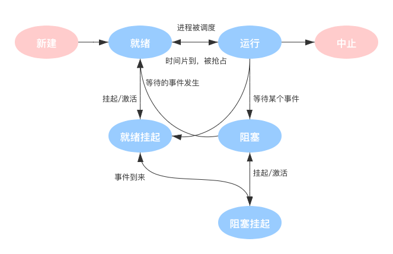

#### 2.1 进程的概念

进程是指一个具有一定独立功能的程序在一个数据集合上的一次动态执行过程。进程是操作系统处于执行状态程序的抽象，程序 = 文件 (静态的可执行文件)，进程 = 执行中的程序 = 程序 + 执行状态。

操作系统要记录PID、进程所属用户ID，以及给进程分配了哪些资源如分配了多少内存、正在使用哪些I/O设备、正在使用哪些文件，进程的运行情况如CPU使用时间、磁盘使用情况、网络流量使用情况等，这些信息都被保存在一个数据结构PCB (Process Control Block)中，即进程控制块。操作系统需要对各个并发运行的进程进行管理，但凡管理时所需要的信息，都会被放在PCB中。

进程由PCB和程序段、数据段组成，PCB用于操作系统管理进程，程序段和数据段是进程给自己用的。

进程是进程实体的运行过程，是系统进行资源分配和调度的一个独立单位，调度就是指操作系统决定让这个进程上CPU运行。

进程的特点
动态性，可动态地创建、结束进程
并发性，进程可以被独立调度并占用处理机运行
独立性，不同进程的工作不相互影响
制约性，因访问共享数据/资源或进程间同步而产生制约

在一个系统中，通常有数十、数百乃至数千个PCB。为了能对他们加以有效的管理，应该用适当的方式 把这些PCB组织起来。
- 链表方式，按进程状态将PCB分为多个链表，就绪链表、阻塞链表
- 索引方式，按照进程状态建立不同的索引表
#### 2.2  五状态模型
进程的三种基本状态为运行态、就绪态和阻塞态，运行态指的是进行在CPU上运行，就绪态指进程拥有了除了CPU以外所有的资源，阻塞态又称等待态，因等待一些事件暂时不能运行。
另外还有两种状态，创建态和中止态，前者指的是进程正在被创建，系统在为进程分配资源，初始化PCB。进程运行结束或无法继续执行下去而撤销进程，系统回收资源，撤销PCB。

- 只有就绪态和运行态可以相互转换，其它的都是单向转换。就绪状态的进程通过调度算法从而获得 CPU 时间，转为运行状态；
- 运行状态的进程，在分配给它的 CPU 时间片用完之后就会转为就绪状态，等待下一次调度。
- 阻塞状态是缺少需要的资源从而由运行状态转换而来，但是该资源不包括 CPU 时间，缺少 CPU 时间会从运行态转换为就绪态；
- 阻塞态是进程自己做出的主动行为

进程控制状态的转换通过进程控制原语实现，要做的无非三类事情: 
1. 更新PCB中的信息
	a. 所有的进程控制原语一定都会修改进程状态标志
	b. 剥夺当前运行进程的CPU使用权必然需要保存其运行环境 
	c. 某进程开始运行前必然要恢复期运行环境
2. 将PCB插入合适的队列 
3. 分配/回收资源

**进程的挂起态与七状态模型**
暂时调到外存等待的进程状态为挂起状态(挂起态，suspend) 挂起态又可以进一步细分为就绪挂起、阻塞挂起两种状态。阻塞挂起指进程在外存并等待某事件的出现，就绪挂起是进程在外存并等待某事件的出现。

- 阻塞 ->阻塞挂起，没有进程处于就绪状态或就绪进程要求更多内存资源
- 就绪到就绪挂起，当有高优先级等待（系统认为会很快就绪的）进程和低优先级就绪进程
- 运行到就绪挂起，对抢先式分时系统，当有高优先级阻塞挂起进程因事件出现而进入就绪挂起
- 阻塞挂起到就绪挂起，当有等待挂起进程因相关事件出现
- 就绪挂起到就绪，没有就绪进程或挂起就绪进程优先级高于就绪进程

#### 2.3 进程的通信

进程通信就是指进程之间的信息交换。进程是分配系统资源的单位(包括内存地址空间)，因此各进程拥有的内存地址空间相互独立。为了保证安全，一个进程不能直接访问另一个进程的地址空间。但是进程之间的信息交换又是必须实现的。为了保证进程间的安全通信，操作系统提供了三种通信的方式：共享内存、消息传递和管道。

两个进程对共享空间的访问必须是互斥的，互斥访问通过操作系统提供的工具实现。操作系统只负责提供共享空间和同步互斥工具(如P、V操作)。
 - 基于数据结构的共享:比如共享空间里只能放一个长度为10的数组。这种共享方式速度慢、 限制多，是一种低级通信方式

- 基于存储区的共享:在内存中划出一块共享存储区，数据的形式、存放位置都由进程控制，
  而不是操作系统。相比之下，这种共享方式速度更快，是一种高级通信方式

管道是指用于连接读写进程的一个特殊文件，又名pipe 文件。其实就是在内存中开辟 一个大小固定的缓冲区，管道只能采用半双工通信，某一时间段内只能实现单向的传输。如果要实现双向同时通信，则需要设置两个管道。
数据以字符流的形式写入管道，当管道写满时，写进程的write()系统调用将被阻塞，等待读进程将数据取走。当读进程将数据全部取走后，管道变空，此时读进程的read()系统调用将被阻塞。如果没写满，就不允许读。如果没读空，就不允许写。数据一旦被读出，就从管道中被抛弃，这就意味着读进程最多只能有一个，否则可能会有读错数据的情况。各进程要互斥地访问管道。

进程间的数据交换以格式化的消息(Message)为单位。进程通过操作系统提供的发送消息/接收
消息两个原语进行数据交换。  消息直接挂到接收进程的消息缓冲队列上或中间实体。

#### 2.4 线程

当切换进程时，需要保存/恢复进程运行环境，还需要切换内存地址空间(更新快表、更新缓存)开销很大，因此引入线程，线程属于进程，进程内的线程共享进程中的全部系统资源，如虚拟地址空间，文件描述符和信号处理等等。线程拥有极少量的私有资源 线程控制块TCB、寄存器信息、堆栈等。

各个进程的内存地址空间相互独立，只能通过请求操作系统内核的帮助来完成进程间通信。同一进程下的各个 线程间共享内存地 址空间，可以直接通过读/写内存空间 进行通信

当切换进程时，需要 保存/恢复进程运行 环境，还需要切换内存地址空间(更新快表、更新缓存)，同一进程内的各个线程间并发，不需要切换进程运行环境和内存地址空间，线程间并发开销更小。

进程是资源分配的基本单位，线程是调度的基本单位。线程也有运行态、就绪态、阻塞态。在多CPU环境下，各个线程 也可以分派到不同的CPU上 并行地执行。
线程有两种实现
- 用户级线程，用户级线程由应用程序通过线程库实现。所有的线程管理工作都由应用程序负责(包括线程切换)，用户级线程中，线程切换可以在用户态下即可完成，无需操作系统干预。
- 内核级线程，内核级线程的管理工作由操作系统内核完成。线程调度、切换等工作都由内核负责，因此内核级线程的切换必然需要在核心态下才能完成。

在同时支持用户级线程和内核级线程的系统中，由几个用户级线程映射到几个内核级线程的问题引出了多线程模型问题
1. 多对一模型:多个用户及线程映射到一个内核级线程。每个用户进程只对应一个内核级线程。
2. 一对一模型:一个用户及线程映射到一个内核级线程。每个用户进程有与用户级线程同数量的内核级线程。
3. 多对多模型:n 用户及线程映射到 m 个内核 级线程(n >= m)。每个用户进程对应 m 个 内核级线程。克服了多对一模型并发度不高的缺点，以及一对一模型中一个用户进程占用太多内核级线程，开销太大的缺点

#### 2.5 调度
在多道程序系统中，进程的数量往往是多于处理机的个数的，这样不可能同时并行地处理各个进程。处理机调度，就是从就绪队列中按照一定的算法选择一个进程并将处理机分配给它运行，以实现进程的并发执行。

由于内存空间有限，有时无法将用户提交的作业全部放入内存，因此就需要确定某种规则来决定 将作业调入内存的顺序。 高级调度(作业调度)。按一定的原则从外存上处于后备队列的作业中挑选一个或多个作业， 给他们分配内存等必要资源，并建立相应的进程(建立PCB)，以使它们获得竞争处理机的权 利。 高级调度是辅存(外存)与内存之间的调度。每个作业只调入一次，调出一次。作业调入时会建 立相应的PCB，作业调出时才撤销PCB。高级调度主要是指调入的问题，因为只有调入的时机需要操作系统来确定，但调出的时机必然是作业运行结束才调出。

引入了虚拟存储技术之后，可将暂时不能运行的进程调至外存等待。等它重新具备了运行条件且 内存又稍有空闲时，再重新调入内存。这么做的目的是为了提高内存利用率和系统吞吐量。 暂时调到外存等待的进程状态为挂起状态。值得注意的是，PCB并不会一起调到外存，而是会常驻 内存。PCB中会记录进程数据在外存中的存放位置，进程状态等信息，操作系统通过内存中的PCB 来保持对各个进程的监控、管理。被挂起的进程PCB会被放到的挂起队列中。中级调度(内存调度)，就是要决定将哪个处于挂起状态的进程重新调入内存。一个进程可能会被多次调出、调入内存，因此中级调度发生的频率要比高级调度更高。

低级调度(进程调度)，其主要任务是按照某种方法和策略从就绪队列中选取一个进程，将处理
机分配给它。进程调度是操作系统中最基本的一种调度，在一般的操作系统中都必须配置进程调度。进程调度的频率很高，一般几十毫秒一次。

进程调度就是按照某种算法从就绪队列中选择一个进程为其分配处理机。需要进行进程调度与切换的情况分为主动放弃CPU和被动放弃CPU，即调度的时机

- 主动放弃CPU包括进程正常终止 运行过程中发生异常而终止 进程主动请求阻塞(如 等待I/O)
- 被动放弃CPU包括分给进程的时间片用完、有更紧急的事需要处理(如 I/O中断)和有更高优先级的进程进入就绪队列

下列情况不能进行进程调度

- 在处理中断的过程中。中断处理过程复杂，与硬件密切相关，很难 做到在中断处理过程中进行进程切换。

- 进程在操作系统内核程序临界区中。
- 在原子操作过程中(原语)。原子操作不可中断

进程调度的方式分类

- 非剥夺调度方式，又称非抢占方式。即只允许进程主动放弃处理机。在运行过程中即便有更紧迫 的任务到达，当前进程依然会继续使用处理机，直到该进程终止或主动要求进入阻塞态。
- 剥夺调度方式，又称抢占方式。当一个进程正在处理机上执行时，如果有一个更重要或更紧迫的进程需要使用处理机，则立即暂停正在执行的进程，将处理机分配给更重要紧迫的那个进程。

注意:进程切换是有代价的，因此如果过于频繁的进行进程调度、切换，必然会使整个系统的效率降低，使系统大部分时间都花在了进程切换上，而真正用于执行进程的时间减少。
