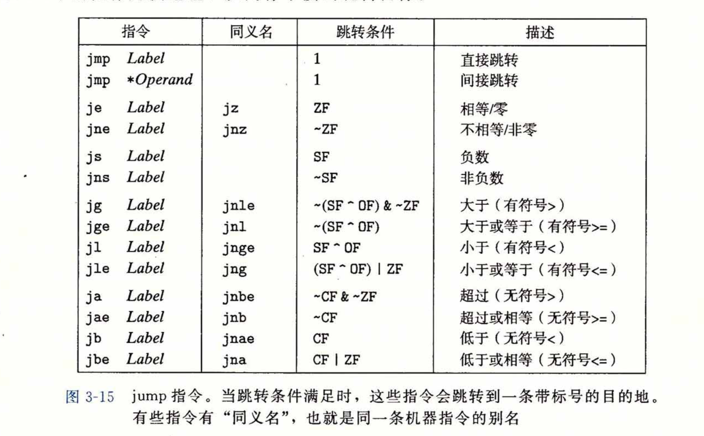
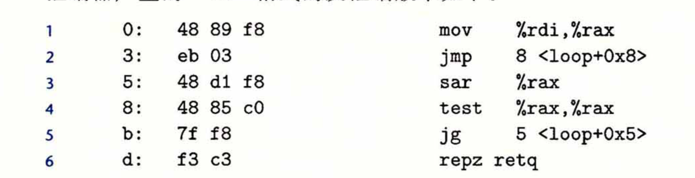

#### 1. 机器级代码

计算机系统使用了多种不同形式的抽象，利用简单的抽象模型来隐藏实现的细节。对于机器级编程来说，两种抽象尤为重要，一是由指令集体系结构货指令集架构(Instruction Set Architecture)来定义机器级程序的格式和行为，也定义了处理器状态，指令的格式，以及每条指令对状态的影响。第二种抽象是，机器级程序使用的内存地址是虚拟地址，提供的内存模型看上去像一个大数组。

在编译过程中，编译器完成大部分的工作，以C为例，它把C语言提供的相对抽象的执行模型转化为处理器执行的基本指令。汇编代码和二进制的机器码相比更具有可读性。

##### 2.1 操作数

大多数指令有一个或者多个操作数(operand)，指示除操作中使用的源数据以及目标位置。源数据可以是常数、寄存器中的数据或内存中的数据。结果可以防砸寄存器或内存中。因此操作数可以分为三种类型，第一立即数(immediate)也就是常数，以美元符开头，如\$0x1F。第二种是寄存器，他表示某个寄存器的内容，一般用$r_a$表示a寄存器，则$R[r_a]$表示寄存器的内容。第三种是内存操作数，它会根据计算出来的地址访问某个内存位置$M_b[Add]$，b表示长度。格式与操作数的值如下。


#### 2.2 数据传输指令

最简单的传送指令MOV，分别由movb、movw、movl和movq组成。这些指令执行同样的操作，区别在于操作数据大小不同。分别是1、2、4、8个字节。该指令的源操作数是一个立即数，存储在寄存器或者内存中，目的操作数制定一个位置，要么是一个寄存器要么是一个内存地址。x86-64加了一条限制，传送指令的两个操作数不能都指向内存的位置。这些指令的寄存器操作数可以是16个通用寄存器中的任意一个。如下案例

```assembly
 movl $0x4550,%eax Imm -> Reg 4bytes
 movw %bp,%bp Reg -> Reg 2bytes
 movb (%rd1,%rcx),%al Mem -> Reg 1byte
 movq %rax,-12(%rbp) Reg -> Mem 8bytes
```

movq只能以表示为32位补码立即数作为源操作数，然后把这个值扩展到64位放入目的位置。movabbsq指令能够将任意64位立即数作为源操作数，但只能以寄存器为目的。

还有两类指令是将较小的源辅助到较大的目的时使用，源数据可以是寄存器或内存中，而目的之能是寄存器。MOVZ类中指令是把目的中剩余的字节填充0，而MOVS是剩余的用符号位扩种。

movzbw 将做了零扩展的字节传送到字

movzbl 将做了零扩展的字节到双字

movzwl 将做了零扩展的字到双字

movzbq 将做了零扩展的字节传送到四字

movzwq 将做了零扩展的字传送到四字 

#### 2.3 入栈和出栈指令

栈是 内存中的某个区域，遵循先进后出的规则。pushq指令是把数据压入栈中，而popq指令是弹出数据。这两个指令都只有一个操作数。压入的数据源和弹出的数据目的。如将一个四字值压入栈中，pushq %rbp等价于

```assembly
subq $8，%rsp
movq %rbp,(%rsp)
```

弹出一个4字值，则需要对栈指针减8。当然栈中的元素可以向访问内存一样，假如栈顶元素是4字，则movq 8(%rsp), %rdx将栈中第二个元素复制到寄存器%rdx。

#### 2.4 算数和逻辑操作


位移量可以是一个立即数或者放在单字节寄存器%cl中。位移量是由%cl寄存器的低m位决定的，高位会被忽略，所以当%cl寄存器的值位0xFF时，指令salb会位移7位而salw会位移15位。sall会位移31位。逻辑位移填充0而算术位移填充符号位。

leaq指令实际上是movq的变形，如%rdx初始值位x，leaq 7(%rdx,%rdx,4),%rdx，最终%rdx终的值位5x+7。


除法和余数操作是通过一条指令完成。原文中应该是有处错误，商是放在%rax中，而余数是放在%rdx中的。

16个通用寄存器表


#### 2.5 条件控制

除了整数寄存器，CPU还有一组单个位的条件码寄存器，他们描述了最近的算数或者逻辑操作的属性。可以检测这些寄存器来执行条件分支指令，常见的条件码有：

CF：进位标志，最近的操作使得最高位产生了进位，用来检查无符号操作的溢出

ZF：零标志，最近操作的结果为0

SF：符号标志，最近的操作结果为负数

OF：溢出标志，最近的操作导致一个补码溢出，正溢出或负溢出

leaq指令不会改变任何条件码，因为它是用来进行地址计算的。除此之外3-10中的算数运算符都会改变条件码，比如xor进位标志和溢出标志会设置为0，位移操作将会把最后一个移出的位设置到进位标志上，而溢出标志设置为0。INC和DEC指令会设置溢出和零标志，但不会改变进位标志。还有两类指令只改变条件码而不改变其他寄存器。


CMP指令和SUB指令类似，如果两个操作数相等，则会将零标志设置为为1。其他标志位可以用来确定两个操作数之间的大小。TEST指令和AND指令类似。

条件码的获取一般是将件码组合，如a<b的表达式对应的指令

```assembly
cmpq %rsi,%rdi
setl %al
movzbl %al,%eax
```

setl作用是讲比较的结果放入%al寄存器中。movzbl指令会将%al中的值放入%eax的，高3字节清0，同时%rax的高4字节都清零。set类指令还有很多


#### 2.6. 跳转指令

跳转指令分为条件跳转和无条件跳转，无条件跳转是不参考条件码直接跳转至目标地址。条件跳转则需要参考条件码。



直接跳转指的是操作数Label是一个立即数，这里被称为标号，而间接跳转的操作数是寄存器中或者内存中的值。

跳转指令中的地址一般用相对地址来表示，即目标指令地址和当前指令结束位置的差值。

比如一下汇编代码

第二行机器吗中的跳转指令目标码是0x3，把它加5，就是跳转的地址。同理第五行中的0xf8是-8的补码，d-8 = 5就是跳转的地址。

#### 2.7  条件传送指令

条件传送指令有两个操作数，原寄存器或者内存地址和目的寄存器。指令取决于条件码，只有条件满足时，才会被复制到目的寄存器。源和目的的值可以是16、32或64位长。


条件传送指令也已实现条件分支，并且更适合流水线。流水线通过重叠连续指令来获取高性能。虽然条件跳转可通过分支预测逻辑来实现流水线，但毕竟预测失败将会有严重的惩罚。

#### 2.8 switch 语句

switch语句可以根据一个中枢索引值进行多重分支，它通过使用跳转表使得实现更加高效。跳转表是一个数组，元素是某个代码段的地址。与if-else相比，它执行的时间与数据量无关。