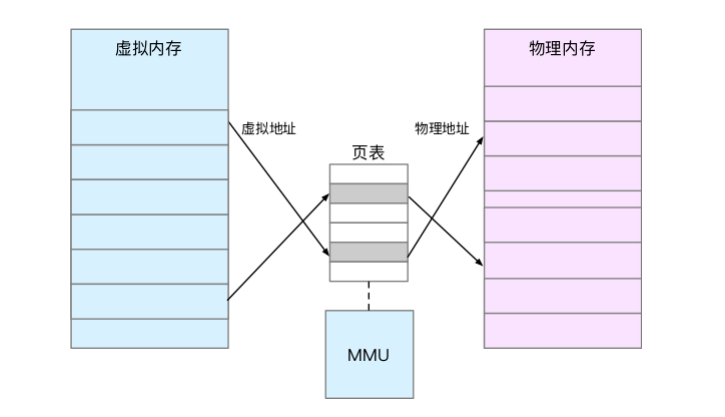

#### CPU寻址
内存通常被组织为一个由M个连续的字节大小的单元组成的数组，每个字节都有一个唯一的物理地址（Physical Address PA），作为到数组的索引。CPU访问内存最简单直接的方法就是使用物理地址，这种寻址方式被称为物理寻址。

现代处理器使用的是一种称为虚拟寻址（Virtual Addressing）的寻址方式。使用虚拟寻址，CPU需要将虚拟地址翻译成物理地址，这样才能访问到真实的物理内存。虚拟寻址需要硬件与操作系统之间互相合作。CPU中含有一个被称为内存管理单元（Memory Management Unit, MMU）的硬件，它的功能是将虚拟地址转换为物理地址。MMU需要借助存放在内存中的页表来动态翻译虚拟地址，该页表由操作系统管理。

#### 虚拟内存

Linux 内核给每个进程都提供了一个独立的虚拟地址空间，并且这个地址空间是连续的。这样，进程就可以很方便地访问内存，更确切地说是访问虚拟内存。

虚拟地址空间的内部又被分为内核空间和用户空间两部分，不同字长（也就是单个 CPU 指令可以处理数据的最大长度）的处理器，地址空间的范围也不同。比如最常见的 32 位和64 位系统,如下所示两张图来分别表示它们的虚拟地址空间：

32 位系统的内核空间占用 1G，位于最高处，剩下的 3G 是用户空间。而 64 位系统的内核空间和用户空间都是 128T，分别占据整个内存空间的最高和最低处，剩下的中间部分是未定义的。

进程在用户态时，只能访问用户空间内存；只有进入内核态后，才可以访问内核空间内存。虽然每个进程的地址空间都包含了内核空间，但这些内核空间，其实关联的都是相同的物理内存。这样，进程切换到内核态后，就可以很方便
地访问内核空间内存。既然每个进程都有一个这么大的地址空间，那么所有进程的虚拟内存加起来，自然要比实
际的物理内存大得多。所以，并不是所有的虚拟内存都会分配物理内存，只有那些实际使用的虚拟内存才分配物理内存，并且分配后的物理内存，是通过内存映射来管理的。

内存映射，其实就是将虚拟内存地址映射到物理内存地址。为了完成内存映射，内核为每
个进程都维护了一张页表，记录虚拟地址与物理地址的映射关系，如下图所示：

页表实际上存储在 CPU 的内存管理单元 MMU 中，这样，正常情况下，处理器就可以直
接通过硬件，找出要访问的内存。而当进程访问的虚拟地址在页表中查不到时，系统会产生一个缺页异常，进入内核空间分配物理内存、更新进程页表，最后再返回用户空间，恢复进程的运行。

TLB（Translation Lookaside Buffer，转译后备缓冲器） MMU 中页表的高速缓存。由于进程的虚拟地址空间是独立的，而 TLB 的访问速度又比 MMU 快得多，所以，通过减少进程的上下文切换，减少 TLB 的刷新次数，就可以提高 TLB 缓存的使用率，进而提高 CPU 的内存访问性能。

#### 页表

虚拟内存空间被组织为一个存放在硬盘上的M个连续的字节大小的单元组成的数组，每个字节都有一个唯一的虚拟地址，作为到数组的索引（这点其实与物理内存是一样的）。

操作系统通过将虚拟内存分割为大小固定的块来作为硬盘和内存之间的传输单位，这个块被称为虚拟页（Virtual Page, VP），每个虚拟页的大小为`P=2^p`字节。物理内存也会按照这种方法分割为物理页（Physical Page, PP），大小也为`P`字节。

CPU在获得虚拟地址之后，需要通过MMU将虚拟地址翻译为物理地址。而在翻译的过程中还需要借助页表，所谓页表就是一个存放在物理内存中的数据结构，它记录了虚拟页与物理页的映射关系。

页表是一个元素为页表条目（Page Table Entry, PTE）的集合，每个虚拟页在页表中一个固定偏移量的位置上都有一个PTE。下面是PTE仅含有一个有效位标记的页表结构，该有效位代表这个虚拟页是否被缓存在物理内存中。

https://sylvanassun.github.io/2017/10/29/2017-10-29-virtual_memory/