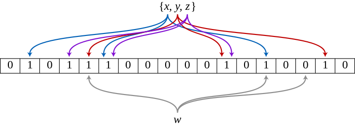

海量数据的过滤及去重，老生常谈的话题了。Bitmap和Bloom Filter是常见的结决办法。

Bitmap的思路很单纯，一条数据是否存在只需要一个Bit就可以表示，因此一个Byte可以表示8条数据的布尔值，为每一个可能出现的值分配一个bit，一般Bitmap用来解决某个数字是否存在，这个数字就是Index。在JDK中的实现为BitSet，底层实现为long数组。Bitmap不做过多介绍，原理实现比较通俗易懂。

Bitmap对于每一个可能的整型值，通过直接寻址的方式进行映射，相当于使用了一个哈希函数。那布隆过滤器就是引入了$k(k>1)$个相互独立的哈希函数，保证在给定的空间、误判率下，完成元素判重的过程。下图中是$k=3$时的布隆过滤器。

$x,y,z$经由哈希函数映射将各自在Bitmap中的3个位置置为1，判断$w$是否存在，仅当3个标志位都为1时，才表示w**可能**在集合中，否则一定不再集合中。图中所示的情况，布隆过滤器将判定w不在集合中。

当$k$个标志位都为1时为什么说是可能存在，这其实也好理解，比如从来没有插入过元素$a$，但是它对应的标志位已经被其他的元素置为1了，因此即使标志位全部为1，也不能说明该元素存在。当插入一个元素时它的标志位已经全部为1的概率成为错误率。

假设$m$是该bit数组的大小，$k$是哈希函数的个数，$n$是插入的元素的个数，hash函数以等概率条件选择并设置bit位为$1$，其概率为$\frac 1m$，因此bit数组中某一特定的位在进行元素插入时的hash操作中没有被置为1的概率是$1− \frac{1}{m}$。

在经过k个哈希函数之后，该位仍然没有被全部置1的概率是：$(1 - \frac{1}{m})^k$

若插入了n个元素，该没有被置1的概率是：$(1 - \frac{1}{m})^{kn}$

那么该位置为1的概率为：$1-(1 - \frac{1}{m})^{kn}$

现在检测某一元素是否在该集合中，则表明需要判断是否所有hash值对应的位都置1，但是该方法可能会错误的认为原本不在集合中的元素是在Bloom Filter中的，即导致误判率的发生，其概率为：$(1-(1 - \frac{1}{m})^{kn})^k$

这里使用极限公式$\lim_{x \to \infty}{(1- \frac{1}{x})^{-x}}=e$，m一般至少都是亿级别，近似的看做无穷大，最终简化的公式为：$(1 - e^{-\frac {kn}{m}})^k$

至于最优解推导就不装了，因为我实在是推不出来😂。这里贴一张误差表，使用的时候好心里有个数。

| *m*/*n* | *k*  | *k*=1  | *k*=2  | *k*=3  | *k*=4  | *k*=5   | *k*=6   | *k*=7   | *k*=8   |
| ------- | ---- | ------ | ------ | ------ | ------ | ------- | ------- | ------- | ------- |
| 2       | 1.39 | 0.393  | 0.400  |        |        |         |         |         |         |
| 3       | 2.08 | 0.283  | 0.237  | 0.253  |        |         |         |         |         |
| 4       | 2.77 | 0.221  | 0.155  | 0.147  | 0.160  |         |         |         |         |
| 5       | 3.46 | 0.181  | 0.109  | 0.092  | 0.092  | 0.101   |         |         |         |
| 6       | 4.16 | 0.154  | 0.0804 | 0.0609 | 0.0561 | 0.0578  | 0.0638  |         |         |
| 7       | 4.85 | 0.133  | 0.0618 | 0.0423 | 0.0359 | 0.0347  | 0.0364  |         |         |
| 8       | 5.55 | 0.118  | 0.0489 | 0.0306 | 0.024  | 0.0217  | 0.0216  | 0.0229  |         |
| 9       | 6.24 | 0.105  | 0.0397 | 0.0228 | 0.0166 | 0.0141  | 0.0133  | 0.0135  | 0.0145  |
| 10      | 6.93 | 0.0952 | 0.0329 | 0.0174 | 0.0118 | 0.00943 | 0.00844 | 0.00819 | 0.00846 |

数据来源：http://pages.cs.wisc.edu/~cao/papers/summary-cache/node8.html

Bitmap一般当作BitArray/BitSet来使用，一般键值为Index，因此比较试用密集的数据，并且key为整数类型。而Bloom Filter经过多个Hash，占用了多个Bit，在内存占用上没有优势，但是它的键可以是任意值，且无关密集稀疏。

