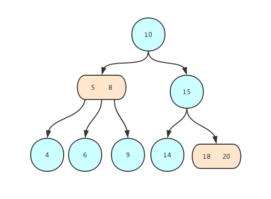
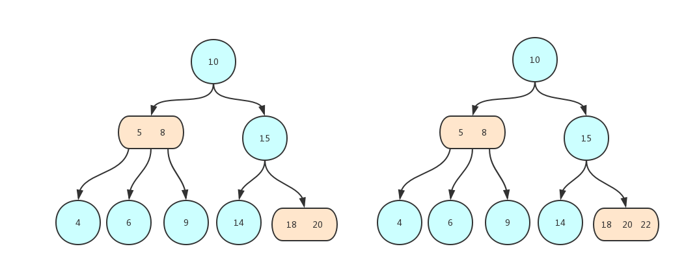
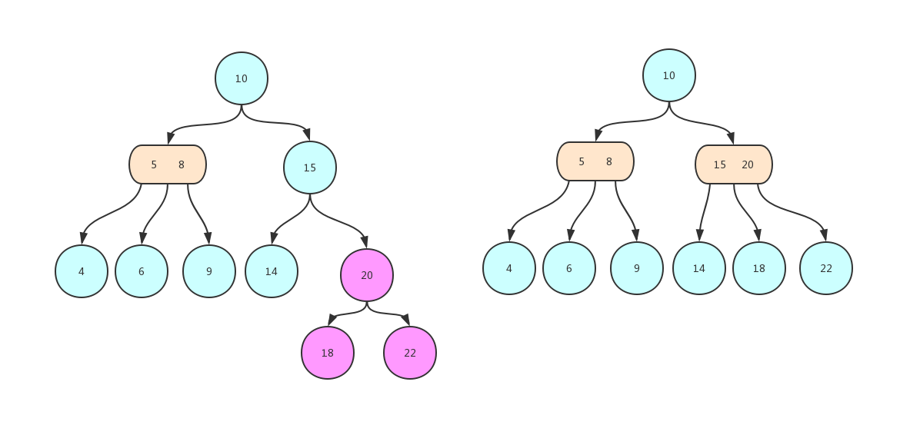
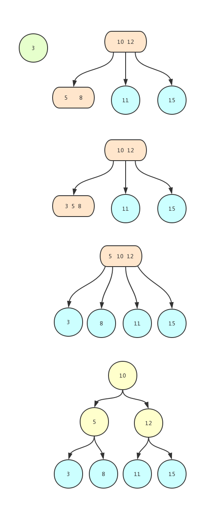
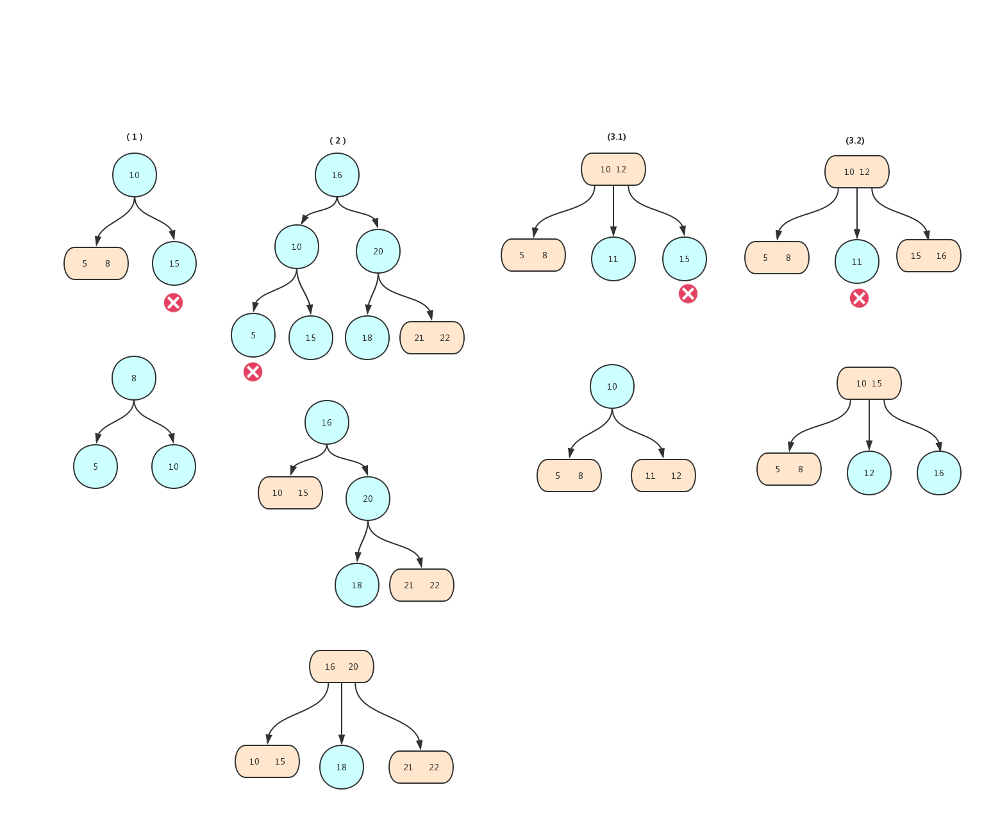

#### 2-3树
二叉搜索树的高度不确定，可能导致低查询效率，AVL尽管树相对平衡但是插入删除带来的较高的调整复杂度。2-3树尝试通过绝对平衡来寻找突破口，实际上是它具有较高的插入复杂度和实现复杂度，实际应用并不广泛。
但2-3树衍生的红黑树在很多底层源码中都有应用。
#### 2-3树的定义及概念
一颗2-3查找树或一颗空树由以下结点组成：
 - `2-结点`，包含一个键，以及左右两个链接，分别指向的2-3树的键都小于/大于该结点，与二叉搜索树的普通结点相同。
 - `3-结点`，包含两个键，和三个链接，左边的键小于右边的键，左链接指向的树(结点)小于左键，中间链接指向的树大于左键并且小于右键。右链接指向的树大于右键。

 2-3树的叶子结到根结点的距离相同，也就是说它平衡的。如下例子：
 
#### 2-3树的查找
查找操作和二叉搜索树类似，从根结点开始比较，只不过遇到`3-结点`需要做两次比较来找到合适的链接。
#### 2-3树的插入
和二叉搜索树相同，`2-3树`的元素插入也需要找到合适的叶子结点，只不过二叉搜索树讲新的结点挂在了叶子结点的下面，而`2-3树`则需要和叶子结点进行融合，然后在进行调整操作。
所谓的融合说白了就是将`2-结点`变为`3-结点`,`3-结点`变为`4-结点`。
>4-结点：插入时用来调整平衡的临时结点，它含有三个键(及其对应的值)和四条链接，四条链接代表了从小到大的四个范围，这四个范围用三个键切分开。

因此也就有插入的元素查找到的叶子结点为`2-结点`和`3-结点`两种情况,定义中描述只能有`2-结点`和`3-结点`存在，为什么会出现`4-结点`呢？不要急继续往下看。

##### 向2-结点插入
当查找未命中结束于`2-结点`处时情况比较简单，比如插入`3元素`，我们找到了键值为4的结点，只需将`2-结点`变为`3-结点`即可。
 
##### 向3-结点插入
当查找未命中结束于`3-结点`处时，如果我们将键值映射融合到其中就会变成一个`4-结点`。

 形成的4-结点在`2-3树`中是不允许的，所以要进行分解。将这个4-结点(小、中、大)分解成两个2-子结点(小和大)和一个它们的父结点(中)，但是这又增加了树的高度，使得整个树不平衡，
 因此还需要将中键结点融入到父结点中，如果父结点为`2-结点`，那么直接融入，如果父结点为`3-结点`，先暂时融入形成`4-结点`，，直到融合到一个`2-结点`或者将根结点也分解了,这个时候是整棵树的高度提升。先看一个简单的例子

再来看一个稍微复杂的一个例子：

如果根结点变为了`4-结点`，需要分解为3个`2-结点`，使得树的高度增加。同时也保持了树的平衡。
通过插入结点和标准的二叉查找树由上向下生长不同，2-3树的生长是由下向上的。
#### 删除操作
删除操作再很多书中都没有介绍，其过程虽然情况复杂，但都是有规律可循。

删除键可以分为两种
- 键在叶子结点
- 键在非叶子结点

删除叶子结点中的键又可以分为两类，叶子结点是`3-结点`和`2-结点`，前者比较容易，直接去键，变为`2-结点`。如果键在`2-结点`中将结点删除，此时树肯定不满足2-3树的性质，这时候需要根据其父结点和兄弟结点的情况来决定，
1. 父结点为`2-结点`，兄弟结点为`3-结点`，将兄弟结点拆分，和父结点形成高度为2的二叉树，见下图中(1)。
2. 父结点为`2-结点`，兄弟结点为`2-结点`，将父结点与兄弟结点合并，将合并后的结点看成当前结点，后续的操作需要判断父结点和兄弟结点，重复从1开始判断。
3. 父结点为`3-结点`，可以分为两类：
    (1).兄弟结点不全是`3-结点`，意思是两个兄弟结点至少有一个`2-结点`，这种情况向下移动一个父键与`2-结点`的兄弟融合形成`3-结点`,见(3.1)。
    (2).兄弟结点全是`3-结点`，意思是除了删除的键在`2-结点`中，其他兄弟结点都是`3-结点`，这种情况向下移动一个父键，向上移动一个兄弟键。图中(3.2)，

删除非叶子结点中的键，使用中序遍历找到待删除键的后继键，然后将后继节键移到删除键的位置，此时就将问题转化为删除结点为叶子结点

#### 2-3-4树
2-3-4树只是在2-3树的基础上进行了扩展。2-3-4树的优势在于能尽量存放多的数据元素，而且树的高度还能尽量地低。不好的地方就是由于节点类型的多样，导致操作起来更加复杂。具有如下性质：

1.任一节点只能是1、2、3个key，对应的子节点为2个子节点或3个子节点或4个子节点；
2.所有叶子节点到根节点的长度一致；
3. 每个节点的key从左到右保持了从小到大的顺序，两个key之间的子树中所有的key一定大于它的父节点的左key，小于父节点的右key，对于3个key的节点，两两key之间也是如此。

2-3-4树的查询、插入和删除和2-3树基本一样，需要明确的一点是2-3树也属于2-3-4树，因为2-3树满足2-3-4的所有性质。
#### 2-3树总结
和标准的二叉查找树由上向下生长不同，2-3树的生长是由下向上的。和标准的二叉查找树由上向下生长不同，2-3树的生长是由下向上的。2-3 树在最坏的情况下仍有较好的性能。每个操作中处理每个节点的时间都不会超过一个很小的常数，且这两个操作都只会访问一条路径上的节点，所以任何查找或者插入的成本都不会超过对数级别。
其缺点是实现困难，主要表现在对不同结点的状态的表示、树的平衡维护、删除的复杂度较高，实际应用场景也很少，但是可以通过一种跟容易实现的方式红黑树来表示代替它，学习2-3树也有助我们更好的去理解红黑树。