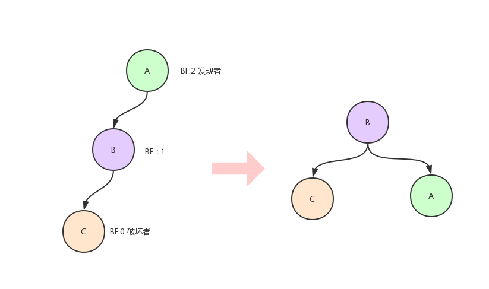
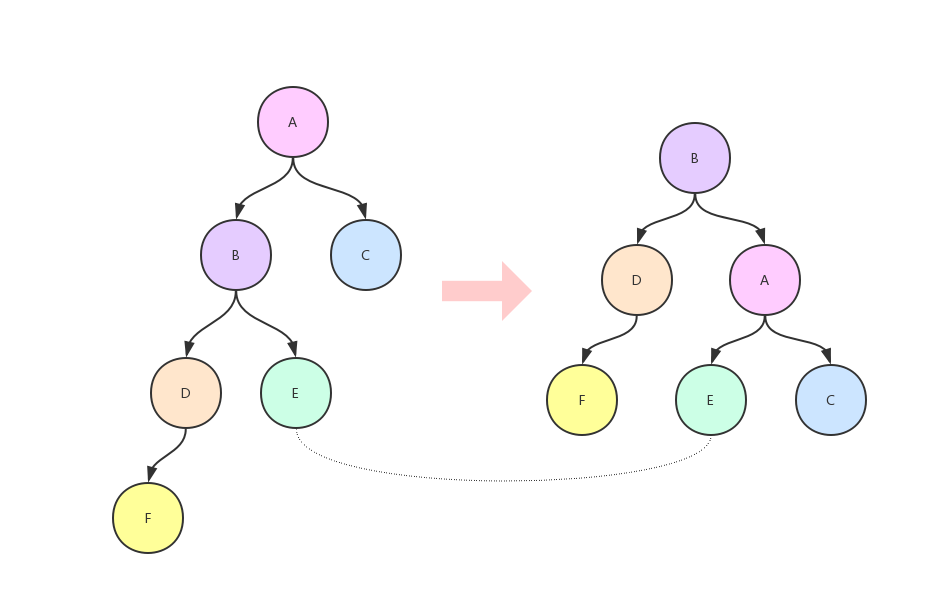
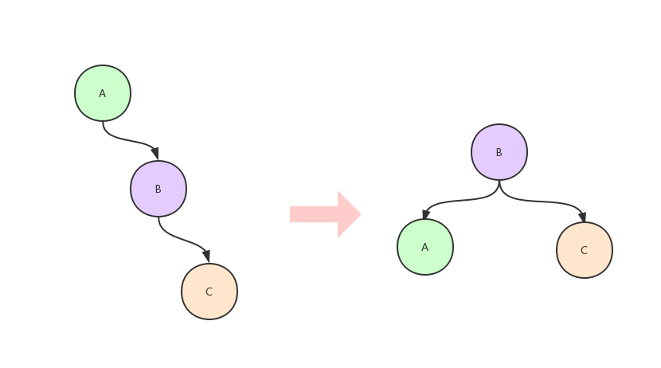
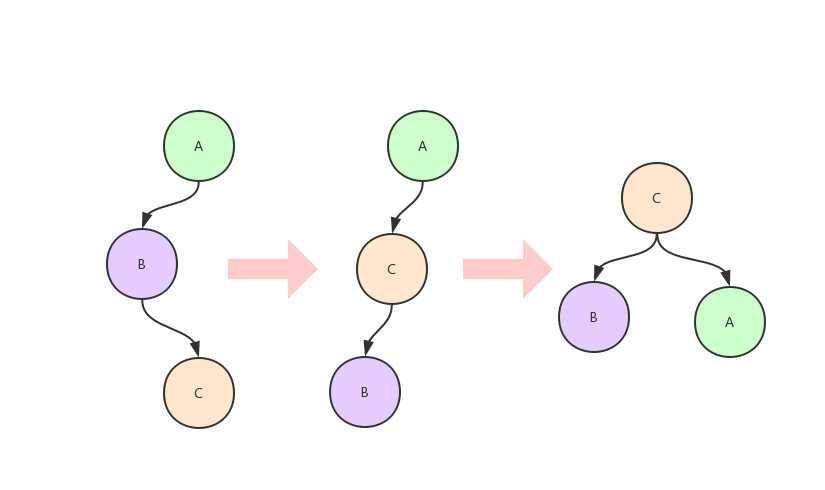
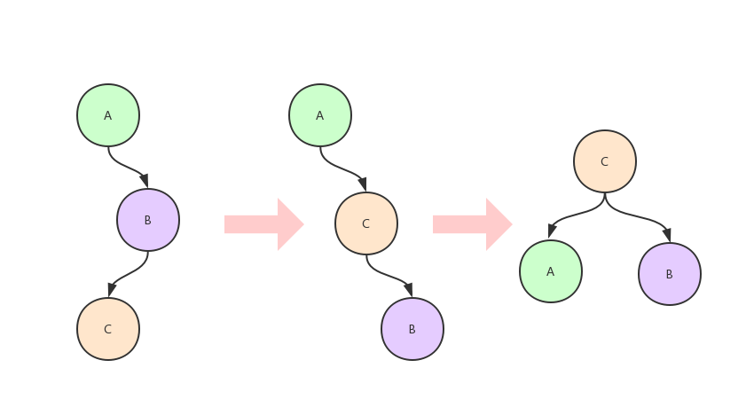

**二叉搜索树中查找和插入、删除的操作取决于树的高度，而树的高度又有不确定性，因此需要尽量让树平衡一些，即避免出现线性结构，因此出现了平衡二叉树。**

#### 定义
平衡二叉树也叫自平衡二叉搜索树（Self-Balancing Binary Search Tree）或者AVL树(提出者名字)，其本质也是一颗二叉搜索树，不过为了限制左右子树的高度差，避免出现倾斜树等偏向于线性结构演化的情况，所以对二叉搜索树中每个结点的左右子树作了限制，**左右子树的高度差称之为平衡因子**，树中每个结点的平衡因子绝对值不大于1，此时二叉搜索树称之为平衡二叉树。

自平衡是指，在对平衡二叉树执行插入或删除结点操作后，可能会导致树中某个结点的平衡因子绝对值超过 1，即平衡二叉树变得“不平衡”，为了恢复该结点左右子树的平衡，此时需要对结点执行旋转操作。

 - 最小不平衡子树：距离插入结点最近的，且平衡因子的绝对值大于1的结点为根的子树
 - 发现者：最小不平衡子树的根结点
 - 破坏者：插入这个结点之后使得树不平衡的那个点。


#### 如何调整
对于任意一次插入所造成的不平衡，都可以简化为下述四种范型之一：
 - LL型
 - RR型
 - LR型
 - RL型
 
#### LL型失衡
LL型失衡指的是破坏者是发现者的左子树中左子结点。
下面是最简单的情况：

1. 发现者向右旋转，变为它的左子结点的右子结点,其右子树不变。将它的左子结点的右子树变为发现者的左子树。
2. 调整结点的高度，只有发现者和其左孩子的高度变化

看下面这个例子：


代码实现    
```java
// 入参node为发现者，返回值为顶替入参的node
public Node turnRight(Node node) {
    Node left = node.left;
    Node leftRight = left.right;
    left.right = node;
    node.left = leftRight;

    node.height = 1 + Math.max(height(node.left),height(node.right));
    left.height = 1 + Math.max(height(left.left),height(left.right));
    return left;
}
```
#### RR型失衡
RR型失衡指的是破坏者是发现者的右子树的右子结点。
这种情况和LL型类似，如下图

1. 发现者向左旋转
2. 调整结点高度

代码实现
```java
public Node turnLeft(Node node) {
    Node right = node.right;
    Node rightLeft = right.left;
    right.right = node;
    node.right = rightLeft;

    node.height = 1 + Math.max(height(node.left),height(node.right));
    right.height = 1 + Math.max(height(right.left),height(right.right));
    return right;
}
```
#### LR型失衡
LR型失衡指的是破坏者是发现者的左子树的右子结点
如下入所示：

1. 先对破坏者和其父结点进行左旋转，变成LL型；
2. 然后对发现者进行右旋转即可。

代码
```java
turnLeft(node.left)// node:失衡点
turnRigth(node)
```
#### RL型失衡
RL型失衡指的是破坏者是发现者的右子树的左子结点


1. 先对破坏者和其父结点进行右旋转，变成RR型；
2. 然后对发现者进行左转
#### 总结
关于插入、删除操作见完整代码[AVLTree.java](./src/main/java/io/four/AVLTree.java)，为了提高查询效率，AVL树早插入和删除上做了牺牲，
每次需要去判断是否平衡，如果失衡需要做出相应的调整。它的插入元素引发的调整的最坏时间复杂度为O(1)，删除引发的最坏时间复杂度为O(logN)，这正是AVL树的弊端所在。
2-3树、2-3-4树、红黑树都尝试对在二叉搜索树的基础上进行了改进，改进的思路可以大概理解为两种：
 - 使树完全平衡
这是2-3树和2-3-4树这两种结构尝试的方向。因为造成AVL树删除时“雪崩”的原因正是因为它所能容忍的这一点高度差，在高度差大量积累后，删除弱侧的结点，就会导致需要大量的调整才能恢复平衡。而如果完全消除高度差，就可以避免这种情况了。
然而实际的情况是这两种树的实现都算不上简单，而且反而使插入的调整行为的时间复杂度变为了O(logN)。
 - 容忍不平衡
红黑树的思路的核心是增大了可容忍的高度差，从而实现既保证查询效率（O(logN)），也保证了插入和删除后调整平衡的效率（O(1)）。
红黑树的查询效率（2 * O(logN)）是略低于AVL树（O(logN)）的，但是红黑树通过牺牲了少许查询效率，使插入删除后的调整效率达到了常数级别。
红黑树算法中的着色策略、对于父结点、叔结点、祖父结点等等结点的颜色判断、以及相应的调整策略都是经过极度抽象后的结果，因此想要从头到尾彻底理解红黑树的设计思想其实还是有些难度的（理解设计思想并非照着抽象好的五条规则照本宣科）

