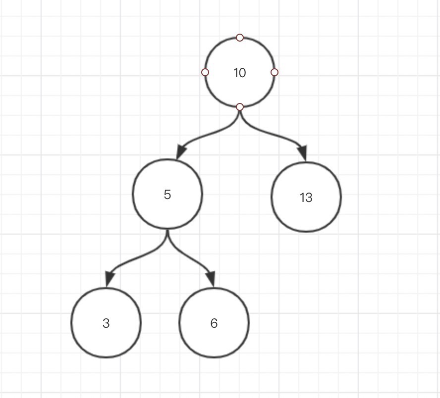
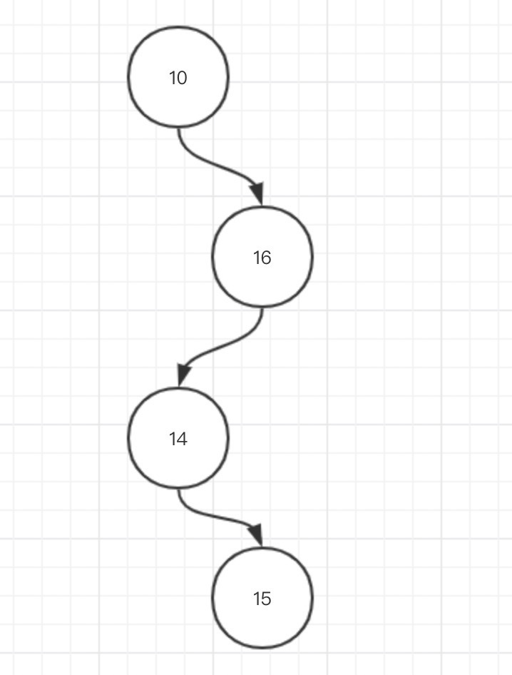
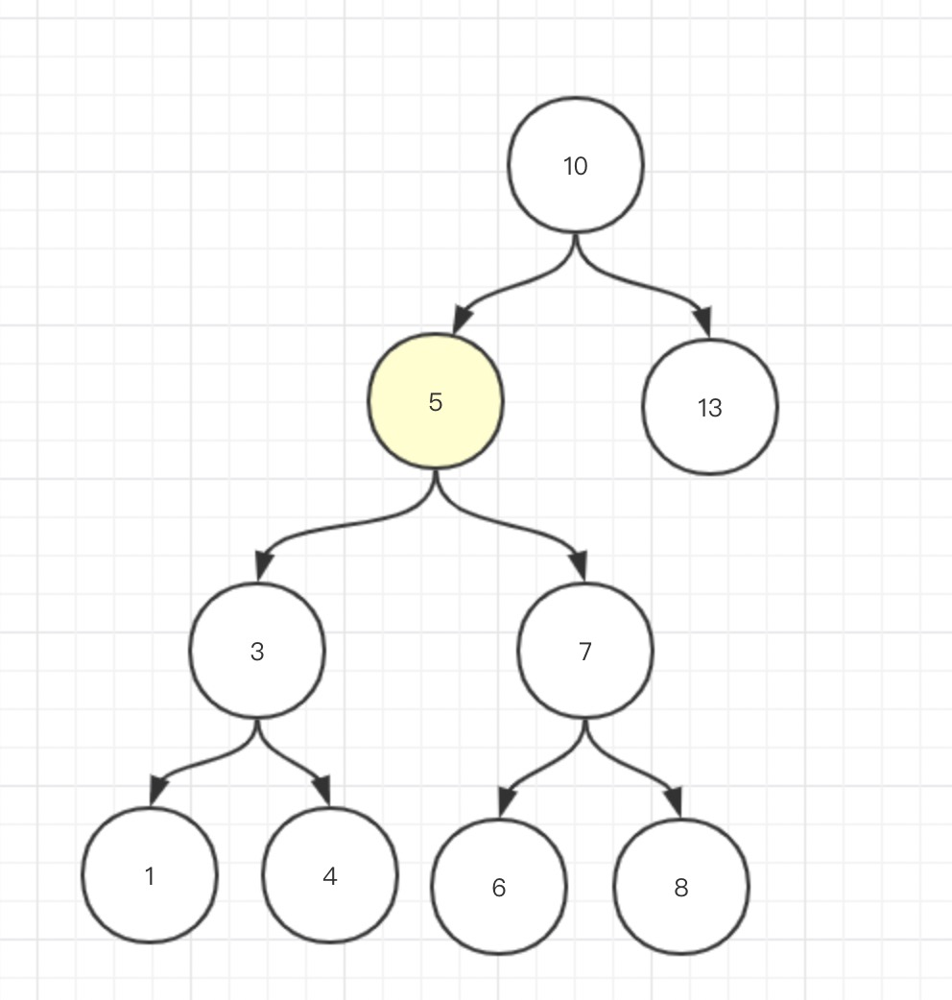

当用线性表作为表的组织形式时，可以有三种查找法。其中以二分查找效率最高。但由于二分查找要求表中结点按关键字有序，且不能用链表作存储结构，因此，当表的插入或删除操作频繁时，为维护表的有序性，势必要移动表中很多结点。这种由移动结点引起的额外时间开销，
因此需要一种有一种较高的插入和删除效率，并且具备较高的查找效率的数据结构，二叉排序因此产生。

#### 定义
二叉排序树，也称二叉搜索树（Binary Search Tree），是指一棵空树或者具有下列性质的二叉树：
 - 任意结点的左子树不空，则左子树上所有结点的值均小于它的根结点的值
 - 任意结点的右子树不空，则右子树上所有结点的值均大于它的根结点的值
 - 任意结点的左、右子树也分别为二叉查找树
 - 一般不存在相同的键值
示例：



观察二叉搜索树结构可知，查询每个结点需要的比较次数为结点深度加一。如深度为 0，结点值为 “10” 的根结点，只需要一次比较即可；深度为 1，结点值为 “5” 的结点，只需要两次比较。即二叉树结点个数确定的情况下，整颗树的高度越低，结点的查询复杂度越低。

二叉搜索树的两种极端情况：
1. 完全二叉树，所有结点尽量填满树的每一层，上一层填满后还有剩余结点的话，则由左向右尽量填满下一层。如上图BST所示，即为一颗完全二叉树
2. 每一层只有一个结点的二叉树,如下图



所以二叉搜索树的查询复杂度为 $O(log_2 n)$ ~ $O(n)$。

#### 添加元素
1. 如果根元素为空，创建一个元素设置为root
2. 如果要插入的元素比当前访问结点node小，而且node.left == null，就可以插入到node的左孩子那里
3. 如果要插入的元素比当前访问结点node大，而且node.right == null，就可以插入到node的右孩子那里；
4. 如果要插入的元素比当前访问结点node小，而且node.left != null，就递归的去左子树插入这个值；
4. 如果要插入的元素比当前访问结点node大，而且node.right != null，就递归的去右子树插入这个值；

```java
public BSTree add(E e) {
    if(root == null) {
        root = new Node(e);
    }
    add(root, e);
    return this;
}
private void add(Node node, E e) {
    int n = node.e.compareTo(e);
    if(n > 0) {
        if(node.left == null) {
            node.left = new Node(e);
        } else {
            add(node.left, e);
        }
    } else if(n < 0) {
        if(node.right == null) {
            node.right = new Node(e);
        } else {
            add(node.right, e);
        }
    }
    // 等于0不处理
}
```
#### 搜索查询
步骤和添加元素类似，从根结点开始，如果和当前结点相同，那么返回。如果小于当前结点递归右子树，如果大于递归左子树，遇到null结点结束。
```java
private Node search(Node node, E e) {
    if(node == null) {
        return null;
    }
    int n = node.e.compareTo(e);
    if(n == 0) {
        return node;
    } else if(n > 0) {
        return search(node.left, e);
    } else {
        return search(node.right, e);
    }
}
```
还有一些常用的查询比如寻找最小最大元素，一直递归左右孩子直到为null。
#### 删除最大最小结点
首先需要找到结点，然后判断结点是否是叶子结点，如果是直接删除。否则和他的孩子替换。注意最大最小结点只可能有一个子结点。
```java
public void removeMin() {
    root = removeMin(root);
}

private Node removeMin(Node node) {
    if (node.left == null) { //node is min
        Node rightNode = node.right;
        node.right = null;//cut
        return rightNode;
    }
    node.left = removeMin(node.left);
    return node;
}
```
#### 删除任意结点
相比之下删除操作稍微复杂一些，有三种情况
1. 如果是叶子结点，直接删除
2. 如果结点的度为1，删除之后将他的孩子和父亲连接即可
3. 如果结点的度为2，则有两种方式，用左子树的最大结点顶替当前结点或者用右子树的最小结点顶替当前结点。

如下图，删除标记的结点

```java
public void remove(E e) {
    root = remove(root, e);
}
private Node remove(Node node, E e) {
    if (node == null) return null;
    if (e.compareTo(node.e) < 0) {
        node.left = remove(node.left, e);
        return node;
    } else if (e.compareTo(node.e) > 0) {
        node.right = remove(node.right, e);
        return node;
    } else {
        if (node.left == null) {
            Node rightNode = node.right;
            node.right = null;
            return rightNode;
        }
        if (node.right == null) {
            Node leftNode = node.left;
            node.left = null;
            return leftNode;
        }
    
        Node successor = min(node.right); //找到右子树的最小结点
        successor.right = removeMin(node.right); //将successor.right设置成 原先结点node的右子树移除 successor之后的树
        successor.left = node.left;
        node.left = node.right = null;
        return successor; //返回新结点
    }
}
```
#### 总结

二叉搜索树的三种操作时间复杂度均为$O(log_2 n)$ ~ $O(n)$，与线性结构对比，二叉搜索树在插入和删除占优，查询以二分法为例$O(log_2 n)$,二叉搜索树劣与线性结构。

二叉树的搜索,删除，插入等效率取决于树的高度，前面也提到过，如果能调整树的高度树的高度那么就能降低操作复杂度。下篇介绍这种调整树高度的方式。

完整代码见: [BSTree.java](./src/main/java/io/four/BSTree.java)