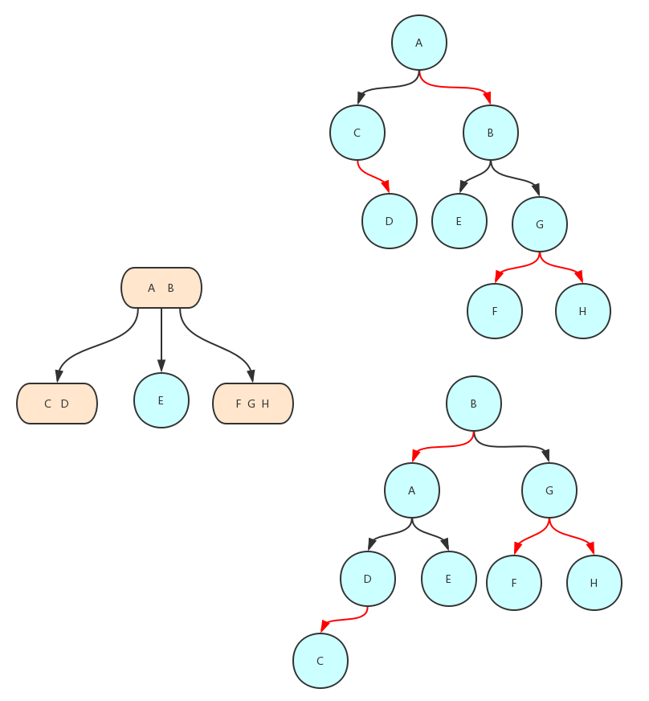
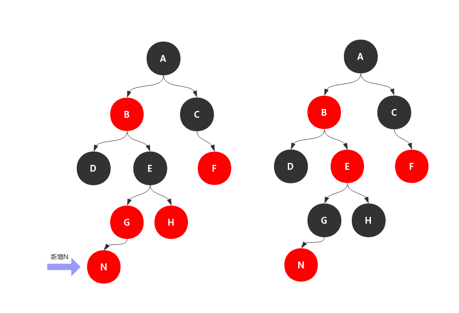
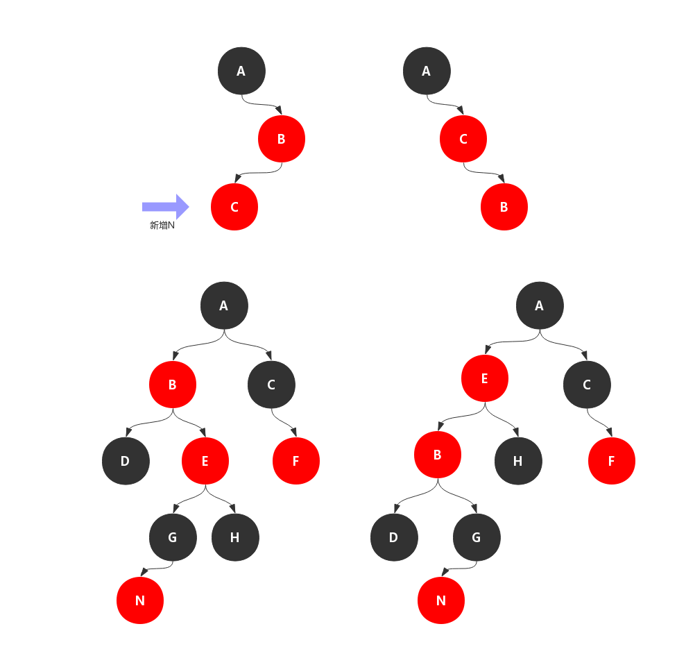
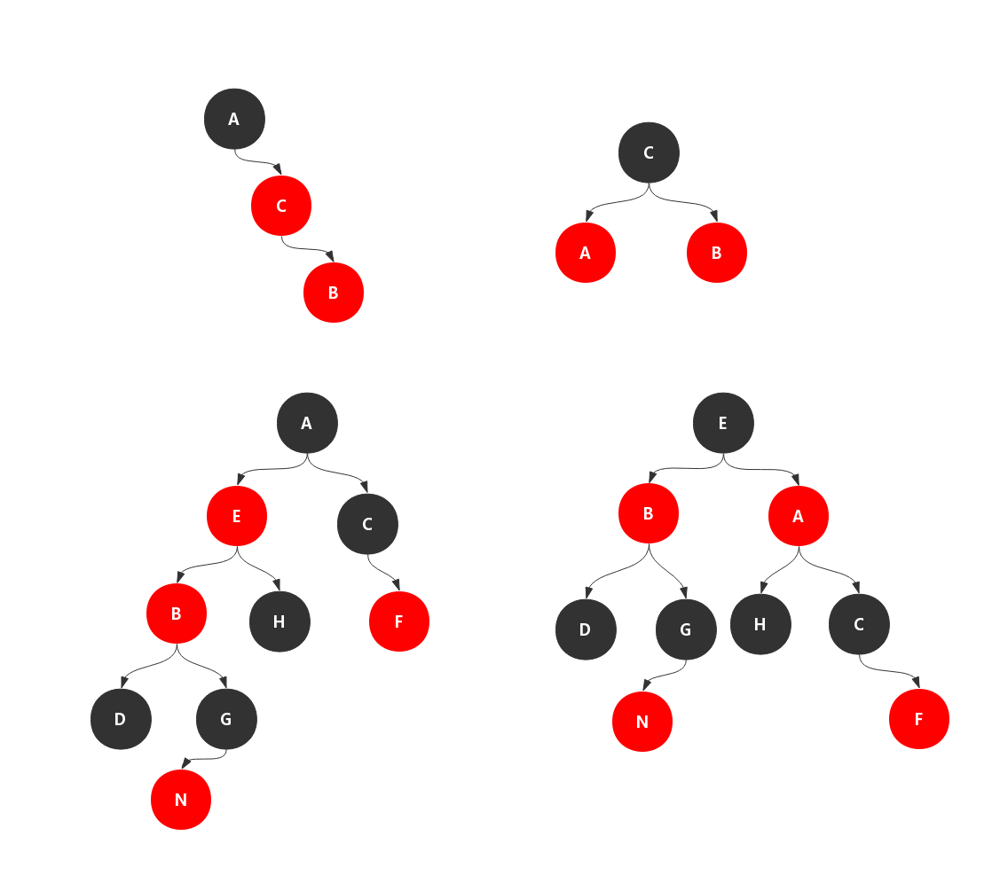
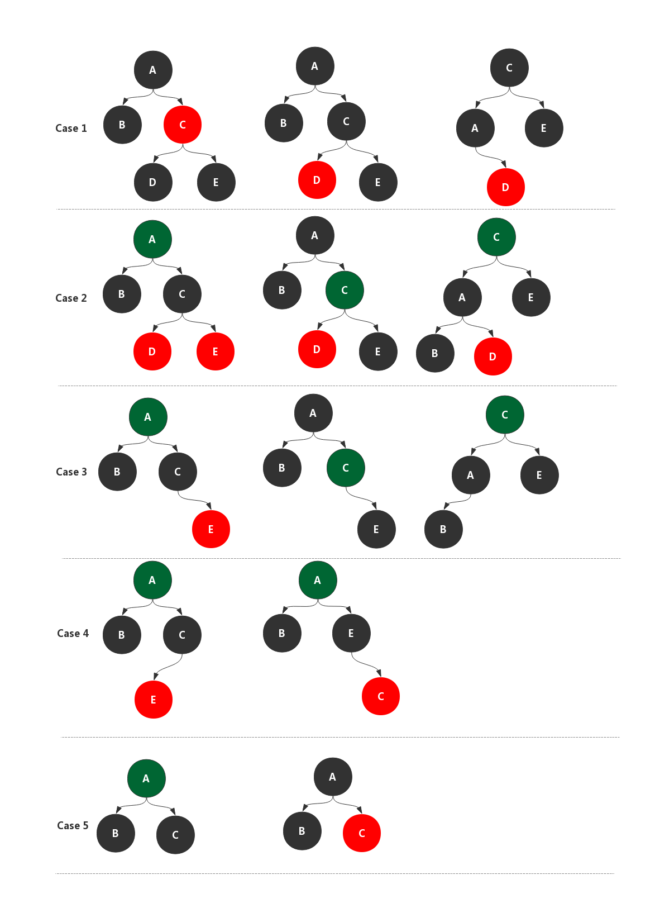

之前提到的自平衡二叉查找树，属于一种高度平衡的二叉查找树，对每个结点的平衡因子进行严苛的限制，所以 AVL 树能够提供 (log N) 的结点查询复杂度。也因为对每个结点的平衡因子限制较大，所以插入和删除结点时，需要进行很频繁的平衡调节操作。
接下来谈到了2-3树，2-3树属于自平衡的树，查找复杂度最差(全部是2-结点)是logN，但由于其实现复杂度较高，并且额外对多种结点的维护带来的消耗可能导致这里效率比二叉搜索树还要差，
但是基于二叉树来表示一颗2-3树，可以省去一些多种类型结点的开销，因此就有了红黑树。

> 《算法4》中用2-3树来引出了红黑树，2-3树对应的红黑树只是红黑树的一个子集，作者是在书中提到了"为了方便读者理解，少去了很多情况"。它有一个专门名称左倾红黑树。
> 而2-3树属于2-3-4树的一个子集，往往用2-3-4树来和红黑树来对应更加合适。

#### 2-3-4树和红黑树
如下图的2-3-4树，转化为下面两种类型的二叉树

可以看出，我们将3-结点和4-结点拆分，同时用红色的链接表示这查分出来的。之所以是两种是因为3-结点在拆分时，红链接有两种方向，注意拆分前3-结点的中链接将会归属于红色链接指向的一方。
为了更方便的实现，我们将红链接指向的结点表示为红色，当然也可以是绿色只是为了区分普通的结点，这就是红黑二叉查找树（下面简称红黑树）
接下通过2-3-4树来看红黑树的要求：
1. 结点是红色或者黑色；
2. 根结点是黑色；
3. 叶子结点是黑色；
4. 红色结点必须具有两个黑色子结点；
5. 从任一结点到其后代的叶子结点路径中包含相同个数的黑色结点。

叶子结点指的是最后的空结点，都指定为黑色的结点，第5条是最重要的一条性质，最主要的原因是2-3-4树是绝对平衡的，如果途中经过的是一个3-节和4-结点都是有一个黑色结点，经过的黑色结点的数量是一样多的，所以红黑树是保持"黑平衡"的二叉树，本质就是2-3-4树是绝对平衡的；
红黑树的查询和二叉搜索树没有什么区别，因此直接从插入结点开始讲起。
#### 二叉树的旋转
树的旋转在AVL树的文章中讲到过，分为左旋右旋，有一点需要声明下，旋转不是红黑树特有，二叉树都可以旋转。(图片来自维基百科)

#### 插入结点
插入新的结点需要先查询新结点的位置，终结于最下层的非空结点，另外插入的新结点统一为红色，这样轻易不会改变红黑树的高度，如果迫不得已则进行整体调整，也就是整体高度增加，正如2-3-4树的向上生长。
基于红黑树现有形状插入可分为一下几种情况。

- 情况1：插入的是根结点，原树是空树，此情况只会违反性质2，直接把此结点涂为黑色。
- 情况2：插入的结点的父结点是黑色，红黑树没有被破坏，直接加入。
- 情况3：当前结点的父结点是红色且祖父结点的另一个子结点（叔叔结点）是红色
将当前结点的父结点和叔叔结点涂黑，祖父结点涂红，把当前结点指向祖父结点，从新的当前结点重新开始算法，如果曾祖父结点是黑色，那么满足是红黑树的特性直接结束，否则以祖父结点作为当前结点开始匹配属于那种情况。

如上图所示，插入结点N的父节点和叔叔结点都为红色，根据情况3的指示，父结点和叔叔结点染黑，祖父结点染红。此时有可能破坏红黑树的性质，以祖父结点为当前结点，再判断破坏属于那种情景。
- 情况4：当前结点的父结点是红色,叔叔结点是黑色(空也为黑色)，若当前结点是LR型，那么将当前结点和父结点进行左旋。如果当前结点是RL型，则进行右旋转。可是旋转还是没有解决问题，性质4仍然不满足，需要在情况5中解决。

如上图所示，新加入的结点N属于RL型，所谓的RL就是它的父亲是右结点，自身是左结点，在AVL树中，RL或者LR型失衡需要两次旋转，红黑树中也类似，需要将相连的红结点转化为RR或者LL型，然后在进行情况5的。
-  情况5：当前结点的父结点是红色,叔叔结点是黑色，若当前结点是LL型，那么将父结点变为黑色，祖父结点变为红色，父节点进行右旋。若当前结点是RR型，那么将还是将父节点变为黑色，祖父结点变为红色，进行右旋。

#### 删除结点
删除操作相对插入会复杂一些，和二叉搜索树的删除类似，只是红黑树的删除多了一步修复的过程。因为黑色结点的缺失导致了红黑树的性质不能满足。下面将删除操作分为删除和修复过程。
##### 删除
通过待删除结点的子结点个数分为三类
1. 待删除结点是叶子结点(非NULL结点)，通过颜色又可以分为红色和黑色
 1.1 如果待删除的结点是红色叶子结点，那么直接删除，不需要额外的操作
 1.2 如果待删除的结点是黑色叶子结点，这种情况需要修复，下面分析

2. 待删除结点只有一个叶子结点，注意这种情况只有一种可能，即该结点是黑色，叶子结点是红色，并且无孙结点。这种情况只需将子节点和待删除结点的值交换，然后删除子结点，这样就转化成了1.1的情况。

3. 待删除结点只有两个叶子结点，将待删除的结点的值和后继结点互换，转化为后继结点的删除，而后继节点只可能是以下两种情况：
    3.1 后继结点为叶子结点，这时变为了情况1
    3.2 后继结点有一个叶子结点，成为情况2
    
通过上面的分析，可以看出对于结点的删除最终都转化为了情况1，而需要修复的只有1.1情况，即最终要删除的结点是黑色叶子结点。
##### 修复
修复是针对最终删除的结点为黑色，所谓的修复简单的说就是删除黑色结点之后尽量通过局部的调整使得局部的平衡，并且使得BH恢复至删除前的BH。如果局部不能恢复的之前的BH，在进行递归调整。下面以删除结点为左结点边为例。
调整修复取决于兄弟结点以及侄子结点，因此可以分为两大类，兄弟结点为红色和黑色。
#### 兄弟结点为红色
兄弟结点为红色，根据红黑树的性质，兄弟结点有两个黑色子结点，删除了左边的黑色结点，导致左边高度降低，因此向左旋转。

为了维持与之前的BH相同需要兄弟结点变为黑色和左侄子变为红色。当然也可以旋转之后再染色，但是旋转之前的改色编码更方便。修复之后达到局部平衡，并且BH和删除前相同都为2，因此修复完成。
#### 兄弟结点为结点为黑色
兄弟结点为黑色时，侄子结点可能有可能没有，若有侄子结点一定是红色。因此分为四种情况,其中绿的的结点表示可以为红或者黑。
1.兄弟结点为黑色，有左右侄子都为红色结点，将父节点的颜色赋予兄弟结点，同时将父节点染黑，右侄子染黑，以兄弟结点向左旋转。
2.兄弟结点为黑色，只有右侄子为红色结点，将父节点的颜色赋予兄弟结点，同时将父节点染黑，右侄子染黑，以兄弟结点向左旋转。
3.兄弟结点为黑色，只有左侄子为红色结点，首先将左侄子染为黑色右旋，将兄弟结点染黑，转化为情况2。
4.兄弟结点为黑色，没有侄子结点，将父节点染黑，兄弟结点染红，注意之前删除之前BH为2，而删除之后变为了1，因此即使局部已经平衡，但是不能恢复至之前的BH，将父结点当作当前结点递归。

注意只有最后一种情况是需要向上递归的，其他情况在局部就可以把修复完毕，递归过程是把父结点当作当前结点。再看是这五种中的哪种情况，再进行对应的调整，这样一直向上，直到新的起始点为根节点或者关注节点不为黑色。

#### 总结
红黑树之所以应用广泛，是因为它和其他树相比既有不错的查找性能，还有不错的插入删除效率。其中相对难理解的是删除操作和插入操作。主要是
