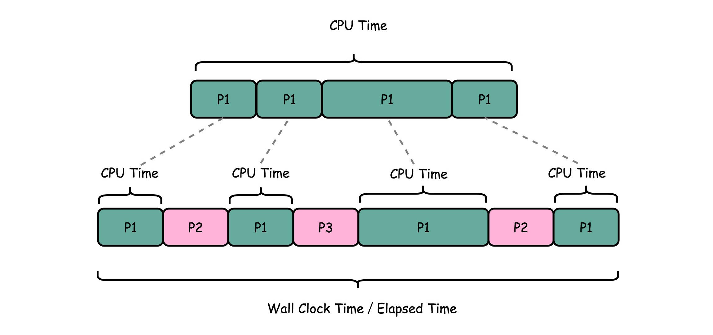

#### 1. 性能
我们主要有两个指标衡量性能。

- 第一个是响应时间（Response time）或者叫执行时间（Execution time）。想要提升响应时间这个性能指标，你可以理解为让计算机“跑得更快”。
- 第二个是吞吐率（Throughput）或者带宽（Bandwidth），想要提升这个指标，你可以理解为让计算机“搬得更多”。
  

响应时间指的就是，我们执行一个程序，到底需要花多少时间。花的时间越少，自然性能就越好。 而吞吐率是指我们在一定的时间范围内，到底能处理多少事情。这里的“事情”，在计算机里就是处理的数据或者执行的程序指令。

如果我们的响应时间短，跑得快，我们可以来回多跑几趟多搬几趟。所以说，缩短程序的响应时间，一般来说都会提升吞吐率。

除了缩短响应时间，我们还可以多找几个人一起来搬，这就类似现代的服务器都是 8 核、16 核的。人多力量大，同时处理数据，在单位时间内就可以处理更多数据，吞吐率自然也就上去了。
一般把性能，定义成响应时间的倒数，也就是：

`性能 = 1/ 响应时间`
####2. CPU 时钟
记录程序运行结束的时间减去程序开始运行的时间。这个时间也叫 Wall Clock Time 或者 Elapsed Time，就是在运行程序期间，挂在墙上的钟走掉的时间。 计算机可能同时运行着好多个程序，CPU 实际上不停地在各个程序之间进行切换。在这些走掉的时间里面，很可能 CPU 切换去运行别的程序了。而且，有些程序在运行的时候，可能要从网络、硬盘去读取数据，要等网络和硬盘把数据读出来，给到内存和 CPU。所以说，要想准确统计某个程序运行时间，进而去比较两个程序的实际性能，我们得把这些时间给刨除掉。

**程序实际花费的 CPU 执行时间（CPU Time），就是 user time 加上 sys time**。程序实际占用的 CPU 时间一般比 Elapsed Time 要少不少。

**即使我们已经拿到了 CPU 时间，我们也不一定可以直接“比较”出两个程序的性能差异**。即使在同一台计算机上，CPU 可能满载运行也可能降频运行，降频运行的时候自然花的时间会多一些。

除了 CPU 之外，时间这个性能指标还会受到主板、内存这些其他相关硬件的影响。所以，我们需要对“时间”这个我们可以感知的指标进行拆解，把程序的 CPU 执行时间变成 CPU 时钟周期数（CPU Cycles）和 时钟周期时间（Clock Cycle）的乘积。

`程序的 CPU 执行时间 =CPU 时钟周期数×时钟周期时间`

而在 CPU 内部有一个叫晶体振荡器（Oscillator Crystal）的东西，简称为晶振。我们把晶振当成 CPU 内部的电子表来使用。晶振带来的每一次“滴答”，就是时钟周期时间。

 2.8GHz，我们可以先粗浅地认为，CPU 在 1 秒时间内，可以执行的简单指令的数量是 2.8G 条。

如果想要更准确一点描述，这个 2.8GHz 就代表，我们   CPU 的一个“钟表”能识别出来的最小的时间间隔。就像我们挂在墙上的挂钟，都是“滴答滴答”一秒一秒地走，所以通过墙上的挂钟能够识别出来的最小时间单位就是秒。

简单的提升性能方案，自然缩短时钟周期时间，也就是提升主频。换句话说，就是换一块好一点的 CPU。，这个是我们这些软件工程师控制不了的事情，所以我们就把目光挪到了乘法的另一个因子——CPU 时钟周期数上。如果能够减少程序需要的 CPU 时钟周期数量，一样能够提升程序性能。

对于 CPU 时钟周期数，我们可以再做一个分解，把它变成“指令数×**每条指令的平均时钟周期数**（Cycles Per Instruction，简称 CPI）”。不同的指令需要的 Cycles 是不同的，加法和乘法都对应着一条 CPU 指令，但是乘法需要的 Cycles 就比加法要多，自然也就慢。在这样拆分了之后，我们的程序的 CPU 执行时间就可以变成这样三个部分的乘积。

程序的 CPU 执行时间 = 指令数×CPI×Clock Cycle Time

因此，如果我们想要解决性能问题，其实就是要优化这三者。

1. 时钟周期时间，就是计算机主频，这个取决于计算机硬件。我们所熟知的[摩尔定律](https://zh.wikipedia.org/wiki/摩尔定律)就一直在不停地提高我们计算机的主频。比如说，我最早使用的 80386 主频只有 33MHz，现在手头的笔记本电脑就有 2.8GHz，在主频层面，就提升了将近 100 倍。
2. 每条指令的平均时钟周期数 CPI，就是一条指令到底需要多少 CPU Cycle。在后面讲解 CPU 结构的时候，我们会看到，现代的 CPU 通过流水线技术（Pipeline），让一条指令需要的 CPU Cycle 尽可能地少。因此，对于 CPI 的优化，也是计算机组成和体系结构中的重要一环。
3. 指令数，代表执行我们的程序到底需要多少条指令、用哪些指令。这个很多时候就把挑战交给了编译器。同样的代码，编译成计算机指令时候，就有各种不同的表示方式。

#### 3. 并行优化，理解阿姆达尔定律

从奔腾 4 开始，Intel 意识到通过提升主频比较“难”去实现性能提升，边开始推出 Core Duo 这样的多核 CPU，通过提升“吞吐率”而不是“响应时间”，来达到目的。

并不是所有问题，都可以通过并行提高性能来解决。如果想要使用这种思想，需要满足这样几个条件。

第一，需要进行的计算，本身可以分解成几个可以并行的任务。

第二，需要能够分解好问题，并确保结果能够汇总到一起。

第三，在“汇总”这个阶段，是没有办法并行进行的，还是得顺序执行，一步一步来。

这就引出了我们在进行性能优化中，常常用到的一个经验定律，**阿姆达尔定律**（Amdahl’s Law）。这个定律说的就是，对于一个程序进行优化之后，处理器并行运算之后效率提升的情况。具体可以用这样一个公式来表示：

`优化后的执行时间 = 受优化影响的执行时间 / 加速倍数 + 不受影响的执行时间`