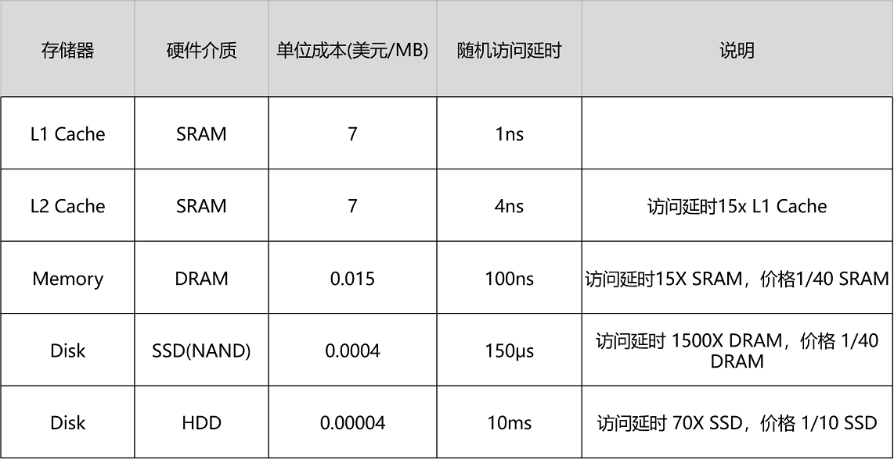

[toc]

#### SRAM

SRAM 之所以被称为“静态”存储器，是因为只要处在通电状态，里面的数据就可以保持存在。而一旦断电，里面的数据就会丢失了。在 SRAM 里面，一个比特的数据，需要 6～8 个晶体管。所以 SRAM 的存储密度不高。同样的物理空间下，能够存储的数据有限。不过，因为 SRAM 的电路简单，所以访问速度非常快。

在 CPU 里，通常会有 L1、L2、L3 这样三层高速缓存。每个 CPU 核心都有一块属于自己的 L1 高速缓存，通常分成**指令缓存**和**数据缓存**，分开存放 CPU 使用的指令和数据。

L2 的 Cache 同样是每个 CPU 核心都有的，不过它往往不在 CPU 核心的内部。所以，L2 Cache 的访问速度会比 L1 稍微慢一些。而 L3 Cache，则通常是多个 CPU 核心共用的，尺寸会更大一些，访问速度自然也就更慢一些。

####DRAM

内存用的芯片和 Cache 有所不同，它用的是一种叫作**DRAM**（Dynamic Random Access Memory，动态随机存取存储器）的芯片，比起 SRAM 来说，它的密度更高，有更大的容量，而且它也比 SRAM 芯片便宜不少。

从 Cache、内存，到 SSD 和 HDD 硬盘，一台现代计算机中，就用上了所有这些存储器设备。其中，容量越小的设备速度越快，而且，CPU 并不是直接和每一种存储器设备打交道，而是每一种存储器设备，只和它相邻的存储设备打交道。比如，CPU Cache 是从内存里加载而来的，或者需要写回内存，并不会直接写回数据到硬盘，也不会直接从硬盘加载数据到 CPU Cache 中，而是先加载到内存，再从内存加载到 Cache 中。

**这样，各个存储器只和相邻的一层存储器打交道，并且随着一层层向下，存储器的容量逐层增大，访问速度逐层变慢，而单位存储成本也逐层下降，也就构成了我们日常所说的存储器层次结构。**

存储器在不同层级之间的性能差异和价格差异，都至少在一个数量级以上。

