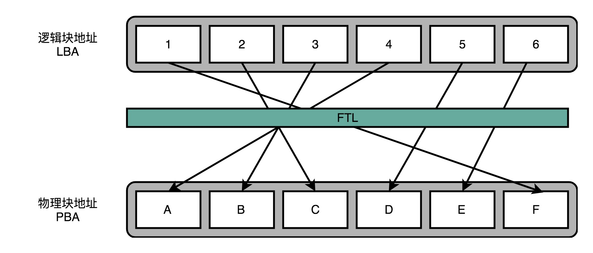

[toc]

#### 顺序访问和随机访问

硬盘通常你会看到两个指标。一个是**响应时间**（Response Time），另一个叫作**数据传输率**（Data Transfer Rate）。前面那个就是响应时间，后面那个就是吞吐率了。

常用的硬盘有两种。一种是 HDD 硬盘，也就是我们常说的机械硬盘。另一种是 SSD 硬盘，一般也被叫作固态硬盘。现在的 HDD 硬盘，用的是 SATA 3.0 的接口。而 SSD 硬盘呢，通常会用两种接口，一部分用的也是 SATA 3.0 的接口；另一部分用的是 PCI Express 的接口。

 Crucial MX500 的 SSD 硬盘。它的数据传输速率能到差不多 500MB/s，比 HDD 的硬盘快了一倍不止。不过 SATA 接口的硬盘，性能也就到顶了。因为 SATA 接口的速度也就这么快。实际 SSD 硬盘能够更快，所以我们可以换用 PCI Express 的接口。在读取的时候就能做到 2GB/s 左右，差不多是 HDD 硬盘的 10 倍，而在写入的时候也能有 1.2GB/s


除了数据传输率这个吞吐率指标，另一个我们关心的指标响应时间，就是这里面的 Acc.Time 指标。这个指标，其实就是程序发起一个硬盘的写入请求，直到这个请求返回的时间。可以看到，在上面的两块 SSD 硬盘上，大概时间都是在几十微秒这个级别。如果你去测试一块 HDD 的硬盘，通常会在几毫秒到十几毫秒这个级别。这个性能的差异，就不是 10 倍了，而是在几十倍，乃至几百倍。

上面有一个“4K”的指标。这个指标是什么意思呢？它其实就是我们的程序，去随机读取磁盘上某一个 4KB 大小的数据，一秒之内可以读取到多少数据。

你会发现，在这个指标上，我们使用 SATA 3.0 接口的硬盘和 PCI Express 接口的硬盘，性能差异变得很小。这是因为，在这个时候，接口本身的速度已经不是我们硬盘访问速度的瓶颈了。更重要的是，你会发现，即使我们用 PCI Express 的接口，在随机读写的时候，数据传输率也只能到 40MB/s 左右，是顺序读写情况下的几十分之一。

我们拿这个 40MB/s 和一次读取 4KB 的数据算一下。

> `40MB / 4KB = 10,000`

也就是说，一秒之内，这块 SSD 硬盘可以随机读取 1 万次的 4KB 的数据。如果是写入的话呢，会更多一些，90MB /4KB 差不多是 2 万多次。

这个每秒读写的次数，我们称之为[IOPS](https://en.wikipedia.org/wiki/IOPS)，也就是每秒输入输出操作的次数。

#### IO_WAIT

即使是用上了 PCI Express 接口的 SSD 硬盘，IOPS 也就是在 2 万左右。而我们的 CPU 的主频通常在 2GHz 以上，也就是每秒可以做 20 亿次操作。很多时候，CPU 指令发出去之后，不得不去“等”我们的 I/O 操作完成，才能进行下一步的操作。

Top命令

```shell
top - 06:26:30 up 4 days, 53 min,  1 user,  load average: 0.79, 0.69, 0.65
Tasks: 204 total,   1 running, 203 sleeping,   0 stopped,   0 zombie
%Cpu(s): 20.0 us,  1.7 sy,  0.0 ni, 77.7 id,  0.0 wa,  0.0 hi,  0.7 si,  0.0 st
KiB Mem:   7679792 total,  6646248 used,  1033544 free,   251688 buffers
KiB Swap:        0 total,        0 used,        0 free.  4115536 cached Mem
```

wa 的指标，这个指标就代表着 iowait，也就是 CPU 等待 IO 完成操作花费的时间占 CPU 的百分比。

“iostat”，就能够看到实际的硬盘读写情况。

```
avg-cpu:  %user   %nice %system %iowait  %steal   %idle
          17.02    0.01    2.18    0.04    0.00   80.76
Device:            tps    kB_read/s    kB_wrtn/s    kB_read    kB_wrtn
sda               1.81         2.02        30.87     706768   10777408
```

这里的 tps 指标，其实就对应着我们上面所说的硬盘的 IOPS 性能。而 kB_read/s 和 kB_wrtn/s 指标，就对应着我们的数据传输率的指标。	

`iotop`

```
Total DISK READ :       0.00 B/s | Total DISK WRITE :      15.75 K/s
Actual DISK READ:       0.00 B/s | Actual DISK WRITE:      35.44 K/s
  TID  PRIO  USER     DISK READ  DISK WRITE  SWAPIN     IO>    COMMAND                                             
  104 be/3 root        0.00 B/s    7.88 K/s  0.00 %  0.18 % [jbd2/sda1-8]
  383 be/4 root        0.00 B/s    3.94 K/s  0.00 %  0.00 % rsyslogd -n [rs:main Q:Reg]
 1514 be/4 www-data    0.00 B/s    3.94 K/s  0.00 %  0.00 % nginx: worker process
```

通过 iotop 这个命令，你可以看到具体是哪一个进程实际占用了大量 I/O

#### 机械硬盘

一块机械硬盘是由盘面、磁头和悬臂三个部件组成的。

首先，自然是**盘面**（Disk Platter）。盘面其实就是我们实际存储数据的盘片。

盘面中间有一个受电机控制的转轴。这个转轴会控制我们的盘面去旋转。我们平时买硬盘的时候经常会听到一个指标，叫作这个硬盘的**转速**。我们的硬盘有 5400 转的、7200 转的，乃至 10000 转的，英文单位叫**RPM**，也就是**每分钟的旋转圈数**（Rotations Per Minute）

我们的数据并不能直接从盘面传输到总线上，而是通过磁头，从盘面上读取到，然后再通过电路信号传输给控制电路、接口，再到总线上的。通常，我们的一个盘面上会有两个磁头，分别在盘面的正反面。盘面在正反两面都有对应的磁性涂层来存储数据，而且一块硬盘也不是只有一个盘面，而是上下堆叠了很多个盘面，各个盘面之间是平行的。每个盘面的正反两面都有对应的磁头。

最后我们来看**悬臂**（Actutor Arm）。悬臂链接在磁头上，并且在一定范围内会去把磁头定位到盘面的某个特定的磁道（Track）上。一个盘面通常是圆形的，由很多个同心圆组成，就好像是一个个大小不一样的“甜甜圈”嵌套在一起。每一个“圈”都是一个磁道。每个磁道都有自己的一个编号。


磁道会分成一个一个扇区（Sector）。上下平行的一个一个盘面的相同扇区呢，我们叫作一个柱面（Cylinder）。

读取数据，其实就是两个步骤。一个步骤，就是把盘面旋转到某一个位置。在这个位置上，我们的悬臂可以定位到整个盘面的某一个子区间。所有这些扇区都可以被悬臂访问到。

所以，我们进行一次硬盘上的随机访问，需要的时间由两个部分组成。

第一个部分，叫作**平均延时**（Average Latency）。这个时间，其实就是把我们的盘面旋转，把几何扇区对准悬臂位置的时间。这个时间很容易计算，它其实就和我们机械硬盘的转速相关。随机情况下，平均找到一个几何扇区，我们需要旋转半圈盘面。上面 7200 转的硬盘，那么一秒里面，就可以旋转 240 个半圈。那么，这个平均延时就是

> 1s / 240 = 4.17ms

第二个部分，叫作**平均寻道时间**（Average Seek Time），也就是在盘面选转之后，我们的悬臂定位到扇区的的时间。我们现在用的 HDD 硬盘的平均寻道时间一般在 4-10ms。

，如果随机在整个硬盘上找一个数据，需要 8-14 ms。我们的硬盘是机械结构的，只有一个电机转轴，也只有一个悬臂，所以我们没有办法并行地去定位或者读取数据。那一块 7200 转的硬盘，我们一秒钟随机的 IO 访问次数，也就是

> 1s / 8 ms = 125 IOPS 或者 1s / 14ms = 70 IOPS

#### SSD

首先，自然和其他的 I/O 设备一样，它有对应的**接口和控制电路**。现在的 SSD 硬盘用的是 SATA 或者 PCI Express 接口。在控制电路里，有一个很重要的模块，叫作**FTL**（Flash-Translation Layer），也就是**闪存转换层**。这个可以说是 SSD 硬盘的一个核心模块。

接下来是**实际 I/O 设备**，是由很多个裸片（Die）叠在一起的，一张裸片上可以放多个**平面**（Plane），一般一个平面上的存储容量大概在 GB 级别。一个平面上面，会划分成很多个块（Block），一般一个块（Block）的存储大小， 通常几百 KB 到几 MB 大小。一个块里面，还会区分很多个页（Page），就和我们内存里面的页一样，一个页的大小通常是 4KB。

对于 SSD 硬盘来说，数据的**写入**叫作 Program。写入通过**覆写**（Overwrite）来进行的，要先去**擦除**（Erase），然后再写入

SSD 的读取和写入的基本单位，不是一个比特（bit）或者一个字节（byte），而是一个**页**（Page）。SSD 的擦除单位按照**块**来擦除。


##### SSD 读写

白色代表这个页从来没有写入过数据，绿色代表里面写入的是有效的数据，红色代表里面的数据，在我们的操作系统看来已经是删除的了。


一开始，所有块的每一个页都是白色的。随着我们开始往里面写数据，里面的有些页就变成了绿色。

然后，因为我们删除了硬盘上的一些文件，所以有些页变成了红色。但是这些红色的页，并不能再次写入数据。因为 SSD 硬盘不能单独擦除一个页，必须一次性擦除整个块，所以新的数据，我们只能往后面的白色的页里面写。这些散落在各个绿色空间里面的红色空洞，就好像硬盘碎片。

随着硬盘里面的数据越来越多，红色空洞占的地方也会越来越多。于是，你会发现，我们就要没有白色的空页去写入数据了。这个时候，找一个红色空洞最多的块，把里面的绿色数据，挪到另一个块里面去，然后把整个块擦除，变成白色，可以重新写入数据。

一块 SSD 的硬盘容量，是没办法完全用满的。生产 SSD 硬盘的厂商，其实是预留了一部分空间，专门用来做这个“磁盘碎片整理”工作的。

##### FTL 和磨损均衡

某些块的频繁擦除会变为不可用，导致磁盘的容量变小，那么，我们有没有什么办法，不让这些坏块那么早就出现呢？我们能不能，匀出一些存放操作系统的块的擦写次数。

我们尽量让 SSD 硬盘各个块的擦除次数，均匀分摊到各个块上。这个策略就叫作**磨损均衡**（Wear-Leveling）。实现这个技术的核心办法就是添加一个间接层。这个间接层就是 FTL 这个**闪存转换层**。



我们通过一个页表映射虚拟内存页和物理页一样，在 FTL 里面，存放了**逻辑块地址**（Logical Block Address，简称 LBA）到**物理块地址**（Physical Block Address，简称 PBA）的映射。操作系统访问的硬盘地址，其实都是逻辑地址。只有通过 FTL 转换之后，才会变成实际的物理地址，找到对应的块进行访问。

操作系统所有对于 SSD 硬盘的读写请求，都要经过 FTL。FTL 里面又有逻辑块对应的物理块，所以 FTL 能够记录下来，每个物理块被擦写的次数。如果一个物理块被擦写的次数多了，FTL 就可以将这个物理块，挪到一个擦写次数少的物理块上。但是，逻辑块不用变，操作系统也不需要知道这个变化。

##### 写入放大

其实，TRIM 命令的发明，也反应了一个使用 SSD 硬盘的问题，那就是，SSD 硬盘容易越用越慢。

当 SSD 硬盘的存储空间被占用得越来越多，每一次写入新数据，我们都可能没有足够的空白。我们可能不得不去进行垃圾回收，合并一些块里面的页，然后再擦除掉一些页，才能匀出一些空间来。

这个时候，从应用层或者操作系统层面来看，我们可能只是写入了一个 4KB 或者 4MB 的数据。但是，实际通过 FTL 之后，我们可能要去搬运 8MB、16MB 甚至更多的数据。

我们通过“**实际的闪存写入的数据量 / 系统通过 FTL 写入的数据量 = 写入放大**”，可以得到，写入放大的倍数越多，意味着实际的 SSD 性能也就越差，会远远比不上实际 SSD 硬盘标称的指标。

而解决写入放大，需要我们在后台定时进行垃圾回收，在硬盘比较空闲的时候，就把搬运数据、擦除数据、留出空白的块的工作做完，而不是等实际数据写入的时候，再进行这样的操作。

##### 删除

操作系统和 SSD 硬件的特性还有一个不匹配的地方。那就是，操作系统在删除数据的时候，并没有真的删除物理层面的数据，而只是修改了 inode 里面的数据。这个“伪删除”，使得 SSD 硬盘在逻辑和物理层面，都没有意识到有些块其实已经被删除了。这就导致在垃圾回收的时候，会浪费很多不必要的读写资源。

为了解决这个问题，现在的操作系统和 SSD 的主控芯片，都支持**TRIM 命令。**这个命令可以在文件被删除的时候，让操作系统去通知 SSD 硬盘，对应的逻辑块已经标记成已删除了。
