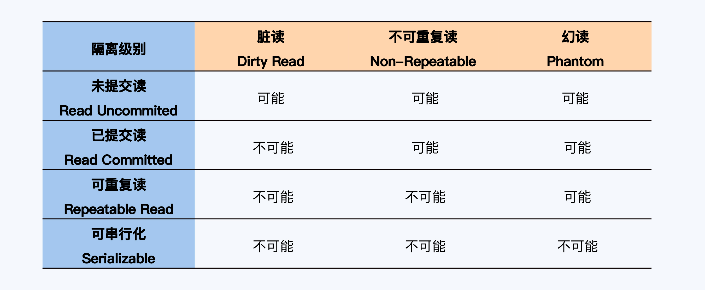
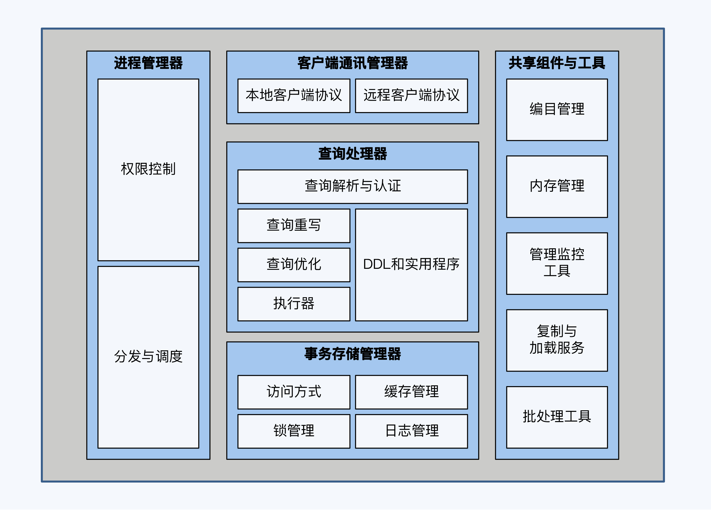
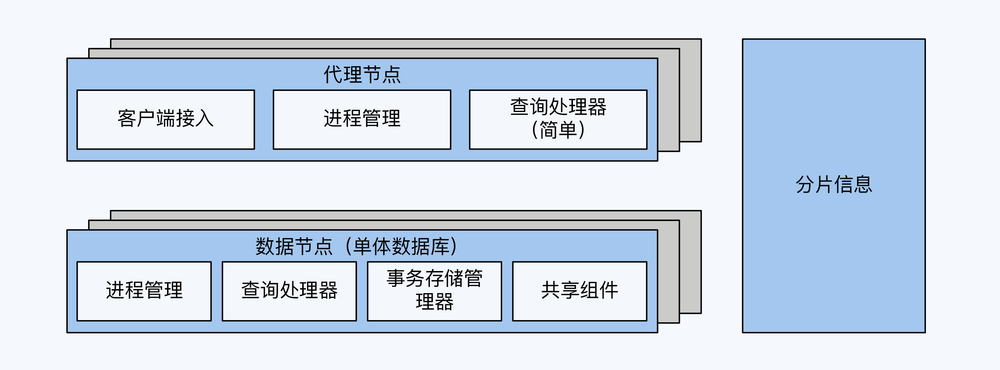
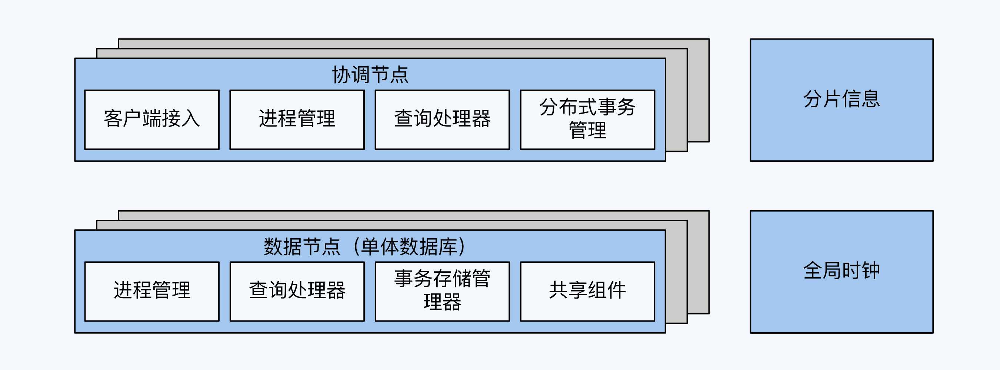
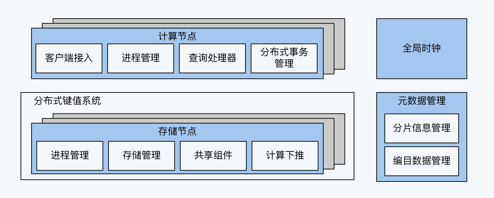

[toc]

#### 1. 分布式数据库

“分布式数据库”在字面上可以分解为“分布式”和“数据库”两部分，代表了它是跨学科的产物，它的理论基础来自两个领域。这同时也呼应了产品发展的两条不同路径，一些产品是从分布式存储系统出发，进而增加关系型数据库的能力；另外一些产品是从单体数据库出发，增加分布式技术元素。而随着分布式数据库的走向工业应用，在外部需求的驱动下，这两种发展思路又呈现出进一步融合的趋势。

#### 2. 类似的产物

1. 客户端组件+单体数据库

   通过独立的逻辑层建立数据分片和路由规则，实现单体数据库的初步管理，使应用能够对接多个单体数据库，实现并发、存储能力的扩展。其作为应用系统的一部分，对业务侵入较为深。这种客户端组件的典型产品是Sharding-JDBC。

2. 代理中间件+单体数据库

   以独立中间件的方式，管理数据规则和路由规则，以独立进程存在，与业务应用层和单体数据库相隔离，减少了对应用的影响。随着代理中间件的发展，还会衍生出部分分布式事务处理能力。这种中间件的典型产品是MyCat。

3. 单元化架构+单体数据库

   单元化架构是对业务应用系统的彻底重构，应用系统被拆分成若干实例，配置独立的单体数据库，让每个实例管理一定范围的数据。例如对于银行贷款系统，可以为每个支行搭建独立的应用实例，管理支行各自的用户，当出现跨支行业务时，由应用层代码通过分布式事务组件保证事务的ACID特性。

   根据不同的分布式事务模型，应用系统要配合改造，复杂性也相应增加。例如TCC模型下，应用必须能够提供幂等操作。

看过这三种方案，它们共同的特点是单体数据库仍然能够被应用系统感知到。相反，分布式数据库则是将技术细节收敛到产品内部，以一个整体面对业务应用。

#### 3. 一致性是什么

在“分布式系统”和“数据库”这两个学科中，一致性（Consistency）都是重要概念，但它表达的内容却并不相同。

对于分布式系统而言，一致性是在探讨当系统内的一份逻辑数据存在多个物理的数据副本时，对其执行读写操作会产生什么样的结果，这也符合CAP理论对一致性的表述。而在数据库领域，“一致性”与事务密切相关，又进一步细化到ACID四个方面。因此，当我们谈论分布式数据库的一致性时，实质上是在**谈论数据一致性**和**事务一致性**两个方面。

#### 4. 数据一致性

##### 4.1 数据一致性视角

包括分布式数据库在内的分布式存储系统，为了避免设备与网络的不可靠带来的影响，通常会存储多个数据副本。逻辑上的一份数据同时存储在多个物理副本上，自然带来了数据一致性问题。

讨论数据一致性还有一个前提，就是同时存在读操作和写操作，否则也是没有意义的。把两个因素加在一起，就是多副本数据上的一组读写策略，被称为“一致性模型”（ConsistencyModel）。

观察数据一致性的两个视角：

- 状态一致性是指，数据所处的客观、实际状态所体现的一致性；

- 操作一致性是指，外部用户通过协议约定的操作，能够读取到的数据一致性。

从状态的视角来看，任何变更操作后，数据只有两种状态，所有副本一致或者不一致。在某些条件下，不一致的状态是暂时，还会转换到一致的状态，所以习惯上大家会把暂时的不一致称为“弱一致”。相对的，一致就叫做“强一致”了。

1. MySQL全同步复制是强一致性模式，但有两个问题，1.性能差，2.可用性问题，任何一个副本不可用整个集群不可用。集群规模越大，这些问题就越严重，所以全同步复制模式在生产系统中也很少使用。

2. 对于最终一致性可以这样理解为：在主副本执行写操作并反馈成功时，不要求其他副本与主副本保持一致，但在经过一段时间后这些副本最终会追上主副本的进度，重新达到数据状态的一致。

最终一致性，在语义上包含了很大的不确定性，所以很多时候并不是直接使用，而是加入一些限定条件，也就衍生出了若干种一致性模型。因为它们是在副本不一致的情况下，进行操作层面的封装来对外表现数据的状态，所以都可以纳入操作视角。

##### 4.2 数据一致性模型

1. 写后读一致性/单调读一致性

​	一个用户一旦读到某个值，不会读到比这个值更旧的值，实现单调读一致性的方式，可以是将用户与副本建立固定的映射关系，比如使用哈希算法将用户ID映射到固定副本上

2. 前缀一致性

​	若数据之间是有因果关系的，但这种关系在复制的过程中被忽略了，就会出现异常。要实现这种一致性，可以考虑在原有的数据上增加一种显式的因果关系，这样系统可以据此控制在其他进程的读取顺序。

3. 线性一致性

​	线性一致性（Linearizability）就是建立在事件的先后顺序之上的。在线性一致性下，整个系统表现得好像只有一个副本，所有操作被记录在一条时间线上，并且被原子化，这样任意两个事件都可以比较先后顺序。

主流分布式数据库大多以实现线性一致性为目标，在设计之初或演进过程中纷纷引入了全局时钟，比如Spanner、TiDB、OceanBase、GoldenDB和巨杉等等工程实现上。多数产品采用单点授时（TSO），也就是从一台时间服务器获取时间，同时配有高可靠设计；而Spanner以全球化部署为目标，因为TSO有部署范围上的限制，所以Spanner的实现方式是通过GPS和原子钟实现的全局时钟，也就是TrueTime，它可以保证在全球范围内任意节点能同时获得的一个绝对时间，误差在7毫秒以内。

4. 因果一致性

​	因果一致性的基础是偏序关系，也就是说，部分事件顺序是可以比较的。至少一个节点内部的事件是可以排序的，依靠节点的本地时钟就行了；节点间如果发生通讯，则参与通讯的两个事件也是可以排序的，接收方的事件一定晚于调用方的事件。

分布式数据库主要应用了线性一致性或因果一致性。线性一致性必须要有全局时钟，全局时钟可能来自授时服务器或者特殊物理设备（如原子钟），全局时钟的实现方式会影响到集群的部署范围；因果一致性可以通过逻辑时钟实现，不依赖于硬件，不会限制集群的部署范围。

#### 5. 事务一致性

##### 5.1 ACID

ACDID定义

- 原子性：事务中的所有变更要么全部发生，要么一个也不发生。 
- 一致性：事务要保持数据的完整性。 
- 隔离性：多事务并行执行所得到的结果，与串行执行（一个接一个）完全相同。 
- 持久性：一旦事务提交，它对数据的改变将被永久保留，不应受到任何系统故障的影 响。

一致性是其中存在感最低的特性，可以看作是对 “事务”整体目标的阐述。

持久性它不仅是对数据库的基本要求。它的核心思想就是要应对系统故障。怎么理解系统故障呢？我们可以把故障分为两 种

1. 存储硬件无损、可恢复的故障。这种情况下，主要依托于预写日志（Write Ahead Log, WAL）保证第一时间存储数据。WAL 是单体数据库的成熟技术，NoSQL 和分布式数据库都借鉴了过去。

2. 存储硬件损坏、不可恢复的故障。这种情况下，需要用到日志复制技术，将本地日志及时同步到其他节点。实现方式大体有三种

   - 单体数据库自带的同步或半同步的 方式，其中半同步方式具有一定的容错能力，实践中被更多采用；

   - 将日志存储 到共享存储系统上，后者会通过冗余存储保证日志的安全性，亚马逊的 Aurora 采用了 这种方式，也被称为 Share Storage；

   - 基于 Paxos/Raft 的共识算法同步日志数据，在分布式数据库中被广泛使用。

无论采用哪种方式，目的都是保证在本地节点之外，至少有一份完整的日志可用于数据恢复。

##### 5.2 隔离级别

最早、最正式的对隔离级别的定义，是 ANSI SQL-92（简称 SQL-92），它定义的隔离级 别和异常现象如下所示：

Critique 丰富和细化了 SQL-92 的内容，定义了六种隔离级别和八种异常现象。其中，我们最关注的是快照隔离（Snapshot Isolation, SI）级别。因为快照隔离能解决幻读 的问题，但却无法处理写倾斜（Write Skew）问题，因此，今天，使用最广泛的隔离级别有四个，就是已提交读、可重复读、快照隔离、可串 行化。

#### 6. 两种分布式数据库架构

##### 6.1 单机数据库

将数据库从逻辑上拆分为 5 个部分，分别是客户端 通讯管理器 (Client Communications Manager)、查询处理器（Relational Query Processor）、事务存储管理器（Transactional Storage Manager）、进程管理器 （Process Manager）和共享组件与工具 (Shared Components and Utilities)，每个部 分下面又可以拆分成一些组件。

1. 客户端通讯管理器。这是应用开发者能够直观感受到的模块，通常我们使用 JDBC 或者 ODBC 协议访问数据库时，连接的就是这个部分。 
2.  进程管理器。连接建好了，数据库会为客户端分配一个进程，客户端后续发送的所有操 作都会通过对应的进程来执行。当然，这里的进程只是大致的说法。事实上，Oracle 和 PostgreSQL 是进程的方式，而 MySQL 使用的则是线程。
3. 查询处理器。它包括四个部分，功能上是顺序执行的。首先是解析器，它将接收到的 SQL 解析为内部的语法树。然后是查询重写（Query Rewrite），它也被称为逻辑优 化，主要是依据关系代数的等价变换，达到简化和标准化的目的，比如会消除重复条件 或去掉一些无意义谓词 ，还有将视图替换为表等操作。再往后就是查询算法优化 （Query Optimizer），它也被称为物理优化，主要是根据表连接方式、连接顺序和排 序等技术进行优化，我们常说的基于规则优化（RBO）和基于代价优化（CBO）就在这 部分。最后就是计划执行器（Plan Executor），最终执行查询计划，访问存储系统。
4. 事务存储管理器。它包括四个部分，其中访问方式（Access Methods）是指数据在磁 盘的具体存储形式。锁管理（Lock Manager）是指并发控制。日志管理（Log Manager）是确保数据的持久性。缓存管理（Buffer Manager）则是指 I/O 操作相关的缓存控制。
5. 共享组件和工具。在整个过程中还会涉及到的一些辅助操作，当然它们对于数据库的运 行也是非常重要的。例如编目数据管理器（Catalog Manager）会记录数据库的表、字 段、视图等元数据信息，并根据这些信息来操作具体数据内容。复制机制 （Replication）也很重要，它是实现系统高可靠性的基础，在单体数据库中，通过主备 节点复制的方式来实现数据的复制。

##### 6.2 PG派系

但在面临高并发场景的时候单机数据库会碰到写入性能不足的问题，大家首先想到的，最直接的办法就是分库分表。

分库分表方案就是在多个单体数据库之前增加代理节点，本质上是增加了 SQL 路由功能。 这样，代理节点首先解析客户端请求，再根据数据的分布情况，将请求转发到对应的单体数据库。

代理节点需要实现三个主要功能，它们分别是客户端接入、简单的查询处理器和进程管理 中的访问控制。 另外，分库分表方案还有一个重要的功能，那就是分片信息管理，分片信息就是数据分布情况，是区别于编目数据的一种元数据。不过考虑到分片信息也存在多副本的一致性的问题，大多数情况下它会独立出来

如果把每一次的事务写入都限制在一个单体数据库内，业务场景就会很受局限。因 此，跨库事务成为必不可少的功能，但是单体数据库是不感知这个事情的，所以我们就要 在代理节点增加分布式事务组件。简单的分库分表不能满足全局性的查询需求，因为每个数据节点只能看到一部分数 据，有些查询运算是无法处理的，比如排序、多表关联等。所以，代理节点要增强查询计 算能力，支持跨多个单体数据库的查询。

很多分库分表方案会演进到这个阶段，比如 MyCat。这时离分布式数据库还差重要的一 步，就是全局时钟。加上这最后一块拼图，PG区别于单体数据库的功能也就介绍完整了，它们是分片、分布式事务、跨节点查询和全局时钟。

协调节点与数据节点，实现了一定程度上的计算与存储分离，这也是所有分布式数据库的一个架构基调。但是，因为 PGXC 的数据节点本身就是完整的单体数据库，所以也具备很强的计算能力。

很多厂商在 PGXC 上二次开发，推出自己的产品。 不过，这些改动都没有变更主体架构风格，所以我把这类产品统称为 PGXC 风格，其中包 括 TBase、GuassDB 300 和 AntDB 等。

##### 6.3 NewSQL：革命性的新架构

NewSQL 也叫原生分布式数据库，就是说它的每个组件在设计之初都是 基于分布式架构的，不像 PGXC 那样带有明显的单体架构痕迹。

NewSQL 的基础是 NoSQL，更具体地说，是类似 BigTable 的分布式键值（K/V）系统。NoSQL将重点放在对 存储和写入能力的扩展上，这个能力扩展的基础就是分片。引入分片的另一个好处是，系 统能够以更小的粒度调度数据，实现各节点上的存储平衡和访问负载平衡。

NewSQL 还有两个重要的革新，分别出现在高可靠机制和存储引擎的设计上。高可靠机制的变化在于，放弃了粒度更大的主从复制，转而以分片为单位采用 Paxos 或 Raft 等共识算法。这样，NewSQL 就实现了更小粒度的高可靠单元，获得了更高的系统整体可靠性。存储引擎层面，则是使用 LSM-Tree 模型替换 B+ Tree 模型，大幅提升了写入性能。

NewSQL主要的工作负载由计算节点和存储节点承担， 另外由管理节点承担全局时钟和分片信息管理功能。不过，这三类节点是逻辑功能上划分，在设计实现层面是可分可合的。

Spanner 是 NewSQL 的开山鼻祖，这个不用说了；其他知名度比较高的产品有 CockroachDB、TiDB 和 YugabyteDB，这三款数据库都宣称设计灵感来自 Spanner；另外就是阿里自研的 OceanBase。
