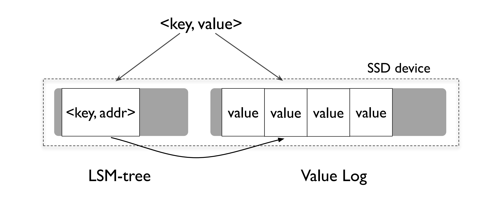

[toc]

#### RUM猜想

我相信很多人都有一种直觉，那就是读写两种操作的优化在很多时候是互斥的。

数据以什么形式存储，可以实现最快的写入速度？答案肯定是按照顺序 写入，每次新增数据都追加在文件尾部，因为这样物理磁盘的磁头移动距离最小。 但这种方式对于读取显然是不友好，读操作必须从头到尾扫描文件。反过来，如果要实现更高效的读取，就要设计更复杂的数据结构， 那么写入的速度当然就降低了，同时在存储空间上也会有额外的要求。

2016 年的一篇论文将我们这种朴素的理解提升到理论层面，这就是 RUM 猜想。

它说的是，对任何数据 结构来说，在 Read Overhead（读）、Update Overhead（写） 和 Memory or Storage Overhead（存储） 中，同时优化两项时，需要以另一项劣化作为代价。论文用 一幅图展示了常见数据结构在这三个优化方向中的位置

我们可以看到两个非常熟悉的数据结构 B-Tree 和 LSM，它们被用于分布式 数据库的存储引擎中。

#### 存储结构

写放大系数（Write Amplification Factor， WAF）这个指标，就是指实际写入磁盘的数据量和应用程序要求写入数据量之比。空间放大有类似的度量单位，也就是空间放大系数（Space Amplification Factor, SAF）。

##### B+Tree

B+Tree 是对读操作优化的存储结构，能够支持高效的范围扫描，叶节点之间保留链接并且 按主键有序排列，扫描时避免了耗时的遍历树操作。

B+Tree存在两个问题

1. 写放大

   为了维护BTree的平衡，会产生写放大

2. 空间不连续

   虽然新增叶节点会加入到原有叶节点构成的有序链表中，整体在逻辑上是连续的，但是在 磁盘存储上，新增页表申请的存储空间与原有页表很可能是不相邻的。这样，在后续包含 新增叶节点的查询中，将会出现多段连续读取，磁盘寻址的时间将会增加

填充因子

填充因子（Factor Fill）是一种常见的优化方法，它的原理就是在页表中预留一些空间，这 样不会因为少量的数据写入造成树结构的大幅变动。但填充因子的设置也很难拿捏，过大 则无法解决写放大问题；过小会造成页表数量膨胀，增大对磁盘的扫描范围，降低查询性 能。

##### LSM Tree

LSM-Tree（Log Structured-Merge Tree）由 Patrick O’Neil 在 1996 年的同名论文中首先提出。而后 Google 在Bigtable（Fay Chang et al.(2008)）中使用了这个模型。

系统接收到写操作后会记录日志（Tablet Log）并将数据写入内存（Memtable），这时 写操作就可以返回成功了。而在系统接收到读操作时，会在内存和磁盘文件中查找对应的 数据。

LSM 是分成三步完成了数据的落盘。

1. 第一步已经说过了，就是写入 Memtable，同时记录 Tablet Log；
2. 当 Memtable 的数据达到一定阈值后，系统会把其冻结并将其中的数据顺序写入磁盘上 的有序文件（Sorted String Table，SSTable）中，这个操作被称为 Flush；当然，执 行这个动作的同时，系统会同步创建一个新的 Memtable，处理写入请求。 
3. 根据第二步的处理逻辑，Memtable 会周期性地产生 SSTable。当满足一定的规则时， 这些 SSTable 会被合并为一个大的 SSTable。这个操作称为 Compact

真正的写放大就发生在 Compact 这个动作上。Compact 有两个关键点，一是 选择什么时候执行，二是要将哪些 SSTable 合并成一个 SSTable。这两点加起来称为“合并策略”。

刚刚在例子中描述的就是一种合并策略，称为 **Size-Tiered Compact Strategy**，简称 Tiered。BigTable 和 HBase 都采用了 Tiered 策略。它的基本原理是，每当某个尺寸的 SSTable 数量达到既定个数时，将所有 SSTable 合并成一个大的 SSTable。这种策略的优 点是比较直观，实现简单，但是缺点也很突出。

1. 读放大

   执行读操作时，由于单个 SSTable 内部是按照 Key 顺序排列的，那么查找方法的时间复杂 度就是 O(logN)。因为 SSTable 文件是按照时间间隔产生的，在 Key 的范围上就会存在交 叉，所以每次读操作都要遍历所有 SSTable

2. 写放大

   Compact 会降低读放大，但却带来更多的写放大和空间放大。其实 LSM 只是推迟了写放 大，短时间内，可以承载大量并发写入，但如果是持续写入，则需要一部分 I/O 开销用于 处理 Compact

3.  空间放大

   从空间放大的角度看，Tiered 策略需要有两倍于数据大小的空间，分别存储合并前的多个 SSTable 和合并后的一个 SSTable，所以 SAF 是 2，而 B+Tree 的 SAF 是 1.33。

##### Leveled Compact Strategy

Tiered 策略之所以有严重的写放大和空间放大问题，主要是因为每次 Compact 需要全量 数据参与，开销自然就很大。

Leveled设计核心就是将数据分成一系列 Key 互不重叠且固定大小的 SSTable 文件，并分层（Level）管理。同时，系统记录每个 SSTable 文件存储的 Key 的 范围。Leveled 策略最先在 LevelDB 中使用，也因此得名。后来从 LevelDB 上发展起来的 RocksDB 也采用这个策略。

处理过程如下：

1. 第一步处理 Leveled 和 Tiered 是一样的。当内存的数据较多时，就会 Flush 到 SSTable 文件。对应内存的这一层 SSTable 定义为 L0，其他层的文件我们同样采用 Ln 的形式表示，n 为对应的层数。因为 L0 的文件仍然是按照时间顺序生成的，所以文件之间就可能有重叠的 Key。L0 不做整理的原因是为了保证写盘速度。
2. 通常系统会通过指定 SSTable 数量和大小的方式控制每一个层的数据总量。当 L0 超过预定文件数量，就会触发 L0 向 L1 的 Compact。因为在 L0 的 SSTable 中 Key 是交叉 的，所以要读取 L0 的所有 SSTable，写入 L1，完成后再删除 L0 文件。从 L1 开始， SSTable 都是保证 Key 不重叠的。
3. 随着 L1 层数据量的增多，SSTable 可能会重新划分边界，目的是保证数据相对均衡的存储。
4. 由于 L1 的文件大小和数量也是受限的，所以随着数据量的增加又会触发 L1 向 L2 的 Compact。因为 L1 的文件是不重叠的，所以不用所有 L1 的文件都参与 Compact，这就延缓了磁盘 I/O 的开销。而 L2 的单个文件容量会更大，通常从 L1 开始每层的存储数 据量以 10 倍的速度增长。这样，每次 Ln 到 L(n+1) 的 compact 只会涉及少数的 SSTable，间隔的时间也会越来越长。

再从 RUM 三个角度来分析下。

1. 读放大

   因为 SSTable 是有序的，如 果有 M 个文件，则整体计算的时间复杂度是 O(MlogN)。这个地方还可以优化。通常的方 法是在 SSTable 中引入 Bloom Filter（BF），时间复杂度是 O(1)。

   L0 层的 SSTable 无序，所有都需要遍历， 而从 L1 层开始，每层仅需要查找一个 SSTable。那么优化后的整体时间复杂度就是 O(X+L-1+logN)，其中 X 是 L0 的 SSTable 数量，L 是层数。

2. 写放大

   Leveled 策略对写放大是有明显改善的，除了 L0 以外，每次更新仅涉及少量 SSTable。但 是 L0 的 Compact 比较频繁，所以仍然是读写操作的瓶颈。

3.  空间放大

   数据在同层的 SSTable 不重叠，这就保证了同层不会存在重复记录。而由于每层存储的数 据量是按照比例递增的，所以大部分数据会存储在底层。因此，大部分数据是没有重复记 录的，所以数据的空间放大也得到了有效控制。

#### 分布式数据库的实现

##### Wisckey

WiscKey 提出的改进是通过将 value 分离出 LSM-Tree 的方法来降低写放大。

WiscKey 的主要设计思想是，在 SSTable 的重写过程中，核心工作是对 Key 进行整理， 保证多个 SSTable 的 Key 范围不重叠，且内部有序。而这个过程中 Value 的重写是没有 太大价值的，而从实践看，Value 占用的存储空间远远大于 Key。这意味着大量的写操作 和空间成本被浪费了。所以 WiscKey 提出将 Value 从 SSTable 中分离出来单独存储，这 样就降低了写放大系数。

Value 单独存储的问题是按照 Key 连续读取数据时，对应的 Value 并不是连续存储，磁盘 寻址成本增大。而 WiscKey 的设计前提是使用 SSD 替换 HDD，SSD 的随机读写效率接 近于顺序读写，所以能够保持较高的整体效率。事实上，过高的写放大也会严重缩短 SSD 的使用寿命。WiscKey 就是针对 SSD 提出的存储模型。

##### OB

- 宏块与微块

  在 Compact 过程中，被合并文件中的所有数据都要重写到新文件中。其实，对于那些没 有任何修改的数据，这个过程是可以被优化的。 OceanBase 引入了宏块与微块的概念，微块是数据的组织单元，宏块则由微块组成。这样 在进行 Compact 操作时，可以在宏块和微块两个级别判断，是否可以复用。如果在这两 个级别数据没有发生实质变化，则直接进行块级别的拷贝，这样就省去了更细粒度的数据 解析、编码以及计算校验和（Checksum）等操作

- 轮转合并

  OceanBase 还在多副本基础上设计了轮转合并机制。我们知道，根据 Raft 协议或者 Paxos 协议，总有多个副本同时存储着最新的数据，那么我们就可以用多副本来解耦 Compact 操作和同时段的查询操作，避免磁盘 I/O 上的竞争。 它的大致设计思路是这样的，将 Compact 操作放在与 Leader 保持数据同步的 Follower 上执行，而 Leader 节点则保持对外提供查询服务。当 Compact 完成后，改由那个 Follower 对外提供查询服务，Leader 和其他副本则去执行 Compact。 OceanBase 的这两项优化虽然没有降低写放大系数，但却有效减少了 Compact 过程中的 I/O 竞争。

