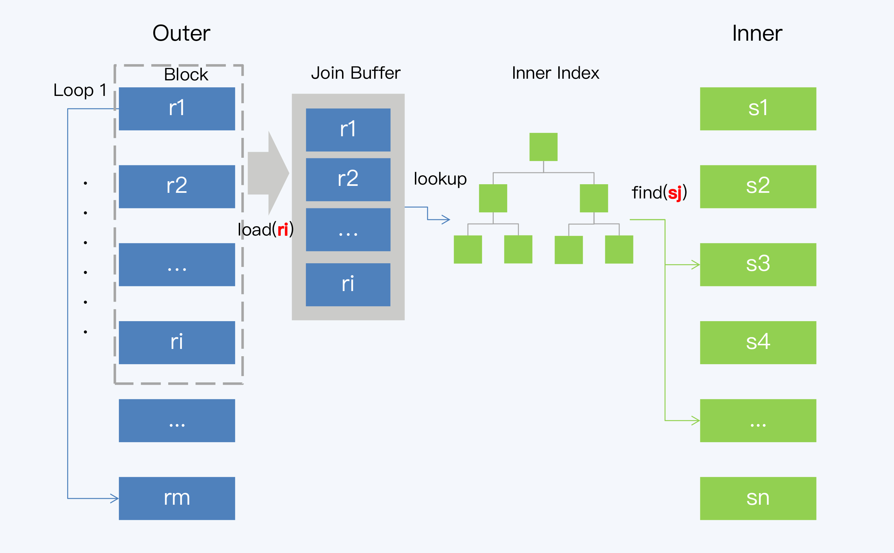

[toc]

#### 经典关联算法 

常见的关联算法有三大类，分别是嵌套循环（Nested Loop Join）、排序归并（SortMerge Join）和哈希（Hash Join）。

##### 嵌套循环连接算法

所有的嵌套循环算法都由内外两个循环构成，分别从两张表中顺序取数据。其中，外层循 环表称为外表（Outer 表），内层循环表则称为内表（Inner 表）。因为这个算法的过程是 由遍历 Outer 表开始，所以 Outer 表也称为驱动表。在最终得到的结果集中，记录的排列 顺序与 Outer 表的记录顺序是一致的。 根据在处理环节上的不同，嵌套循环算法又可以细分为三种，分别是 Simple NestedLoop Join（SNLJ）、Block Nested-Loop Join（BNJ）和 Index Lookup Join（ILJ）。

##### Simple Nested Loop Join

SNLJ 的执行过程是这样的：

1. 遍历 Outer 表，取一条记录 r1；
2. 遍历 Inner 表，对于 Inner 表中的每条记录，与 r1 做 join 操作并输出结果；
3. 重复步骤 1 和 2，直至遍历完 Outer 表中的所有数据，就得到了最后的结果集

存在非常明显的性能问题每次为 了匹配 Outer 表的一条记录，都要对 Inner 表做一次全表扫描操作。

##### Block Nested-Loop Join

BNJ 是对 SNLJ 的一种优化，改进点就是减少 Inner 表的全表扫描次数。BNJ 的变化主要 在于步骤 1，读取 Outer 表时不再只取一条记录，而是读取一个批次的 x 条记录，加载到 内存中。这样执行一次 Inner 表的全表扫描就可以比较 x 条记录。在 MySQL 中，这个 x 对应一个叫做 Join Buffer 的设置项，它直接影响了 BNJ 的执行效率

与 SNLJ 相比，BNJ 虽然在时间复杂度都是 O(m*n)（m 和 n 分别是 Outer 表和 Inner 表 的记录行数），但磁盘 I/O 的开销却明显降低了，所以效果优于 SNLJ

##### Index Lookup Join

Index Lookup Join（ILJ）就是在 BNJ 的基础上使用了索引，算法执行过程是这样的



1. 遍历 Outer 表，取一个批次的记录 ri； 
2. 通过连接键（Join Key）和 ri 可以确定对 Inner 表索引的扫描范围，再通过索引得到对 应的若干条数据记录，记为 sj；
3. 将 ri 的每一条记录与 sj 的每一条记录做 Join 操作并输出结果； 4. 重复前三步，直到遍历完 Outer 表中的所有数据，就得到了最后结果集。

##### 排序归并连接算法

排序归并算法就是 Sort-Merge Join（SMJ），也被称为 Merge Join。SMJ 可以分为排 序和归并两个阶段：

1. 第一阶段是排序，就是对 Outer 表和 Inner 表进行排序，排序的依据就是每条记录在连 接键上的数值。
2. 第二阶段就是归并，因为两张表已经按照同样的顺序排列，所以 Outer 表和 Inner 表各 一次循环遍历就能完成比对工作了。

选择 SMJ 是有前提的，而这个前提就是表的记录本身就是有序的，否则就不划 算了。我们知道，索引是天然有序的，如果表的连接键刚好是索引列，那么 SMJ 就是三种嵌套循环算法中成本最低的，它的时间复杂度只有 O(m+n)。

##### 哈希连接算法

Simple Hash Join，也称为经典哈希连接（Classic Hash Join），它的执行过程包括建立 阶段（Build Phase）和探测阶段（Probe Phase）。

1. 建立阶段

   选择一张表作为 Inner 表，对其中每条记录上的连接属性（Join Attribute）使用哈希函数 得到哈希值，从而建立一个哈希表。在计算逻辑允许的情况下，建立阶段选择数据量较小的表作为 Inner 表，以减少生成哈希表的时间和空间开销。

2. 另一个表作为 Outer 表，扫描它的每一行并计算连接属性的哈希值，与建立阶段生成的哈希表进行对比。当然，哈希值相等不代表连接属性相等，还要再做一次判断，返回最终满足条件的记录。

哈希表无法全部放入内存怎么办呢？这时就要使用 Grace HashJoin 算法了,GHJ 算法与 SHJ 的不同之处在于，GHJ 正视了哈希表大于内存这个问题，将哈希表分块缓 存在磁盘上。

第一阶段，Inner 表的记录会根据哈希值分成若干个块（Bucket）写入磁盘，而且每个 Bucket 必须小于内存容量。Outer 表也按照同样的方法被分为若干 Bucket 写入磁盘，但 它的大小并不受到内存容量限制。

第二阶段和 SHJ 类似，先将 Inner 表的 Bucket 加载到内存，再读取 Outer 表对应 Bucket 的记录进行匹配，所有 Inner 表和 Outer 表的 Bucket 都读取完毕后，就得到了最 终的结果集。

哈希连接的核心思想和排序归并很相似，都是对内外表的记录分别只做一次循 环。哈希连接算法不仅能够处理大小表关联，对提升大表之间关联的效率也有明显效果， 但限制条件就是适用于等值连接。

#### 分布式数据库实现

##### 大小表关联（复制表）

大小表关联时，可以把小表复制到相关存储节点，这样全局关联就被转换为一系列的本地 关联，再汇总起来就得到了最终结果。这种算法的具体实现方式有两种。

**静态的方式**，其实就是在创建表的时候，直接使用关键字将表声明为复制表，这样每个节 点上都会保留一份数据副本。当它与大表关联时，计算节点就可以将关联操作下推到每个 存储节点进行。很多分布式数据库，比如 TBase、TDSQL 等，都支持定义复制表。

动态方式也称为“小表广播”，这种方式不需要人工预先定义，而是在关联发生时，系统 自行处理。这就是说，当关联的某张表足够小时，在整个集群中分发不会带来太大的网络 开销，系统就将其即时地复制到相关的数据节点上，实现本地关联。

##### 大表关联（重分布）

复制表解决了大小表关联的问题，还剩下最棘手的大表间关联，它的解决方案通常就是重分布。

我们直接看一个例子，现在要对 A、B 两张大表进行关联，执行下面的 SQL：

```sql
select A.C1,B.C2 from A,B where A.C1=B.C1;
```

这个 SQL 可能会引发两种不同的重分布操作。

第一种，如果 C1 是 A 表的分区键，但不是 B 表的分区键，则 B 表按照 C1 做重分布，推 送到 A 的各个分片上，实现本地关联。

第二种，如果两张表的分区键都不是 C1，则两张表都要按照 C1 做重分布，而后在多个节 点上再做本地关联。当然这种情况的执行代价就比较高了。

这个基于重分布的关联过程，其实和 MapReduce、Spark 等并行计算引擎的思路是一样的，

1. shuffle 阶段：分别将两个表按照连接键进行分区，将相同连接键的记录重分布到同一节 点，数据就会被分配到尽量多的节点上，增大并行度。 

2.  hash join 阶段：每个分区节点上的数据单独执行单机 hash join 算法。