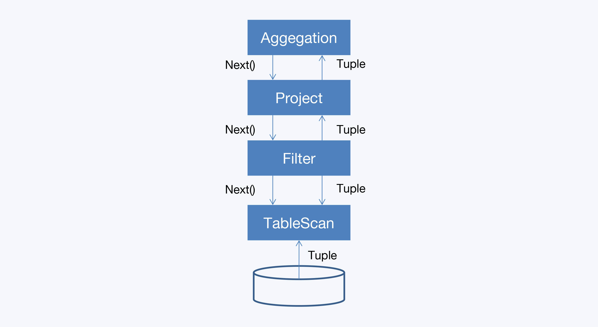
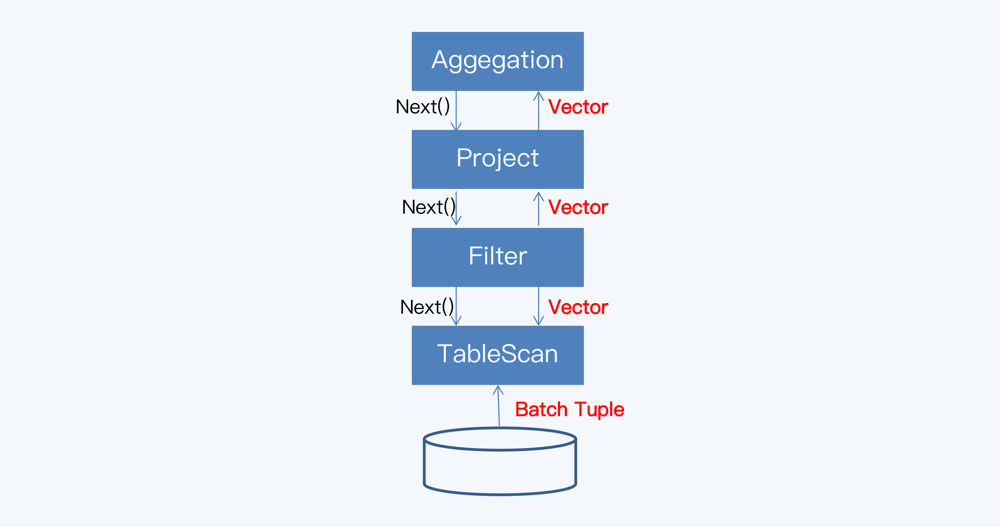

#### 火山模型

火山模型（Volcano Model）也称为迭代模型（Iterator Model），是最著名的查询执行模型，主流的 OLTP 数据库 Oracle、MySQL 都采用了这种模 型。 在火山模型中，一个查询计划会被分解为多个代数运算符（Operator）。每个 Operator 就是一个迭代器，都要实现一个 next() 接口，通常包括三个步骤：

1. 调用子节点 Operator 的 next() 接口，获取一个元组（Tuple）；
2. 对元组执行 Operator 特定的处理；
3. 返回处理后的元组。

通过火山模型，查询执行引擎可以优雅地将任意 Operator 组装在一起，而不需要考虑每 个 Operator 的具体处理逻辑。查询执行时会由查询树自顶向下嵌套调用 next() 接口，数 据则自底向上地被拉取处理。所以，这种处理方式也称为拉取执行模型（Pull Based）。

```sql
select count(*) from store_sales where ss_item_sk = 1000;
```

开始从扫描运算符 TableScan 获取数据，通过过滤运算符 Filter 开始推动元组的处理。然 后，过滤运算符传递符合条件的元组到聚合运算符 Aggregate。



元组大致就是指数据记录（Record），火山模型的优点是处理逻辑清晰，每个 Operator 只要关心自己的处理逻辑即可，耦合性 低。但是它的缺点也非常明显，主要是两点：

1. 虚函数调用次数过多，造成 CPU 资源的浪费。

2. 数据以行为单位进行处理，不利于发挥现代 CPU 的特性。


问题分析

1. 在火山模型中，处理一个元组最少需要调用一次 next() 函数，这个 next() 就是虚函数。这 些函数的调用是由编译器通过虚函数调度实现的；虽然虚函数调度是现代计算机体系结构 中重点优化部分，但它仍然需要消耗很多 CPU 指令，所以相当慢。

2. 在火山模型中，每次一个算子给另外一个算子传递元组的时候，都需要将这个元组存放在 内存中，以行为组织单位很容易带来 CPU 缓存失效。

3. 当运行简单的循环时，现代编译器和 CPU 是非常高效的。编译器会自动展开简单的循环， 甚至在每个 CPU 指令中产生单指令多数据流（SIMD）指令来处理多个元组。

在过去大概 20 年的时间里火山模型都运行得很好，主要是因为这一时期执行过程的瓶颈是 磁盘 I/O。而现代数据库大量使用内存后，读取效率大幅提升，CPU 就成了新的瓶颈。因 此，现在对火山模型的所有优化和改进都是围绕着提升 CPU 运行效率展开的。

##### 改进方法

要对火山模型进行优化，一个最简单的方法就是减少执行过程中 Operator 的函数调用。 比如，通常来说 Project 和 Filter 都是常见的 Operator，在很多查询计划中都会出现。 OceanBase1.0 就将两个 Operator 融合到了其它的 Operator 中。这样做有两个好处： 

1. 分支预测能力 降低了整个查询计划中 Operator 的数量，也就简化了 Operator 间的嵌套调用关系， 最终减少了虚函数调用次数。 
2. 单个 Operator 的处理逻辑更集中，增强了代码局部性能力，更容易发挥 CPU 的分支预 测能力。

#### 向量化：TiDB&CockroachDB

向量化模型与火山模型的最大差异就是，其中的 Operator 是向量化运算符，是基于列来 重写查询处理算法的。所以简单来说，向量化模型是由一系列支持向量化运算的 Operator 组成的执行模型。我们来看一下向量化模型怎么处理聚合计算。



向量化模型依然采用了拉取式模型。它和火山模型的唯一区 别就是 Operator 的 next() 函数每次返回的是一个向量块，而不是一个元组。向量块是访 问数据的基本单元，由固定的一组向量组成，这些向量和列 / 字段有一一对应的关系

向量处理背后的主要思想是，按列组织数据和计算，充分利用 CPU，把从多列到元组的转 化推迟到较晚的时候执行。这种方法在不同的操作符间平摊了函数调用的开销。

向量化模型首先在 OLAP 数据库中采用，与列式存储搭配使用可以获得更好的效果，例如 ClickHouse。

 分布式数据库都是面向 OLTP 场景的，所以不能直接使用列式存储，但 是可以采用折中的方式来实现向量化模型，也就是在底层的 Operator 中完成多行到向量 块的转化，上层的 Operator 都是以向量块作为输入。这样改造后，即使是与行式存储结 合，仍然能够显著提升性能。在 TiDB 和 CockroachDB 的实践中，性能提升可以达到数倍，甚至数十倍。
