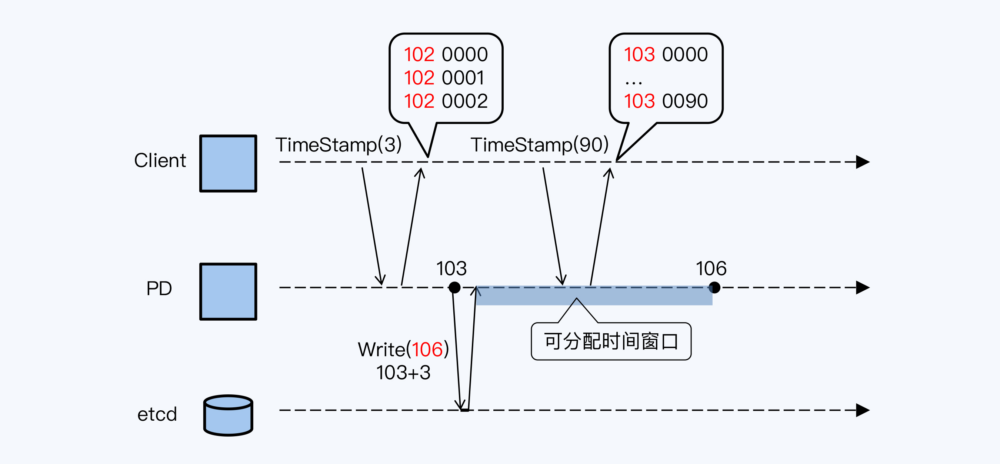
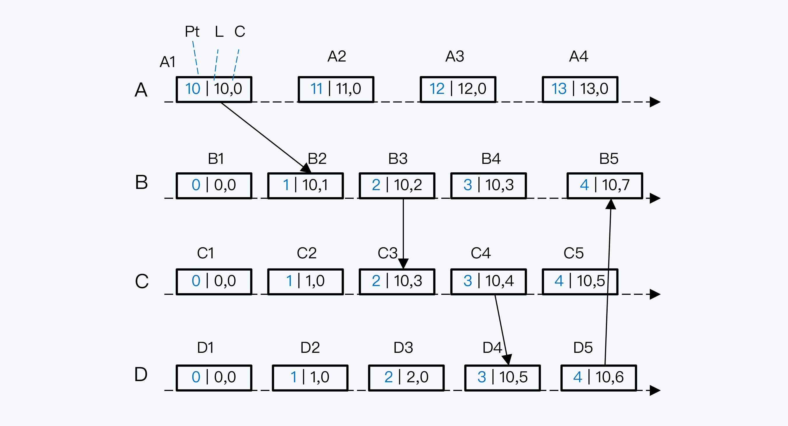

分布式数据库的很多设计都和时间有关，更确切地说是和全局时钟有关。比如线性一致性，它的基础就是全局时钟，还有后面会讲到的多版本并发控制（MVCC）、快照、乐观 协议与悲观协议，都和时间有关。

分布式数据库有多种授时机制，它们的区别主要看三个维度。一，是单时间源还是多时 间源；二，时间源采用的是物理时钟还是混合逻辑时钟；三，授时点是一个还是多个。

1. TrueTim，Spanner 采用的方案是 TrueTime。它的时间源是 GPS 和原子钟，所以属于多时间源和物理时钟，同时它也采用了多点授时机制，就是说集群内有多个时间服务器都可以提供授时服务。它依赖于特定硬件设备。
2. HLC（混合逻辑时钟），多时间源、多点授时，但时钟采用了物理时钟与逻辑时钟混合的方式。HLC 在实现机制上也是蛮复杂的，而且和 TrueTime 同样有整体性的时间误差。
3. TSO，单时间源、单点授时的方式，这种授时机制的最大优点就是实现简便，如果能够 保证时钟单调递增，还可以简化事务冲突时的设计。但缺点也很明显，集群不能大范围部 署，同时性能也有上限。
4. STP，巨杉的 STP(SequoiaDB Time Protoco)。它采用了单时 间源、多点授时的方式，优缺点介于 HLC 和 TSO 之间。

#### 中心化授时：TSO

TiDB 的全局时钟是一个数值，它由两部分构成，其中高位是物理时间，也就是操作系统的 毫秒时间；低位是逻辑时间，是一个 18 位的数值。

单点授时首先要解决的肯定是单点故障问题。TiDB 中提供授时服务的节点被称为 Placement Driver，简称 PD。多个 PD 节点构成一个 Raft 组，这样通过共识算法可以保 证在主节点宕机后马上选出新主，在短时间内恢复授时服务。

如何保证新主产生的时间戳一定大于旧主呢？那就必须将旧主的时间戳存储 起来，存储也必须是高可靠的，所以 TiDB 使用了 etcd。每产生一个时间戳都要保 存吗？显然不行，那样时间戳的产生速度直接与磁盘 I/O 能力相关，会存在瓶颈。

TiDB 采用预申请时间窗口的方式

当前 PD（主节点）的系统时间是 103 毫秒，PD 向 etcd 申请了一个“可分配的时间窗 口”。要知道时间窗口的跨度是可以通过参数指定的，系统的默认配置是 3 毫秒，示例采 用了默认配置，所以这个窗口的起点是 PD 当前时间 103，时间窗口的终点就在 106 毫秒 处。。写入 etcd 成功后，PD 将得到一个从 103 到 106 的“可分配时间窗口”，在这个 时间窗口内 PD 可以使用系统的物理时间作为高位，拼接自己在内存中累加的逻辑时间， 对外分配时间戳。

如果 PD 主节点宕机，新主就可以读取 etcd 中存储的最大值，在此基础上 申请新的“可分配时间窗口”，这样新主分配的时间戳肯定会大于旧主了。

#### 分布式授时：HLC

TrueTime 依赖 Google 强大的工程能力和特殊硬件，不具有普适性。相 反，HLC 作为一种纯软的实现方式，更加灵活，所以在 CockroachDB、YugabyteDB 和 很多分布式存储系统得到了广泛使用。

假如我们有 ABCD 四个节点，方框是节点上发生的事件，方框内的三个数字依次是节点的 本地物理时间(Pt）、HLC 的高位（简称 L 值）和 HLC 的低位（简称 C 值）。

A 节点的本地时间初始值为 10，其他节点的本地时间初始值都是 0。四个节点的第一个事 件都是在节点刚启动的一刻发生的。首先看 A1，它的 HLC 应该是 (10,0)，其中高位直接 取本地时间，低位从 0 开始。同理，其他事件的 HLC 都是 (0,0)。

事件 D2 发生时，首先取**上一个事件 D1 的 L 值和本地时间**比较。本地时间已经递增变为 1，取最大值，那么用本地时间作为 D2 的 L 值。高位变更了，低位要归零， 所以 D2 的 HLC 就是 (1,0)。

如果节点间有调用关系，计时逻辑会更复杂一点。我们看事件 B2，要先判断 B2 的 L 值， 就有三个备选：

1. 本节点上前一个事件 B1 的 L 值 
2. 当前本地时间 
3. 调用事件 A1 的 L 值，A1 的 HLC 是随着函数调用传给 B 节点的

这三个值分别是 0、1 和 10。按照规则取最大值，所以 B2 的 L 值是 10，也就是 A1 的 L 值，而 C 值就在 A1 的 C 值上加 1，最终 B2 的 HLC 就是 (10,1)。

B3 事件发生时，发现当前本地时间比 B2 的 L 值还要小，所以沿用了 B2 的 L 值，而 C 值 是在 B2 的 C 值上加一，最终 B3 的 HLC 就是 (10,2)。

本质上，HLC 还是 Lamport 逻辑时钟的变体，所以对于不同节点上没有调用 关系的两个事件，是无法精确判断先后关系的。

#### 多层级中心化授时：STP（巨杉）

巨杉采用了单时间源、多点授时机制，它有自己的全局时间协议，称为 STP（Serial Time Protocol），是内部逻辑时间同步的协议

STP 下的所有角色统称为 STP Node，具体分为两类：

1. STP Server。多个 STP Server 构成 STP Server 组，组内根据协议进行选主，主节点 被称为 Primary，对外提供服务。 
2.  STP Client。按照固定的时间间隔，从 Primary Server 同步时间

巨杉数据库的其他角色节点，如编目节点（CATALOG）、协调节点（COORD）和数据节 点（DATA）等，都从本地的 STP Node 节点获得时间。