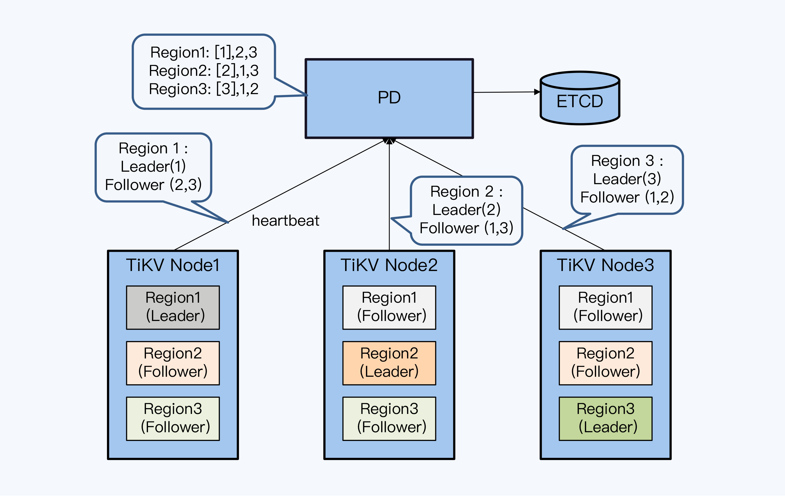

[toc]

在大规模的业务应用下，单体数据库遇 到的主要问题是什么？对，首先就是写入性能不足，另外还 有存储方面的限制。而分片就是解决性能和存储这两个问题的关键设计，甚至不仅是分布 式数据库，在所有分布式存储系统中，分片这种设计都是广泛存在的。

#### 分片策略

分片在不同系统中有各自的别名，Spanner 和 YugabyteDB 中被称为 Tablet，在 HBase 和 TiDB 中被称为 Region，在 CockraochDB 中被称为 Range。分片是一种水平切分数据表的方式，它是数据记录的集合，也是数据表的组成单 位。

分布式数据库的分片与单体数据库的分区非常相似，区别在于：分区虽然可以将数据表按 照策略切分成多个数据文件，但这些文件仍然存储在单节点上；而分片则可以进一步根据 特定规则将切分好的文件分布到多个节点上，从而实现更强大的存储和计算能力。

分片机制通常有两方面需要关注的：

1. 分片策略，主要有 Hash（哈希）和 Range（范围）两种

2. 分片的调度机制，分为静态与动态两种。静态意味着分片在节点上的分布基本是固定的，即使移动也需要人 工的介入；动态则是指通过调度管理器基于算法在各节点之间自动地移动分片。

#### PGXC分片

PGXC 只支持静态的 Hash 分片和 Range 分片

##### Hash分片

Hash 分片，就是按照数据记录中指定关键字的 Hash 值将数据记录映射到不同的分片中。因为 Hash 计算会过滤掉数据原有的业务特性，所以可以保证数据非常均匀地分布到多个 分片上，这是 Hash 分片最大的优势，而且它的实现也很简洁。

如果系统节点数量变动，模也随之改变，数据就要重新 Hash 计 算，从而带来大规模的数据迁移。显然，这种方式对于扩展性是非常不友好的。

需要找一个方法提升系统的扩展性，是的它就是一执行Hash算法，工业实践中应用一致性 Hash 算法，首先会引入虚拟节点，每个虚拟节点就是一个分片。因为分片数量决定了集群的最大规模，所以它通常会远大于初始集群节点数。

节点和数据都通过 Hash 函数映射到 Hash 环上，数据按照顺时针找到最近的节点。我们新增一台服务器，受影响的数据仅仅是新服务器到其环空间中前一台服务器之间数据。

Hash 分片是一种静态分片方式，必须在设计之初约定分片的最大规模。同时，因为 Hash 函数已经过滤掉了业务属性，也很难解决访问业务热点问题。所谓业务热点，就是由于局部的业务活跃度较高，形成系统访问上的热点。

##### Range静态分片

相对 Hash 分片，Range 分片的适用范围更加广泛。其中一个非常重要的原因是，Range 分片可以更高效地扫描数据记录，而 Hash 分片由于数据被打散，扫描操作的 I/O 开销更大。静态的Range分片也可以平衡热点数据。

#### NewSQL

NewSQL 也是支持 Hash 和 Range 两种分片方式的。具体就产品来说， CockroachDB 和 YugabyteDB 同时支持两种方式，TiDB 仅支持 Range 分片。 NewSQL 数据库的 Hash 分片也是静态的，所以重点看下 Range 动态分片。

##### Range动态分片

NewSQL 的 Range 分片，多数是用主键作为关键字来分片的，分片是一 个系统自动处理的过程，用户是感知不到的。动态分片体现在两个方面：

1. 分片可以自动完成分裂与合并

   当单个分片的数据量超过设定值时，分片可以一分为二，这样就可以保证每个分片的数据 量较为均衡。多个数据量较少的分片，会在一定的周期内被合并为一个分片。

2. 可以根据访问压力调度分片

   系统之所以尽量维持分片之间，以及节点间的数据量均衡，存储的原因外，还可 以更大概率地将访问压力分散到各个节点上。但是，有少量的数据可能会成为访问热点，

存储均衡和访问压力均衡，是 NewSQL 分片调度机制普遍具备的两项能力。此外，还有两项能力在Spanner 论文中被提及，但在其他产品中没有看到工程化实现。

1. 减少分布式事务

   Spanner 在 Tablet，也就是 Range 分片，之下增加了目录（Directory），作为数据调度 的最小单位，它的调度范围是可以跨 Tablet 的。通过调度 Directory 可以将频繁参与同样 事务的数据，转移到同一个 Tablet 下，从而将分布式事务转换为本地事务。

2. 缩短服务延时

   对于全球化部署的分布式数据库，数据可能存储在相距很远的多个数据中心，如果用户需 要访问远端机房的数据，操作延时就比较长，这受制于数据传输速度。而 Spanner 可以将 Directory 调度到靠近用户的数据中心，缩短数据传输时间。当然，这里的调度对象都是数 据的主副本，跨中心的数据副本仍然存在，负责保证系统整体的高可靠性。

#### 分片与高可靠

高可靠是分布式数据库的重要特性，分片是数据记录的最小组织单位，也必须是高可靠的。NewSQL 与 PGXC 的区别在于，对于 NewSQL 来说，分片是高可靠的最小单元；而对于 PGXC，分片的高可靠要依附于节点的高可靠。

NewSQL 的实现方式是复制组（Group）。在产品层面，通常由一个主副本和若干个副本组成，通过 Raft 或 Paxos 等共识算法完成数据同步，称为 Raft Group 或 Paxos Group，所以我们简称这种方式为 Group。因为不相关的数据记录会被并发操作，所以同一时刻有多个 Group 在工作。因此，NewSQL 通常支持 Multi Raft Group 或者 Multi Paxos Group。

每个 Group 是独立运行的，只是共享相同的网络和节点资源，所以不同复制组的主副本是 可以分布在不同节点的。

PGXC 的最小高可靠单元由一个主节点和多个备节点组成，我们借用 TDSQL 中的术语，将 其称为 Set。一个 PGXC 是由多个 Set 组成。Set 的主备节点间复制，多数采用半同步复 制，平衡可靠性和性能。

从架构设计角度看，Group 比 Set 更具优势，原因主要有两个方面。首先，Group 的高可 靠单元更小，出现故障时影响的范围就更小，系统整体的可靠性就更高。其次，在主机房 范围内，Group 的主副本可以在所有节点上运行，资源可以得到最大化使用，而 Set 模式 下，占大多数的备节点是不提供有效服务的，资源白白浪费掉。

#### 分片信息存储

在任何一个分布式存储系统中，收到客户端请求后，承担路由功能的节点首先 要访问分片元数据（简称元数据），确定分片对应的节点，然后才能访问真正的数据。这 里说的元数据，一般会包括分片的数据范围、数据量、读写流量和分片副本处于哪些物理 节点，以及副本状态等信息。

元数据 的存储很容易成为整个系统的性能瓶颈和高可靠性的短板。如果系统支持动态分片，那么 分片要自动地分拆、合并，还会在节点间来回移动。这样，元数据就处在不断变化中，又 带来了多副本一致性（Consensus）的问题。

##### 静态分片

最简单的情况是静态分片，只要把元数据复制多份放在对应的工作节点上就可以了，这样同时兼顾了性能和高可靠。TBase 大致就是这个思路，直接将元数据存储在协调节点上。即使协调节点是工作节点，随着集群规模扩展，会导致元数据副本过多，但由于哈希分片基本上就是静态分片，也就不用考虑多副本一致性的问题。

但如果要更新分片信息，这种方式显然不适合，因为副本数量过多，数据同步的代价太大了。所以对于动态分片，通常是不会在有工作负载的节点上存放元数据的。

##### TiDB：无服务状态

在 TiDB 架构中，TiKV 节点是实际存储分片数据的节点，而元数据则由 Placement Driver 节点管理。

TiKV 节点定期主动向 PD 报送心跳，分片的元数据信息也就随着心跳一起报送，而 PD 会将分片调度指令放在心跳的返回信息中。等到 TiKV 下次报送心跳时，PD 就能了解到调度的执行情况。

由于每次 TiKV 的心跳中包含了全量的分片元数据，PD 甚至可以不落盘任何分片元数据，完全做成一个无状态服务。PD 宕机后选举出的新主根本不用处理与旧主的状态衔接，在一个心跳周期后就可以工作了。当然，在具体实现上，PD 仍然会做部分信息的持久化，这可以认为是一种缓存。

三个 TiKV 节点每次上报心跳时，由主副本（Leader）提供该分片的元数据，这样 PD 可以获得全量且没有冗余的信息。虽然无状态服务有很大的优势，但 PD 仍然是一个单点，也就是说这个方案还是一个中心化的设计思路，可能存在性能方面的问题。

##### CockroachDB：去中心化

CockroachDB 采用了 P2P 架构，每个节点都要保存完整的元数据，这样节点规模就非常大，当然也就不适用广播机制。而 Gossip 协议的原理是谣言传播机制，每一次谣言都在几个人的小范围内传播，但最终会成为众人皆知的谣言。这种方式达成的数据一致性是 “最终一致性”，即执行数据更新操作后，经过一定的时间，集群内各个节点所存储的数据最终会达成一致。

