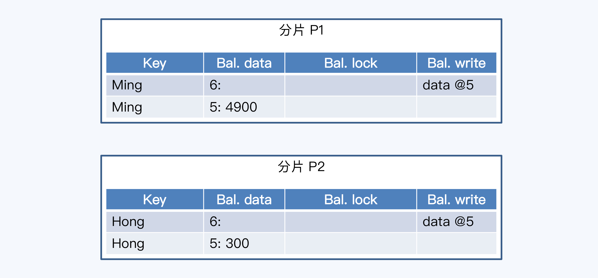
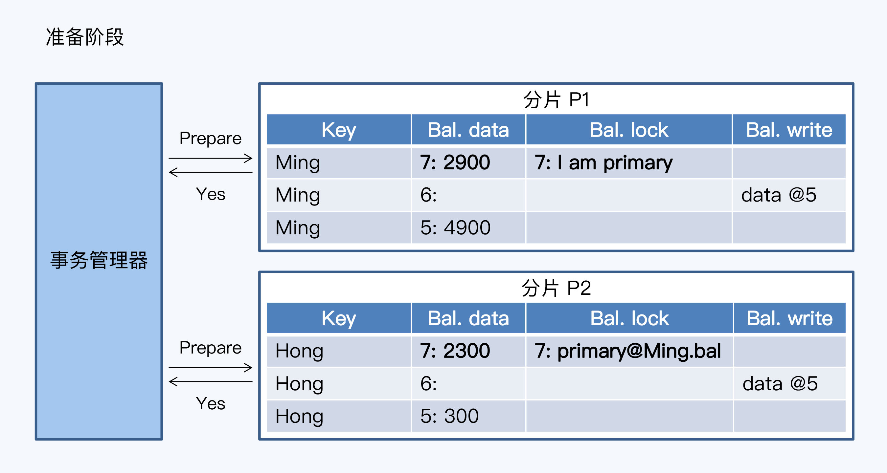
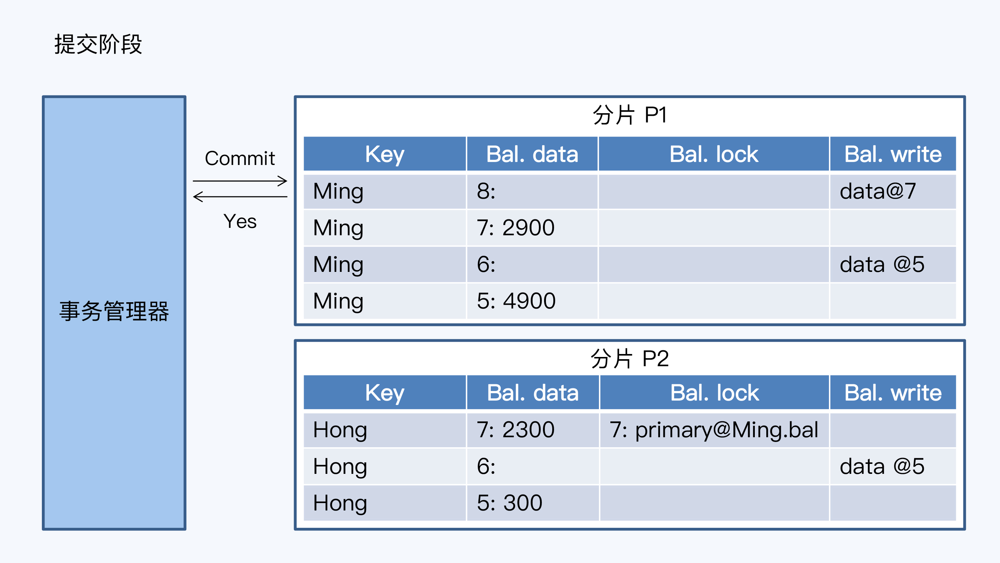
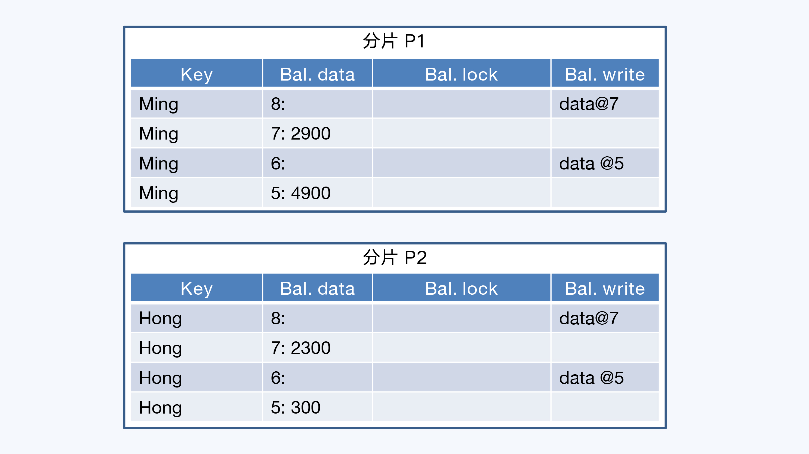

[toc]

关于事务的原子性的定义：Atomicity: Either all the changes from the transaction occur (writes, and messages sent), or none occur.

分布式事务原子性的外在表现与事务原子性一致，但前者要涉及多个物理节点，而且增加了网络这个不确定性因素，使得问题更加复杂。

#### 面向应用层TCC

TCC 是 Try、Confirm 和 Cancel 三个单词的缩写，它们是事务过程中的三个操作。TCC 的整个过程由两类角色参与，一类是事务管理器，只能有一个；另一类是事务参与 者，也就是具体的业务服务，可以是多个，每个服务都要提供 Try、Confirm 和 Cancel 三 个操作。

1. 第一阶段，事务管理器会发出 Try 操作，要求进行资源的检查和预留。
2. 第二阶段，因为参与者都已经做好准备，所以事务管理器会发出 Confirm 操作，执行真正 的业务，如果前面有参与者回复 No，所以事务管理器向所有参与者发出 Cancel 指令， 让已经成功执行 Try 操作的单元 A 执行 Cancel 操作，撤销在 Try 阶段的操作，

#### 2PC

2PC 的处理过程也分为准备和提交两个阶段，每个阶段都由事务管理器与资源管理器共同 完成。其中，事务管理器作为事务的协调者只有一个，而资源管理器作为参与者执行具体 操作允许有多个。

以小明转账给小红伟例。

第一阶段是准备阶段，事务管理器首先向所有参与者发送待执行的 SQL，并询问是否做好 提交事务的准备（Prepare）；参与者记录日志、分别锁定了小明和小红的账户，并做出应答，协调者接收到反馈 Yes，准备阶段结束。 如果不具备执行事务的条件，只能向所有数据库发 出“回滚”（Rollback）指令。

第二阶段是提交阶段，如果所有数据库的反馈都是 Yes，则事务管理器会发出提交 （Commit）指令。这些数据库接受指令后，会进行本地操作，正式提交更新余额，给小明 的账户扣减 2,000 元，给小红的账户增加 2,000 元，然后向协调者返回 Yes，事务结束。

相比于 TCC，2PC 的优点是借助了数据库的提交和回滚操作，不侵入业务逻辑。但是，它 也存在一些明显的问题：

1. 同步阻塞

   执行过程中，数据库要锁定对应的数据行。如果其他事务刚好也要操作这些数据行，那它 们就只能等待。其实同步阻塞只是设计方式，真正的问题在于这种设计会导致分布式事务 出现高延迟和性能的显著下降。

2. 单点故障

   事务管理器非常重要，一旦发生故障，数据库会一直阻塞下去。尤其是在第二阶段发生故障的话，所有数据库还都处于锁定事务资源的状态中，从而无法继续完成事务操作。

3. 数据不一致

   在第二阶段，当事务管理器向参与者发送 Commit 请求之后，发生了局部网络异常，导致 只有部分数据库接收到请求，但是其他数据库未接到请求所以无法提交事务，整个系统就 会出现数据不一致性的现象。

#### Percolator

Percolator 来自 Google 的论文，因为它是基于分布式存储系统 BigTable建立的模型，所以可以和 NewSQL 无缝链接。Percolator 模型同时涉及了隔离性和原子性的处理，使用 Percolator 模型的前提是事务的参与者，即数据库，要支持多版本并发控制 （MVCC）。

还是以转账为例，在转账事务开始前，小明和小红的账户分别存储在分片 P1 和 P2 上

在分片的账户表中各有两条记录，第一行记 录的指针（write）指向第二行记录，实际的账户余额存储在第二行记录的 Bal. data 字段 中。Bal.data 分为两个部分，冒号前面的是时间戳，代表记录的先后次序；后面的是真正的账 户余额。我们可以看到，现在小明的账户上有 4,900 元，小红的账户上有 300 元。

第一，准备阶段，事务管理器向分片发送 Prepare 请求，包含了具体的数据操作要求。 分片接到请求后要做两件事，写日志和添加私有版本。在 lock 字段上写入了标识信息的记录就是私有版本，只有当前事务能够操作，通常其他事务不能读写这条记录。

主锁的选择是随机的，参与事务的记录都可能拥有主锁，但一个事务只能有一条记录拥有主锁，其他参与事务的记录在 lock 字段记录了指针信息指向主锁记录。

第二，提交阶段，事务管理器只需要和拥有主锁的分片通讯，发送 Commit 指令

分片 P1 增加了一条新记录时间戳为 8，指向时间戳为 7 的记录，为7的记录的主锁也被抹去。这时候 7、8 两条记录不再是私有版本，所有事务都可以看到小明的余额变 为 2,700 元，事务结束。

分片 P2 的最后一条记录，保存了指向主锁的指 针。其他事务读取到 Hong7 这条记录时，会根据指针去查找 Ming.bal，发现记录已经提交，所以小红的记录虽然是私有版本格式，但仍然可视为已经生效了。当然，这种通过指针查找的方式，会给读操作增加额外的工作。如果每个事务都照做，性能损耗就太大了。所以，还会有其他异步线程来更新小红的余额记录。最终变为了

与2PC的对比

1. 2PC 的一致性问题主要缘自第二阶段，不能确保事务管理器与多个参与者的通讯始终正 常。 但在 Percolator 的第二阶段，事务管理器只需要与一个分片通讯，这个 Commit 操作本 身就是原子的。所以，事务的状态自然也是原子的，一致性问题被完美解决了。
2. 一是，Percolator 引入的异步线程可以在事务管理器宕机后，回滚各个分片上的事务，提 供了善后手段，不会让分片上被占用的资源无法释放。 二是，事务管理器可以用记录日志的方式使自身无状态化，日志通过共识算法同时保存在 系统的多个节点上。这样，事务管理器宕机后，可以在其他节点启动新的事务管理器，基 于日志恢复事务操作。

CockroachDB 的变化在于没有随机选择主锁，而是引入了一张全局事务表，所有分片记录 的指针指向了这个事务表中对应的事务记录。

#### 延时估算

整个 2PC 的事务延迟由两个阶段组成，可以用公式表达为：
$$
L_{txn}=L_{prep} + L_{commit}
$$
我们先说准备阶段，它是事务操作的主体，包含若干读操作和若干写操作。我们把读操作的次数记为 R，读操作的平均延迟记为Lr，写操作次数记为 W，写操作平均延迟记为 Lw。那么整个准备阶段的延迟可以用公式表达为:
$$
L_{prep} = L_r * R + L_w * w
$$
先忽略掉读取时间，分布式数据库的写入，并不是简单的本地操作，而是使用共识算法同时在多 个节点上写入数据。所以，一次写入操作延迟等于一轮共识算法开销，我们用 Lc代表一 轮共识算法的用时，可以得到下面的公式：
$$
L_{prep} = W * L_c
$$
 Percolator 模型中提交阶段只需要写入一次数据，修改整个事务的状态。对于 CockroachDB，这个事务标识可以保存在本地。那么提交操作的延迟也是一轮共识算法，也就是：
$$
L_{commit} = L_c
$$
分别得到两个阶段的延迟后，带入最开始的公式，可以得到：
$$
L_{txn}=(w+1) * L_c
$$
以小明给小红转账的例子，包含两条写操作 SQL，分别是扣减小明账户余额和增加小红账户余 额，W 等于 2。再加上提交操作，共识3个Lc

#### 优化方法

##### 缓存写提交

所有从 Client 端提交的 SQL 首先会缓存在 TiDB 节点，只有当客户端发起 Commit 时， TiDB 节点才会启动两阶段提交，将 SQL 被转换为 TiKV 的操作。这样，显然可以压缩第一 阶段的延迟，把多个写操作 SQL 压缩到大约一轮共识算法的时间。那么整个事务延迟就 是：
$$
L_{txn} = 2 * L_c
$$
但缓存写提交存在两个明显的缺点。 首先是在客户端发送 Commit 前，SQL 要被缓存起来，如果某个业务场景同时存在长事务 和海量并发的特点，那么这个缓存就可能被撑爆或者成为瓶颈。

其次是客户端看到的 SQL 交互过程发生了变化，在 MySQL 中如果出现事务竞争，判断优 先级的规则是 First Write Win，也就是对同一条记录先执行写操作的事务获胜。而 TiDB 因为缓存了所有写 SQL，所以就变成了 First Commit Win，也就是先提交的事务获胜。

##### Pipeline

CockroachDB 采用的方式，称为 Pipeline。具体过程就是在准备阶段是按照顺序将 SQL 转换为 K/V 操作并执行，但是并不等待返回结果，直接执行下一个 K/V 操作。 这样，准备阶段的延迟，等于最慢的一个写操作延迟，也就是一轮共识算法的开销，加上提交阶段的一轮共识算法开销：
$$
L_{txn} = 2 * L_c
$$

##### 并行提交（Parallel Commits）

准备阶段的操作，在 CockroachDB 中被称为意向写。这个并行执行就是在执行意向写的 同时，就写入事务标志，当然这个时候不能确定事务是否提交成功的，所以要引入一个新 的状态“Staging”，表示事务正在进行。那么这个记录事务状态的落盘操作和意向写大致 是同步发生的，所以只有一轮共识算法开销。

Writes 部分是意向写的 Key。这是留给异步进程的线索，通过这些 Key 是否写成功，可以 倒推出事务是否提交成功。