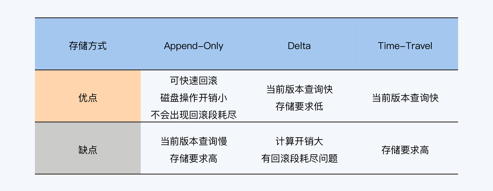
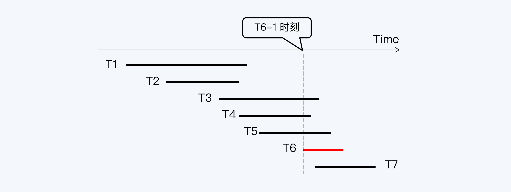
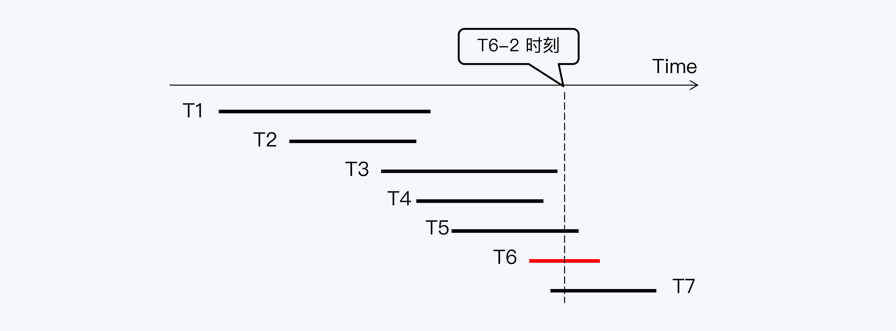

[toc]

多版本并发控制（Multi-Version Concurrency Control，MVCC）就是通过记录数据项历 史版本的方式，来提升系统应对多事务访问的并发处理能力。几乎所有主流的单体数据库都实现了 MVCC，它已经成为一项非常重要也非常普及的技术。

#### 单体数据库的 MVCC

MVCC 有三类存储方式，一类是将历史版本直接存在数据表中的，称为 Appane-Only， 典型代表是 PostgreSQL。另外两类都是在独立的表空间存储历史版本，它们区别在于存储的方式是全量还是增量。增量存储就是只存储与版本间变更的部分，这种方式称为 Delta，典型代表是 MySQL 和 Oracle。全量存储则是将每个版本的数据全部存储下来，这种方式称为 Time-Travle，典型代表是 HANA。

##### Append-Only 方式

优点：

1. 在事务包含大量更新操作时也能保持较高效率。因为更新操作被转换为 Delete + Insert，数据并未被迁移，只是有当前版本被标记为历史版本，磁盘操作的开销较小。 

2. 可以追溯更多的历史版本，不必担心回滚段被用完。

3. 因为执行更新操作时，历史版本仍然留在数据表中，所以如果出现问题，事务能够快速 完成回滚操作。

缺点：

但是新老数据放在一起，会增加磁盘寻址的开销，随着历史版本增多，会导致查询速度变慢。

##### Delta 方式

优点：

1. 因为历史版本独立存储，所以不会影响当前读的执行效率。 
2. 因为存储的只是变化的增量部分，所以占用存储空间较小。

缺点：

1. 历史版本存储在回滚段中，而回滚段由所有事务共享，并且还是循环使用的。如果一个 事务执行持续的时间较长，历史版本可能会被其他数据覆盖，无法查询。 
2.  这个模式下读取的历史版本，实际上是基于当前版本和多个增量版本计算追溯回来的， 那么计算开销自然就比较大。

##### Time-Travel 方式

优点：

1. 同样是将历史版本独立存储，所以不会影响当前读的执行效率。 
2. 相对 Delta 方式，历史版本是全量独立存储的，直接访问即可，计算开销小。

缺点：

1. 相对 Delta 方式，需要占用更大的存储空间。

当然，无论采用三种存储方式中的哪一种，都需要进行历史版本清理。NewSQL 底层使用分布式键值系统来存储数据，MVCC 的存储方式与 PostgreSQL 类 似，采用 Append 方式追加新版本。

#### MVCC 的工作过程

历史版本存储下来后又是如何发挥作用的呢？是要解决多事务的并发控制问题，也就是保证事务的隔离性。先来看 RC 隔离级别下 MVCC 的工作过程。

按照 RC 隔离级别的要求，事务只能看到的两类数据：

1. 当前事务的更新所产生的数据。 
2. 当前事务启动前，已经提交事务更新的数据。

看下面例子

T1 到 T7 是七个数据库事务，它们先后运行，分别操作数据库表的记录 R1 到 R7。事务 T6 要读取 R1 到 R6 这六条记录，在 T6 启动时（T6-1）会向系统申请一个活动事务列表，活动事务就是已经启动但尚未提交的事务，这个列表中会看到 T3、T4、T5 等三个事务。 

T6 查询到 R3、R4、R5 时，看到它们最新版本的事务 ID 刚好在活动事务列表里，就会读取它们的上一版本。而 R1、R2 最新版本的事务 ID 小于活动事务列表中的最小事务 ID（即 T3），所以 T6 可以看到 R1、R2 的最新版本。

 这个例子中 MVCC 的收益非常明显，T6 不会被正在执行写入操作的三个事务阻塞，而如果按照原来的锁方式，T6 要在 T3、T4、T5 三个事务都结束后，才能执行。

#### 快照的工作原理

可重复读（RR）的隔离级别下

当 T6 执行到下一个时间点（T6-2），T1 到 T4 等 4 个事务都已经 提交，此时 T6 再次向系统申请活动事务列表，列表包含 T5 和 T7。遵循同样的规则，这次 T6 可以看到 R1 到 R4 等四条记录的最新版本，同时看到 R5 的上一版本。

很明显，T6 刚才和现在这两次查询得到了不同的结果集，这是不符合 RR 要求的。

实现 RR 的办法也很简单，我们只需要记录下 T6-1 时刻的活动事务列表，在 T6-2 时再次使用就行了。那么，这个反复使用的活动事务列表就被称为“快照”（Snapshot）。快照是基于 MVCC 实现的一个重要功能，从效果上看， 快照就是快速地给数据库拍照片，数据库会停留在你拍照的那一刻。

RC 与 RR 的区别在于 RC 下每个 SQL 语句会有一个自己的快照，所以看到的数据库是不同的，而 RR 下，所有 SQL 语句使用同一个快照，所以会看到 同样的数据库。

为了提升效率，快照不是单纯的事务 ID 列表，它会统计最小活动事务 ID，还有最大已提 交事务 ID。这样，多数事务 ID 通过比较边界值就能被快速排除掉，如果事务 ID 恰好在边 界范围内，再进一步查找是否与活跃事务 ID 匹配。

快照在 MySQL 中称为 ReadView，在 PostgreSQL 中称为 SnapshotData，组织方式都 是类似的。

#### 分布式数据库的挑战

##### PGXC 读写冲突处理

