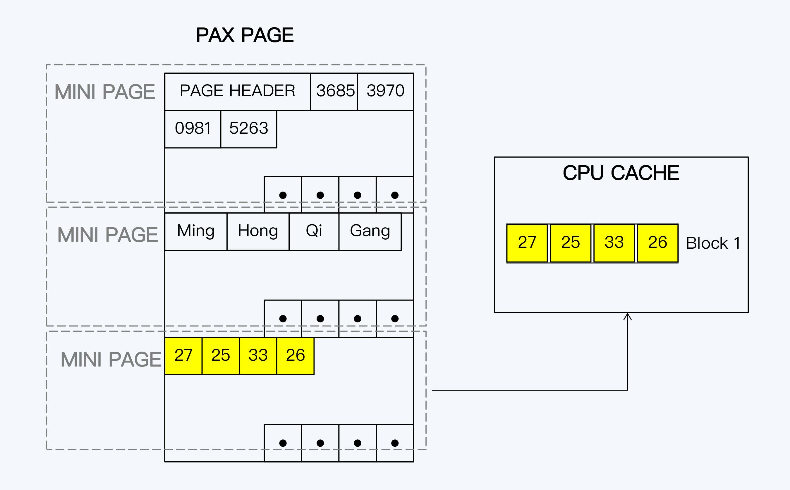

#### 重建 OLAP 体系

重建 OLAP 体系，重视数据加工的时效性，正是近年来大数据技 术的主要发展方向。Kappa 架构就是新体系的代表，在 Kappa 架构中，原来的批量文件传输方式完全被 Kafka 替代，通过流计算系统完成数 据的快速加工，数据最终落地到 Serving DB 中提供查询服务。这里的 Serving DB 泛指各 种类型的存储，可以是 HBase、Redis 或者 MySQL。

要注意的是，Kappa 架构还没有完全实现，因为在实践中流计算仍然无法替代批量计算， Serving DB 也无法满足各种类型的分析查询需求。未来，Kappa 架构需要在两方面继续 完善：

1. 流计算能力的增强，这需要用到 Kafka 和 Flink 等软件； 
2. Serving DB 即时计算能力的增强，这就寄希望于 OLAP 数据库的突破，就像 ClickHouse 已经做的那样。

#### 新建 HTAP 系统

HTAP（Hybrid Transaction/Analytical Processing）就是混合事务分析处理，Gartner 用 HTAP 来描述一种新型数据库，它打破了 OLTP 和 OLAP 之间的隔阂，在 一个数据库系统中同时支持事务型数据库场景和分析型数据库场景。这个构想非常美妙， HTAP 可以省去繁琐的 ETL 操作，避免批量处理造成的滞后，更快地对最新数据进行分 析。

##### HTAP 的两种存储设计

这就要先说回 OLTP 和 OLAP，在架构上，它们的差异在于计算和存储两方面。 计算是指计算引擎的差异，目标都是调度多节点的计算资源，做到最大程度地并行处理。 因为 OLAP 是海量数据要追求高吞吐量，而 OLTP 是少量数据更重视低延迟，所以它们计算引擎的侧重点不同。

存储是指数据在磁盘上的组织方式不同，而组织方式直接决定了数据的访问效率。OLTP 和 OLAP 的存储格式分别为行式存储和列式存储

分布式数据库的主流设计理念是计算与存储分离，那么计算就比较容易实现无状态化，所 以在一个 HTAP 系统内构建多个计算引擎显然不是太困难的事情，而真的要将 HTAP 概念 落地为可运行系统，根本性的挑战就是存储。

面对这个挑战，业界有两个不同的解决思路：

1. Spanner 使用的融合性存储 PAX（Partition Attributes Across），试图同时兼容两类场景。

2. TiDB4.0 版本中的设计，在原有行式存储的基础上，新增列式存储，并通过创新性的设计，保证两者的一致性。

##### Spanner：存储合一

Spanner2017 论文“Spanner: Becoming a SQL System”中介绍了它的新一代存储 Ressi，其中使用了类似 PAX 的方式。

1. NSM （行式存储）

NSM（N-ary Storage Model）就是行式存储，也是 OLTP 数据库默认的存储方式，始终 伴随着关系型数据库的发展。我们常用的 OLTP 数据库，比如 MySQL（InnoDB）、 PostgreSQL、Oracle 和 SQL Server 等等都使用了行式存储。

行式存储的特点是将一条数据记录集中存在一起，这种方式更加贴近于关系模 型。写入的效率较高，在读取时也可以快速获得一个完整数据记录，这种特点称为记录内 的局部性（Intra-Record Spatial Locality）。

行式存储对于 OLAP 分析查询并不友好。OLAP 系统的数据往往是从多个 OLTP 系 统中汇合而来，单表可能就有上百个字段。而用户一次查询通常只访问其中的少量字段， 如果以行为单位读取数据，查询出的多数字段其实是无用的，也就是说大量 I/O 操作都是

2. DSM（列式存储)

DSM（Decomposition Storage Model）就是列式存储，列式存储就是将所有列集中存储，不仅更加适应 OLAP 的访问特点，对 CACHE 也更友 好。这种特点称为记录间的局部性（Inter-Record Spatial Locality）。列式存储能够大幅 提升查询性能，以速度快著称的 ClickHouse 就采用了列式存储。

列式存储的问题是写入开销更大，这是因为根据关系模型，在逻辑上数据的组织单元仍然 是行，改为列式存储后，同样的数据量会被写入到更多的数据页（page）中，而数据页直 接对应着物理扇区，那么磁盘 I/O 的开销自然增大了。

3. PAX

PAX 增加了 minipage 这个概念，是原有的数据页下的二级单位，这样一行数据记录在数据页上的基本分布不会被破坏，而相同列的数据又被集中地存储在一起。PAX 本质上还是更接近于行式存储，但它也在努力平衡记录内局部性和记录间局部性，提升了 OLAP 的性能。 理论上，PAX 提供了一种兼容性更好的存储方式，

##### TiFlash：存储分离

如果底层存储是一份数据，那么天然就可以保证 OLTP 和 OLAP 的数据一致性，这是 PAX 的最大优势，但是由于访问模式不同，性能的相互影响似乎也是无法避免，只能尽力选择 一个平衡点。TiDB 展现了一种不同的思路，介于 PAX 和传统 OLAP 体系之间，那就是 OLTP 和 OLAP 采用不同的存储方式，物理上是分离的，然后通过创新性的复制策略，保 证两者的数据一致性。

TiDB 是在较早的版本中就提出了 HTAP 这个目标，并增加了 TiSpark 作为 OLAP 的计算 引擎，但仍然共享 OLTP 的数据存储 TiKV，所以两种任务之间的资源竞争依旧不可避免。 直到近期的 4.0 版本中，TiDB 正式推出了 TiFlash 作为 OLAP 的专用存储。

个同步机制仍然是基于 Raft 协议的。TiDB 在 Raft 协议原有的 Leader 和 Follower 上增加了一个角色 Learner。 这个 Learner 和 Paxos 协议中的同名角色，有类似的职责，就是负责学习已经达成一致的 状态，但不参与投票。这就是说，Raft Group 在写入过程中统计多数节点时，并没有包含 Learner，这样的好处是 Learner 不会拖慢写操作，但带来的问题是 Learner 的数据更新 必然会落后于 Leader。

Raft 协议能够实现数据一致性，是因为限制了只有主节点提供服务，否则别说是 Learner 就是 Follower 直接对外服务，都不能满足数据一致性。所以，这里还有另外一个设计。

Learner 每次接到请求后，首先要确认本地的数据是否足够新，而后才会执行查询操作。 怎么确认足够新呢？ Learner 会拿着读事务的时间戳向 Leader 发起一次请求，获得 Leader 最新的 Commit Index，就是已提交日志的顺序编号。然后，就等待本地日志继续 Apply，直到本地的日志编号等于 Commit Index 后，数据就足够新了。而在本地 Region 副本完成同步前，请求会一直等待直到超时。