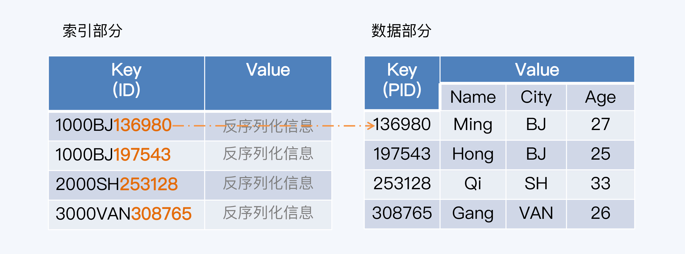
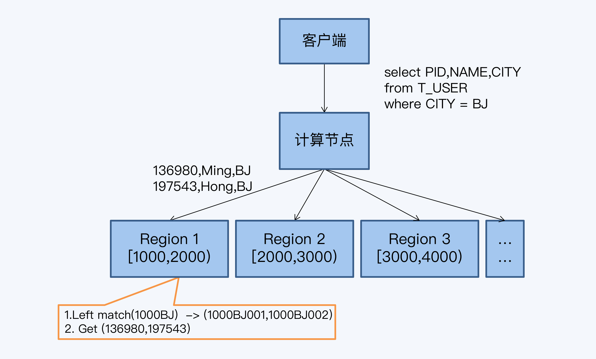

[toc]

#### 计算下推

分布式数据库的主体架构是朝着计算和存储分 离的方向发展的，这一点在 NewSQL 架构中体现得尤其明显。但是计算和存储是一个完整 的过程，架构上的分离会带来一个问题：是应该将数据传输到计算节点 (Data Shipping)， 还是应该将计算逻辑传输到数据节点 (Code Shipping)？ 从直觉上说，肯定要选择 Code Shipping，因为 Code 的体量远小于 Data，因此它能传 输得更快，让系统的整体性能表现更好。 这个将 code 推送到存储节点的策略被称为“计算下推”，是计算存储分离架构下普遍采用的优化方案。

将计算节点的逻辑推送到存储节点执行，避免了大量的数据传输，也达到了计算并行执行的效果。

**谓词下推**，就是把查询相关的条件下推到数据源进行提前的过滤操作，表现形式主要是 Where 子句。

#### 分区索引

分区索引就是索引与数据在同一分区，这个分区实际就是我们之前说的分片。因为分片是 最小调度单位，那就意味着在分区索引下，索引和数据是确保存储在同一物理节点。我们 把索引和数据在同一个物理节点的情况称为同分布（co_located）。

分区索引的优点很明显，那就是性能好，因为所有走索引的查询都可以下推到每个存储节 点，每个节点只把有效查询结果返回给计算节点，避免了大量无效的数据传输。分区索引 的实现难点在于如何保证索引与数据始终同分布。

在 HBase 下，每个分片都有一个不重叠的 Key 区间，这个区间左闭右开。当新增一个键 值对（Key/Value）时，系统会先判断这个 Key 与哪个分片的区间匹配，而后就分配到那 个匹配的分片中保存，匹配算法一般采用左前缀匹配方式。

我们要操作的是一张用户信息表 T_USER，它有四个字段，分别是主键 PID、 客户名称（Name）、城市（City）和年龄（Age）。T_USER 映射到 HBase 这样的键值 系统后，主键 PID 作为 Key，其他数据项构成 Value。

我们在“Ctiy”字段上建立索引，索引与数据行是一对一的关系。索引存储也是 KV 形式， Key 是索引自身的主键 ID，Value 是反序列化信息用于解析主键内容。索引主键由三部分 构成，分别是分片区间起始值、索引值和所指向数据行的主键（PID）。因为 PID 是唯一 的，索引主键在它的基础上增加了前缀，所以也必然是唯一的。

1. 客户端发起查询 SQL。 
2. 计算节点将 SQL 下推到各个存储节点。
3.  存储节点在每个 Region 上执行下推计算，取 Region 的起始值加上查询条件中的索引 值，拼接在一起作为左前缀，扫描索引数据行。 
4.  根据索引扫描结果中的 PID，回表查询。 
5. 存储节点将 Region 查询结果，反馈给计算节点。 
6. 计算节点汇总结果，反馈给客户端。

实现分区索引的难点在于如何始终保持索引与数据的同分布，尤其是发生分片分裂时，这 是很多索引方案没有完美解决的问题。有些方案是在分裂后重建索引，这样开销太大，而且有短暂的不一致。

设计思想并不复杂，那就是把同分布的索引和数据装入一个更小的组织 单元 (Bucket)，而在分片分裂时要保持 Bucket 的完整性。这样一来，因为 Bucket 的粒 度足够小，就不会影响分片分裂本身的目标，也就是平衡分片的数据量和访问压力，又能 维持索引数据同分布。

#### 全局索引

唯一索引对应的方案就是全局索引。全局索引并不保持索引与数据同分布，于是就带来两 个问题：

1. 读操作的通讯成本更高，计算节点要与存储节点做两轮通讯，第一次查询索引信息，第 二次回表查询数据。
2. 写操作的延迟更长，因为任何情况下索引应该与数据保持一致，如果同分布，那么数据 变更时可以通过本地事务保证，但在全局索引下就变成了一个分布式事务，代价当然更高了。

并不是所有分布式数据库都支持了分区索引和全局索引供用户选择，比如 TiDB 的二级索引只支持全局索引。