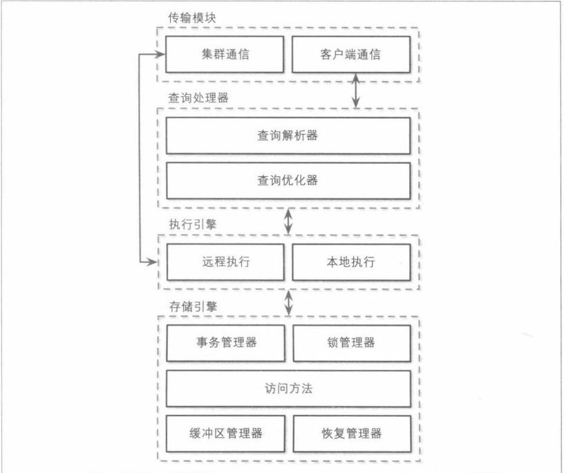

- [1. 数据库的架构](#1-数据库的架构)
- [2. 行列数据库](#2-行列数据库)
- [3. 数据文件&索引文件](#3-数据文件索引文件)
  - [3.1 数据文件](#31-数据文件)
  - [3.2 索引文件](#32-索引文件)
  - [3.3 主键和偏移量](#33-主键和偏移量)
- [4. 缓冲&不可变性&有序性](#4-缓冲不可变性有序性)
- [5. 延伸阅读](#5-延伸阅读)
#### 1. 数据库的架构
数据库的设计及没有共同的蓝图，每个数据库的构建方式都略有不同，各组件之间的边界有些难以分辨和定义。在代码中看似独立的组件也可能由于优化、架构决策被耦合在一起。
数据库使用CS面模型，其中数据库系统实例扮演服务器的角色。客户端请求通过传输系统达到数据库，请求以查询的方式出现，通常查询以查询语言表示，传输系统负责数据库集群间的通讯。

解析后的查询被传递给查询优化器，查询优化器首先消除不可能执行的部分和冗余的部分，然后根据内部统计信息和数据分布尝试找到执行查询的最高效的方法，优化器既处理查询解析所需的关系操作，也处理查询优化,如基数估计和访问方法的选择。查询通常以执行计划或查询计划的形式呈现，执行计划是为了得到完整结果而必须执行的一系列操作，由于执行同一个查询的不同执行计划效率上存在的差异，所以会挑选出最优的计划。

执行计划由执行引擎处理，它会收集本地和远程操作的执行结果，远程执行可能涉及向集群中其他的节点读写数据。

本地、远程查询由存储引擎执行，存储引擎包括下面组件：
1. 事务管理器，调度事务确保数据库处于逻辑一致的状态
2. 锁管理器，为正在运行的事务锁定数据库对象，确保并发操作不会破坏数据的完整性
3. 访问方法，管理磁盘上的数据访问，并负责组织磁盘上的数据
4. 缓冲管理器
5. 恢复管理器，维护操作日志并在故障时还原系统状态

#### 2. 行列数据库
数据库存储数据记录，这些记录由表中的列和行组成，同一列的字段通常具有相同的数据类型，同一行的数据在逻辑上属于一条记录。数据库按照数据在磁盘上的存储方式可以分为按列存储和按行存储，MySQL和PGSQL大多数关系型数据库都是按行存储，而C-Stiore、Clickhouse是按列存储。
按行存储的数据库的布局类似于表格，一条记录的每个字段会存储在一起，按行访问情况下可以提高空间的局部性，磁盘通常是块访问的，或者说磁盘访问的最小单位是块，所以单个块可能包含某行中所有的列。但是如果访问多个记录的某个字段开销会很大。

面向列的数据库垂直的将数据进行分区，同一列的值被连续的存储在磁盘上，不同的列被存储在不同的文件或文件段中。面向列的存储非常适合计算聚合的分析型工作。
为了在逻辑上支持一行记录，还需要在列级别上保留一些源数据，用来标识与它关联的其他列中的数据是哪些。面向列的文件格式也有Apache Paquet、Apache ORC等。。

面向列的数据库和宽列式存储还是有一些区别，在宽列式存储中，列被称为列族，在列族中数据被逐行存储，而不同的列族则分开存储。通过一个或一组键来检索。

#### 3. 数据文件&索引文件
数据库存储数据使用特定的格式来组织文件，每个表通常以一个单独的文件来表示，为了定位记录数据库使用索引，索引由能够标识记录的字段集合构成。
通常数据库将数据文件和索引文件分开，数据文件存储记录集合，而索引文件存储元数据来定位数据文件中的记录。文件被划分为页，每个页通常有多个磁盘块的大小。新增记录和修改使用键值对表示，大多数数据库不显示的删除页上的数据，而是使用删除标记（deletion marker/tombstone）,同时也会记录删除的键和时间戳，在GC过程中这些更新或者删除的记录所占的空间被数据库回收，然后新的记录会写入该位置。
##### 3.1 数据文件
数据文件通常可以用索引组织表(index-organized table,iot)、堆组织表(heap-organized table)或哈希组织表来实现。
其中堆文件的济洛路不需要尊任何规矩，按照写入顺序放置，堆文件需要额外的索引结构来指向存储数据记录的位置。

哈希文件中，记录存储在桶中，而且键的hash code确定记录属于哪个桶。存储在桶中的数据可以按照追加顺序存储，也可以按照键排序存储以提高查询速度。

索引组织表将数据记录存储在索引自身，由于记录是按键的顺序存储，所以这种方式下范围扫描可以通过顺序扫描实现，而将数据记录存储在索引中可以将查询的IO减少，因为在遍历索引找到键后不必再寻址其他文件查找关联的记录。
##### 3.2 索引文件
主数据文件上的索引称为主索引，其他的索引都称为二级索引，二级索引可以指向数据记录，也可以存储它的主键。指向记录的指针可以保存堆文件或者索引组织表中的偏移量。

如果记录的顺序遵循搜索键的顺序，则该索引称为聚簇索引，通常聚簇索引和数据记录存储于一个文件中，有时也会在单独文件。如果记录顺序不遵循搜索顺序则索引称为非聚簇索引。
##### 3.3 主键和偏移量
关于二级索引存储主键或文件偏移量还是有些考量，如果直接引用数据记录可以减少IO次数，但是在可能需要经常更改指针，而存储主键则不需要频繁修改，但是查询成本增加。
#### 4. 缓冲&不可变性&有序性
存储结构有三个变量，是否使用缓冲，是否可变以及是否按顺序存储（有序性）
1. 缓冲
    缓冲定义了存储结构在将数据写入磁盘前是否选择在内存中保留一定数量的数据，这里讨论的是可避免的缓冲
2. 可变性
    可变性定义了存储胡结构是否可以更新文件，不可变的结构是追加的。通常LSM和BTee的区别是不可变的还是原地更新的，BWTree除外。
3. 有序性
    有序性定义为数据记录是否按键顺序存储在磁盘上。
#### 5. 延伸阅读
Architecture of a Database System