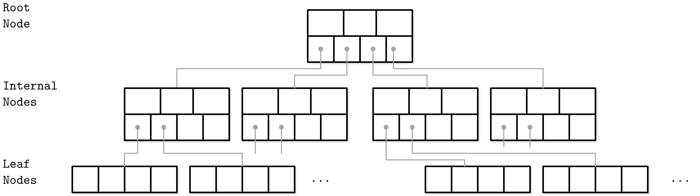
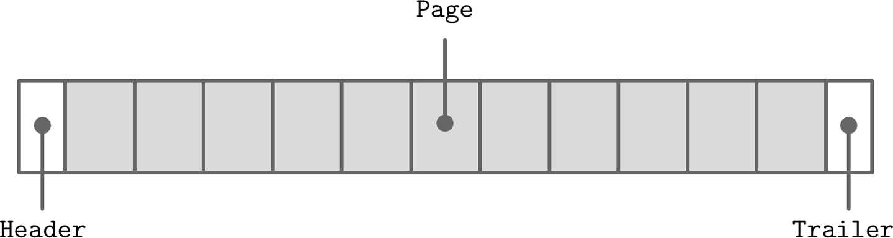
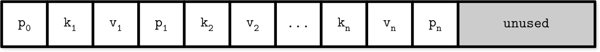
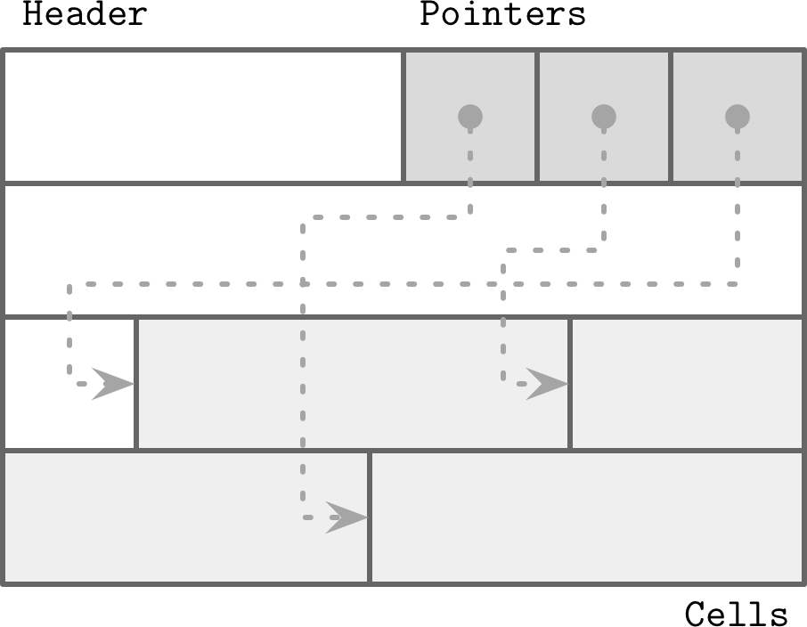
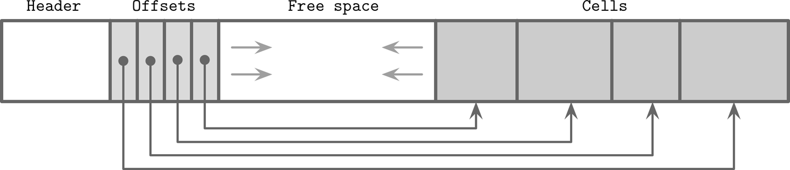
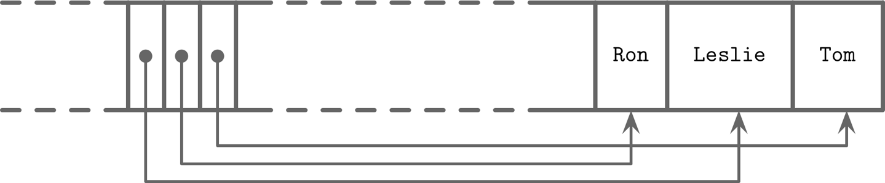
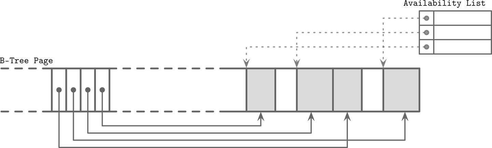

- [1. 基于磁盘的树结构](#1-基于磁盘的树结构)
- [2. B树](#2-b树)
- [3. 文件格式](#3-文件格式)
  - [3.1 slotted page](#31-slotted-page)
  - [3.2 cell layout](#32-cell-layout)
  - [1.3 page layout](#13-page-layout)
  - [1.3 空间管理](#13-空间管理)
- [2. B树的实现](#2-b树的实现)
  - [2.1 页头](#21-页头)
  - [2.2 搜索](#22-搜索)
  - [2.3 分裂与合并](#23-分裂与合并)
  - [2.4 平衡](#24-平衡)
  - [2.5 压缩](#25-压缩)
  - [2.6 GC](#26-gc)

#### 1. 基于磁盘的树结构
我们知道平衡树的时间复杂度是logN,由于扇出较低需要频繁的执行平衡操作，在次盘上维护成本不切实际。（扇出是每个节点最大拥有的子节点个数）

如果在磁盘上维护二分搜索树，会遇到下面问题
1. 局部性：由于元素是随机添加的，所以不能保证新加入的节点在其父节点父节点附近写入，这意味着子节点指针可能跨越多个磁盘页
2. 磁盘查找效率，由于二分树的扇出是2，所以树的高度是log2N，所以必须执行O(log2N)次查找定位搜索的元素，也就是需要执行相同数量的磁盘IO

考虑到这些因素，更适合磁盘实现的树需要有如下属性
1. 高扇出，改进相邻键的数据局部性
2. 低高度，减少遍历期间的寻道次数

#### 2. B树
B树是建立在平衡搜索树的基础上，不同之处在于具有更高的扇出和更低的高度。B树通常被绘制为矩形，指针也被显示的表现出来，为了突出子节点和分隔键的的关系。
B树每个节点最多可容纳N个键和N+1个指向子节点的指针，这些节点在逻辑上分为三类
1. 根节点
2. 叶节点
3. 内部节点
  

B树是一种页管理技术，通常节点和页是等价的。节点容量是其内部持有的键的个数关系成为占用率。

B树允许在根节点、内部节点存储值，而B+树则仅在叶节点中存储值，其内部节点只存储分隔键，用于搜索关联到叶节点。由于B+树的值仅存储在叶节点，所有的操作近影响叶节点，仅在分裂合并期间才会传播到更高层。
存储在B树节点中的键成为分隔键活着分隔单元格，它将树分隔成子树，节点内部的分隔键有序，以便用于二分查找。
节点中的第一个指针指向小于第一个键的子树，最后一个指针指向大于等于最后一个键的子树。通常会有同级别的指针，简化范围扫描。
#### 3. 文件格式
大多数原地更新的存储结构都是用相同大小的页，从而简化了读取和写入访问，仅追加的存储结构同堂也按页写入，一旦内存中的页写满，就将其写到磁盘，文件通常以定长的header开始，一般也以定长的tailer结束，尾部包含访问文件件的辅助信息，文件件的其余部分被分为多个页。

存储数据或者索引的页通常是文件存储系统块的整数倍，一般是4~16K，在B树张中节点分为叶节点和非叶节点，每个B树节点占据一个页或者多个链接在一起的页，因此节点和页通常等价。

在原始的B树论文提出一种简单的用于保存定长记录的页组织方式，每个页由连续的三元组组成。

这种方式存在的问题是新插入记录需要移动其他的的记录，并且无法管理变长的记录。
##### 3.1 slotted page
页格式的挑战主要在于
1. 空间管理，回收删除的记录
2. 较小的代价保存变长的记录
3. 动态的布局，空间回收移动数据后不改变对记录的引用

一般将页分为多个slot（cell），并且每个slot都有一个指针指向它，这些指针集中在文件头部

页头部包含了页和slot的重要信息，slot的大小可以不同，可以不保存任意数据，比如键、数据记录、指针等。
对于上面的三个挑战
1. 对于空间管理，对slot进行整理重写，就可以回收空间
2. slotter page只额外存储一个指针数据
3. 外部的引用通过slot id来引用记录，不关心记录的具体位置

##### 3.2 cell layout
slot或cell（单元格）组合成页，页组合成树，slot分为键单元格和键值单元格。键单元格包含一个分隔键和一个指针，该指针指向两个相邻键之间的页，键值单元格包含键和关联的数据记录。
假定一个页内的所有单元格都是统一的，页内的单元格的元数据只需要保存一份。
构成一个键单元格的数据局如下：
- 单元格类型（可以从页元数据推断）
- 键长度
- 子页ID
- 键的数据

键值单元格存放数据记录，和键单元格类似
  - 单元格类型（页的元数据推断）
  - 键的长度
  - 值得长度
  - 键的数据
  - 值得数据
  
##### 1.3 page layout
单元格放在页的右边，头和指针数组放在页的左边，新插的数据向左边增长。

其中记录的顺序通过调整指针的顺序来实现逻辑上的顺序。这种设计可以使在页中添加数据不需要移动其他记录。
假如页中已有Tomhe 和Leslie这两条数据，这两个名字，这两个名字的逻辑顺序与插入顺序不同，但是指针被重新排序，以便于二分查找。

现在假如新的名字Ron，新数据假如可用空间的末端，但是指针必须保持记录的字典序：Leslie、Ron、Tom，为此重新排序指针：将插入节点之后的指针向右移动

##### 1.3 空间管理
从页中删除一条记录秩序将这个单元格标记为删除，并根据释放的空间大小和指针更新可用列表，这个列表保存了可用短的偏移量以及大小，每当插入新的单元格时，会检查可用列表。

至于新插入的记录使用哪个空闲空可以有两种策略
1. 首次适配优先，把数据填入第一个合适的段
2. 最佳适配优先，寻找的段使得剩余空间最小
如果找不到合适的空闲空间存放新的单元格，但是有足够多的碎片空间，那么会进行碎片整理，以回收空间。

总结一下，我们先认为一个节点占用一个页，页有定长的头部、单元格指针块和单元格组成。单元格内包含键和指向子节点活着记录。
#### 2. B树的实现

##### 2.1 页头
页头保存了有关定位、优化等信息，通常包含页中单元格的数量，空间空间的上下界偏移量等元数据，PGSQL在头部存储页大小和布局版本，MySQL InnoDB中保存记录总数、层数等信息。SQLite中保存了单元格数量和最右指针。

- 魔数，通常页头放一个魔数用来表示这是一个页，并且标明类型和版本。
- 同级指针
一些实现中页头存储了前序和后继指针，指向同级的页，这给分裂和合并增加了一些复杂度，当一个非最右节点拆分时，之前指向分裂前的指针就必须重新指向新创建的节点。优势就是同级节点的遍历会方便很多。

- 最右指针
- 节点高键
- 溢出页
##### 2.2 搜索
##### 2.3 分裂与合并
##### 2.4 平衡
##### 2.5 压缩
##### 2.6 GC