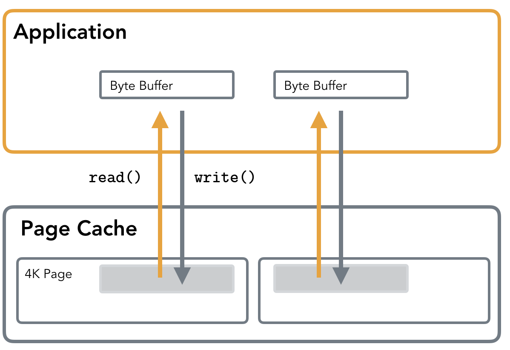
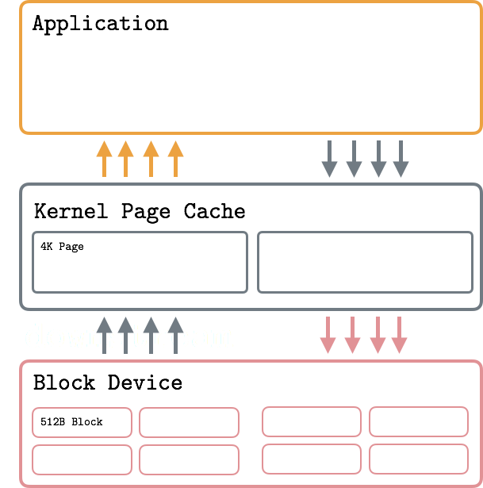
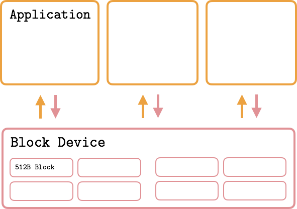

#### 磁盘IO一: IO的风格

系列文章包括5篇:

[Flavors of IO: Page Cache, Standard IO, O_DIRECT]()
[More Flavors of IO: mmap, fadvise, AIO]()
[LSM Trees]()
[Access Patterns in LSM Trees]()
[B-Trees and RUM Conjecture]()

了解 IO 的工作原理并、理解存储系统算法的权衡的使用案例可以让开发人员和操作员的做的更好，他们将能够预先做出更好的选择（基于数据库的底层原理），解决数据库的性能问题（通过比较负载）并调整其堆栈，包括负载均衡、切换到不同的介质、文件系统、操作系统或选择不同的索引类型。

虽然网络 IO 经常被讨论和谈论，但文件系统 IO 却很少受到关注。部分原因是网络 IO 有更多的特性和实现细节，从一个操作系统到另一个，而文件系统 IO 的工具集要少得多。此外，在现代系统中，人们大多使用数据库作为存储手段，因此应用程序通过网络上的驱动程序与数据库进行通信，而文件系统 IO 则留给数据库开发人员了解和处理。我仍然认为了解数据如何写入磁盘并从中读取非常重要。

IO 有几种“风格”（为简洁起见，省略了一些功能）：

系统调用：open、write、read、fsync、sync、close
标准 IO：fopen、fwrite、fread、fflush、fclose
向量 IO：writev，readv
内存映射 IO：open、mmap、msync、munmap

让我们从讨论标准 IO 组合和一些“用户空间”优化开始，因为这是应用程序开发人员最终使用最多的东西。

#### Bufferred IO
在谈到stdio.h函数时，在“buffering”方面存在一些混淆，使用标准 IO 时，可以在全缓冲和行缓冲之间进行选择，或者选择退出任何缓冲。这种“用户空间”缓冲与我们将在本文后面讨论的内核缓冲（页面缓存）无关。您也可以将其视为“buffering”和“cache”之间的区别，这可能会明确区分这些概念。

#### Sector/Block/Page
块设备是一种特殊的文件类型，提供对硬件设备（如HDD或SSD）的缓冲访问。块设备作用于扇区即相邻字节组。大多数磁盘设备的扇区大小为512字节。扇区是块设备的最小数据传输单位，不可能传输少于一个扇区的数据，通常可以一次提取多个相邻扇区。

文件系统的最小可寻址单元是块。块是由设备驱动程序请求的一组多个相邻扇区。典型的块大小为512、1024、2048和4096字节。通常IO是通过虚拟内存完成的，它在内存中缓存了文件系统块，虚拟内存与页一起工作，页映射到文件系统块。典型页面大小为4096字节。

总之，虚拟内存页映射到文件系统块，文件系统块映射到块设备扇区。

#### Standard IO

标准 IO 使用read()和write()系统调用来执行 IO 操作。读取数据时，首先寻址页缓存。如果数据不存在，则会触发Page Fault并调入内容。这意味着对当前未映射区域执行的读取将花费更长的时间，因为缓存层对用户是透明的。

在写入期间，缓冲区内容首先写入页缓存。这意味着数据不会立即到达磁盘。当内核决定是时候执行脏页的写回时，实际的硬件写入就完成了。

标准IO获取用户空间缓冲区，然后将其内容复制到页面缓存。当使用O_DIRECT标志时，缓冲器直接写入块设备。

#### Page Cache
页面缓存 存储最近访问的文件片段，这些片段更有可能在最近的时间被访问。处理磁盘文件时， read()和write()调用不会直接启动磁盘访问，而是通过页面缓存。

缓冲IO如何工作：应用程序的读写通过内核页缓存，它通过进程间共享读取和限制写入以减少IO。

执行读操作时，首先查询Page Cache。如果数据已加载到页面缓存中，则只需将其复制出来以供用户使用：不执行磁盘访问。否则文件内容会被加载到页面缓存中，然后返回给用户。如果页面缓存已满，则最近最少使用的页面会刷新到磁盘上并从缓存中淘汰以释空间。

write()调用只是将用户空间缓冲区复制到内核页面缓存，将写入的页面标记为脏页。稍后内核使用flush或writeback将修改内容写入磁盘。实际的 IO 通常不会立即发生。同时，read()将从页面缓存提供数据，而不是读取已过时磁盘内容。如你所见，页面缓存在读取和写入时都会加载。

标记为脏的页面将被刷新到磁盘，因为它们的缓存现在与磁盘上的不同。这个过程称为writebackwriteback。writeback 可能有潜在的缺点，例如排队 IO 请求，因此值得了解writeback 的阈值和比率，并检查队列深度以确保您可以避免限制和高延迟。您可以在Linux 内核文档中找到有关调整虚拟内存的更多信息。

Page Cache 背后的逻辑可以解释为时间局部性原理，即最近访问的页面将在最近的某个时间点再次访问。

另一个原则，空间局部性，意味着物理上位于附近的元素很有可能相近。这一原则用于一个称为“预取”的过程中，该过程提前加载文件内容，以预测它们的访问并摊销一些 IO 成本。

页面缓存还通过延迟写入和合并相邻读取来提高 IO 性能。

消歧：Buffer Cache 和 Page Cache：以前完全分开的概念，在 2.4 Linux 内核中统一了。现在它主要被称为页面缓存，但有些人仍然使用术语缓冲区缓存，这成为了同义词。

页面缓存根据访​​问模式保存最近访问或可能很快会访问的文件块（预取或用fadvise标记）。由于所有 IO 操作都是通过 Page Cache 进行的，因此可以从内存中提供诸如读-写-读之类的操作序列，而无需后续的磁盘访问。

#### 延迟错误

缓存在由内核或者库缓库回写时，确保数据实际到达磁盘非常重要，这一过程可能会出现错误，比如正在fsync或关闭文件。如果您想了解更多信息，请查看 LWN 文章《确保数据到达磁盘》。

#### Direct IO
在某些情况下，不希望使用内核页缓存来执行 IO。在这种情况下，可以在打开文件时使用O_DIRECT标志。它表示操作系统绕过页缓存，避免存储额外的数据副本并直接对块设备进行 IO 操作。这意味着缓冲区直接刷新到磁盘上，无需先将其内容复制到相应的页缓存并等待内核触发回写。

对于传统”应用程序使用 Direct IO 可能导致性能下降，但在适当的情况下，它可以帮助获得对 IO 操作的细粒度控制并提高性能。通常使用这种类型的 IO 的应用程序需实现自己的应用层缓存。

Direct IO 的工作原理：应用程序绕过页缓存，立即向硬件存储进行写入。这可能会导致性能下降，因为写入内核缓存，可以在应用程序之间共享缓存内容。如果使用得当，可以带来重大的性能提升和改进内存使用。

内核开发人员通常不赞成使用 Direct IO。到目前为止，Linux 手册页引用了 Linus Torwalds 的话：“O_DIRECT一直让我不安的是，所有的接口都很愚蠢”。

但是PostgreSQL和MySQL等数据库使用 Direct IO 是有原因的。开发人员可以确保对数据访问进行细粒度控制，可能使用自定义 IO 调度程序和特定于应用程序的缓存。例如，PostgreSQL 将 Direct IO 用于WAL（预写日志），因为它们必须在确保其持久性的同时尽可能快地执行写入，并且可以使用这种优化，因为它们确信数据不会被立即重用，因此绕过页面缓存编写它不会导致性能下降。

不鼓励同时使用 Direct IO 和 Page Cache 打开同一个文件，因为即使数据在 Page Cache 中，也会对磁盘设备执行直接操作，这可能会导致不希望的结果。

#### 块对齐
因为 Direct IO 绕过 Page Cache 中的中间缓冲区直接访问存储，，所以要求所有操作都与扇区边界对齐。

未对齐写入示例（突出显示）。从左到右：写入既不在块边界开始，也不在块边界结束；写入从块边界开始，但写入大小不是块大小的倍数；写入不是从块边界开始的。

换句话说，每个操作的起始偏移量必须是 512 的倍数，并且缓冲区大小也必须是 512 的倍数。使用 Page Cache 时，由于写入首先进入内存，对齐并不重要：当执行实际块设备写入时，内核将确保将页面拆分为正确大小的部分，并对硬件执行对齐写入。

例如，RocksDB通过预先检查来确保操作是块对齐的（旧版本通过在后台对齐来支持未对齐的访问）。

无论是否使用 O_DIRECT 标志，确保您的读取和写入是块对齐的始终是一个好主意。如上图所示，跨越边界将导致从磁盘加载（或写回）多个扇区。使用块大小或恰好对齐的 I/O 请求，可以防止内核内部的无关工作。
#### 非阻塞文件系统 IO

我在这里添加这部分是因为我经常在文件系统 IO 的上下文中听到“非阻塞”。这很正常，因为网络和文件系统 IO 的大多数编程接口是相同的。但值得一提的是，没有真正的“非阻塞” Filesystem IO，可以同理理解。

对于常规文件，O_NONBLOCK通常被忽略，因为块设备操作被认为是非阻塞的（与套接字操作不同）。系统不考虑文件系统IO延迟。因为在操作完成或多或少有一个确切的时间限制。

出于同样的原因，您通常在网络上下文中使用的东西，例如select和epoll，不允许监视和/或检查常规文件的状态。
#### 结束语

今天，我们讨论了页面缓存、标准IO和O_DIRECT标志的使用，这是数据库开发人员经常使用的一种优化，目的是为了控制标准IO在内核的缓存，也讨论了它的使用场景、工作方式、以及它的缺点。

https://medium.com/databasss/on-disk-io-part-1-flavours-of-io-8e1ace1de017