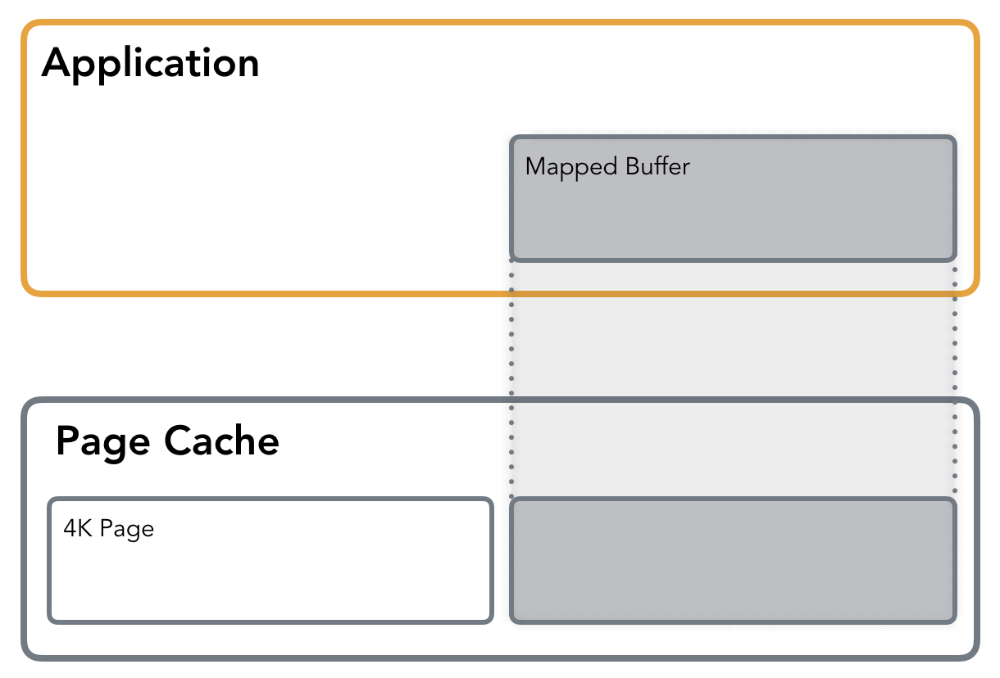
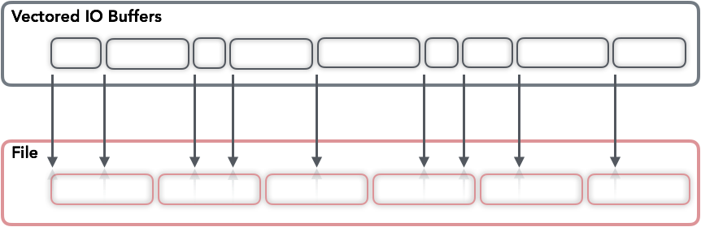

#### 论磁盘IO二：更多的 IO 风格

#### 内存映射
内存映射 (mmap) 让你访问文件就好像它完全加载到内存中一样。它简化了文件访问，并且经常被数据库和应用程序开发人员使用。

内存映射将进程虚拟页面直接映射到内核页缓存，避免像使用标准 IO 那样从用户空间缓冲区进行额外的复制。

使用mmap可以将文件以私有或共享模式映射到内存段。私有映射允许从文件中读取，但任何写入都会触发相关页面的写入时复制，以保持原始页面完整并保持更改私有，因此所有更改都不会反映在文件本身上。在共享模式下，文件映射与其他进程共享，因此它们可以看到映射内存段的更新。此外，更改会传递到底层文件（精确控制需要使用msync的文件）

一般文件内容不会立即加载到内存中，而是以惰性方式加载。内存映射所需的空间是保留的，不会立即分配。第一次读取或写入操作会导致Page-Fault，从而触发相应页面的分配。通过传递MAP_POPULATE，可以对映射区域进行Pre-Page-Fault，并强制文件预读。

在上一篇文章中，我们接触了虚拟内存和页缓存。内存映射是通过页缓存完成的，与标准IO 读写操作的方式相同并且使用按需分页。

在第一次内存访问期间，会发出一个Page-Fault，它向内核发出信号，表示请求的页面当前未加载到内存中需要加载。内核识别从何处加载数据。Page-Fault对开发人员是透明的，程序流将继续进行，就像什么都没有发生一样。有时Page-Fault可能会对性能产生负面影响，我们将在本文后面讨论改善这种情况的方法。

也可以使用保护标志将文件映射到内存中（例如在只读模式下）。如果对映射内存段的操作违反了保护，则会发出段错误。

mmap是处理IO的一个非常有用的工具：它避免了在内存中创建缓冲区的额外副本（与标准IO不同，在标准IO中，数据必须在系统调用之前复制到用户空间缓冲区中）。此外，它避免了触发实际IO操作的系统调用（和后续上下文切换）开销，除非发生页面错误。从开发人员的角度来看，使用mmap文件发出随机读取看起来就像普通的指针操作，不涉及lseek调用。

大多数时候提到的mmap的缺点与现代硬件的关系不大：

- mmap 增加了管理内存映射所需的内核数据结构的开销：在当今的内存大小中，这个并不是主要问题。
- 内存映射文件大小限制：大多数时候，内核代码更加需要对内存友好，64位架构允许映射更大的文件。

当然，这并不意味着所有事情都必须使用内存映射文件来完成。

mmap经常被数据库实现者使用。例如，MongoDB默认存储引擎是mmap- backed，SQLite广泛使用内存映射。

#### 页缓存优化
从我们到目前为止讨论的情况来看，使用标准IO似乎简化了许多事情，并有一些好处，但以失去控制权为代价：但只是在一定程度上得益于内核和页面缓存。通常内核可以使用内部统计数据更好地预测何时执行回写和预取页面。但是，有时我们可以帮助内核以对应用程序有利的方式管理页面缓存。

告诉内核我们的的期望可以使用fadvise。使用以下标志，可以告诉内核我们的期望，并让其优化页缓存：

- FADV_SEQUENTIAL指定按顺序读取文件，从较低的偏移量到较高的偏移量，因此内核可以确保在实际读取发生之前提前获取页面。
- FADV_RANDOM禁用预读，从页面缓存中逐出不太可能在短期内访问的页面。
- FADV_WILLNEED通知操作系统在不久的将来该进程将需要该页面。这使内核有机会提前缓存页面，并在发生读取操作时从页面缓存中提供它而不是页面错误。
- FADV_DONTNEED通知内核它可以释放相应页面的缓存（确保数据事先与磁盘同步）。
还有一个标志（FADV_NOREUSE），但在 Linux 上它没有效果。

顾名思义，fadvise只是代理建议。内核没有义务完全按照fadvise的建议进行操作。

由于数据库开发人员通常可以预测访问，因此fadvise 是一个非常有用的工具。例如，RocksDB 使用它来通知内核有关访问模式的信息，具体取决于文件类型（SSTable 或 HintFile）、模式（随机或顺序）和操作（写入或压缩）。

另一个有用的调用是mlock。它允许您强制将页面保存在内存中。这意味着一旦页面加载到内存中，所有后续操作都将从页面缓存中提供。必须谨慎使用它，因为在每个页面上调用它只会耗尽系统资源。

#### AIO
在 IO 风格方面，我们要讨论的最后一块是Linux 异步 IO (AIO)。AIO 是一个接口，允许启动多个 IO 操作并注册将在完成时触发的回调。操作将异步执行（例如系统调用将立即返回）。使用异步 IO 有助于应用程序在处理提交的 IO 作业时继续在主线程上工作。

负责 Linux AIO 的两个主要系统调用是io_submit和io_getevents。io_submit允许传递一个或多个命令，保存缓冲区、偏移量和必须执行的操作。可以使用io_getevents查询完成情况，该调用允许收集相应命令的结果事件。这允许一个完全异步的接口来处理 IO、流水线 IO 操作和释放应用程序线程，从而可能减少上下文切换和唤醒的数量。

不幸的是，Linux AIO 有几个缺点：系统调用 API 没有被 glibc 公开，并且需要一个库来连接它们（libaio似乎是最流行的）。尽管多次尝试修复该问题，但仅支持带有 O_DIRECT 标志的文件描述符，因此缓冲异步操作将不起作用。此外，某些操作，例如stat、fsync、open和其他一些操作不是完全异步的。

值得一提的是，Linux AIO 不应与Posix AIO混淆，这完全是另一回事。Linux 上的 Posix AIO 实现完全在用户空间中实现，根本不使用这个 Linux 特定的 AIO 子系统。

#### 向量 IO

一种可能不太流行的 IO 操作的方法是 Vectored IO（也称为 Scatter/Gather）。之所以这样叫，是因为它在缓冲区向量上进行操作，并允许在每次系统调用时使用多个缓冲区从磁盘读取和写入数据。

执行向量读取时，字节将首先从源读取到缓冲区中（直到第一个缓冲区的长度偏移量）。然后，从源开始的第一个缓冲区的长度和直到第二个缓冲区的长度偏移的字节将被读入第二个缓冲区，依此类推，就好像源正在一个接一个地填充缓冲区（尽管操作顺序和并行性不是确定性）。向量写入以类似的方式工作：缓冲区将被写入，就好像它们在写入之前被连接一样。

Vecotr IO 示例：不同大小的用户空间缓冲区映射到连续文件区域，允许使用单个系统调用读写多个缓冲区。

这种方法可以通过允许读取较小的块（因此避免为连续块分配大内存区域），同时减少系统调用量。另一个优点是读写都是原子的：内核防止其他进程在读写操作期间对同一描述符执行 IO，保证数据完整性。

从开发的角度来看，如果数据在文件中以某种方式布局（例如它被拆分为一个固定大小的标头和多个固定大小的块），则可以发出一个单独的调用来填充单独的缓冲区分配给这些部分。

这听起来相当有用，但不知何故，只有少数数据库使用 Vectored IO。这可能是因为通用数据库同时处理一堆文件，试图保证每个正在运行的操作的活跃性并减少它们的延迟，因此数据是按块访问和缓存的。Vectored IO 对于分析工作负载和/或列式数据库更有用，其中数据连续存储在磁盘上，其处理可以在稀疏块中并行完成。其中一个例子是Apache Arrow。
#### 结束语
正如你所看到的，有很多东西可供选择，每一种都有自己的优点和缺点。使用特定工具并不能保证产生积极的结果：由于它们的特殊性，这些 IO 风格很容易被误解和误用。最终用户使用数据库的实施、调整和方式仍然可能发挥重要作用。

您可以看到现有方法似乎仍然有一个模式：使用 O_DIRECT 可能需要您编写缓冲区缓存，使用页面缓存可能需要使用fadvise并且使用 AIO 可能需要您将其与类似 Futures 的接口挂钩。其中一些是针对更具体的用例，一些是更通用的。这些系列的主要目的是帮助人们获得基本词汇并了解数据库的底层内容，以便更轻松地查看其子系统、调整、优化和为正确的工作选择正确的工具。

https://medium.com/databasss/on-disk-io-part-2-more-flavours-of-io-c945db3edb13