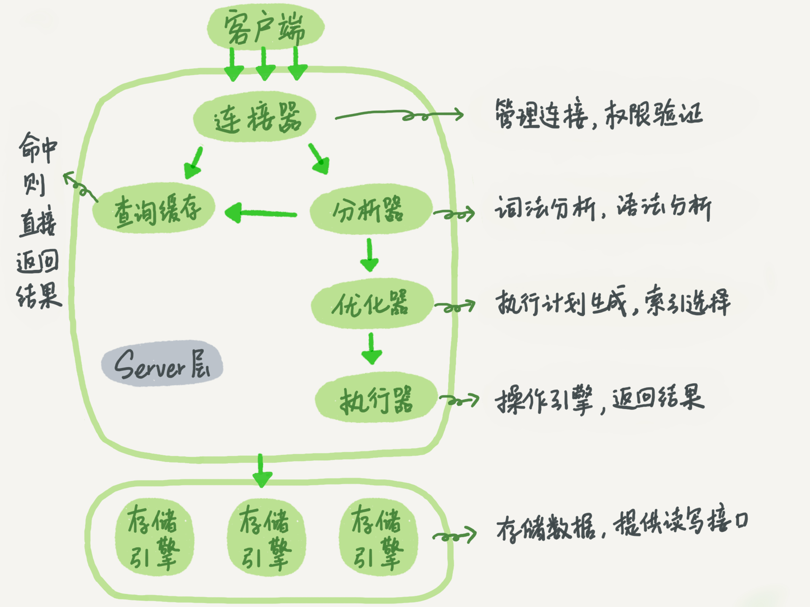

[toc]

mysql 整体架构


 - 最上层的用于客户端交互，比如连接处理、授权认证、安全等等。 
- 第二层服务器层，大多数MySQL的核心服务功能都在这一层，包括查询解析、分析、优化、缓存以及所有的内置函数，所有跨存储引擎的功能都在这一层实现：存储过程、触发器、视图等。
- 第三层包含了存储引擎。存储引擎负责MySQL中数据的存储和提取。

##### 1.1 连接器

连接器负责跟客户端建立连接、获取权限、维持和管理连接。客户端如果太长时间没动静，连接器就会自动将它断开。这个时间是由参数wait_timeout控制的，默认值是8小时。如果在连接被断开之后，客户端再次发送请求的话，就会收到一个错误提醒： Lost connection to MySQL server during query。这时候如果你要继续，就需要重连，然后再执行请求了。

MySQL在执行过程中临时使用的内存是管理在连接对象里面的。这些资源会在连接断开的时候才释放。所以如果长连接累积下来，可能导致内存占用太大，被系统强行杀掉（OOM），从现象看就是MySQL异常重启了。解决办法是定期断开长连接。

##### 1.2  缓存

MySQL拿到一个查询请求后，会先到查询缓存看看，之前是不是执行过这条语句。之前执行过的语句及其结果可能会以key-value对的形式，被直接缓存在内存中。key是查询的语句，value是查询的结果。如果你的查询能够直接在这个缓存中找到key，那么这个value就会被直接返回给客户端。

查询缓存的失效非常频繁，只要有对一个表的更新，这个表上所有的查询缓存都会被清空。对于更新压力大的数据库来说，查询缓存的命中率会非常低。MySQL 8.0版本直接将查询缓存的整块功能删掉了。

##### 1.3 分析器

分析器是对SQL语句做解析。MySQL需要识别出里面的字符串分别是什么，代表什么。做完了这些识别以后，就要做“语法分析”。根据词法分析的结果，语法分析器会根据语法规则，判断你输入的这个SQL语句是否满足MySQL语法

##### 1.4 优化器

优化器是在表里面有多个索引的时候，决定使用哪个索引；或者在一个语句有多表关联（join）的时候，决定各个表的连接顺序。比如你执行下面这样的语句，这个语句是执行两个表的join：

```sql
select * from t1 join t2 using(ID)  where t1.c=10 and t2.d=20;
```

- 既可以先从表t1里面取出c=10的记录的ID值，再根据ID值关联到表t2，再判断t2里面d的值是否等于20。
- 也可以先从表t2里面取出d=20的记录的ID值，再根据ID值关联到t1，再判断t1里面c的值是否等于10。

这两种执行方法的逻辑结果是一样的，但是执行的效率会有不同，而优化器的作用就是决定选择使用哪一个方案。

##### 1.5 执行器

开始执行的时候，要先判断一下你对这个表T有没有执行查询的权限，如果没有，就会返回没有权限的错误，如果有权限，就打开表继续执行。打开表的时候，执行器就会根据表的引擎定义，去使用这个引擎提供的接口。

